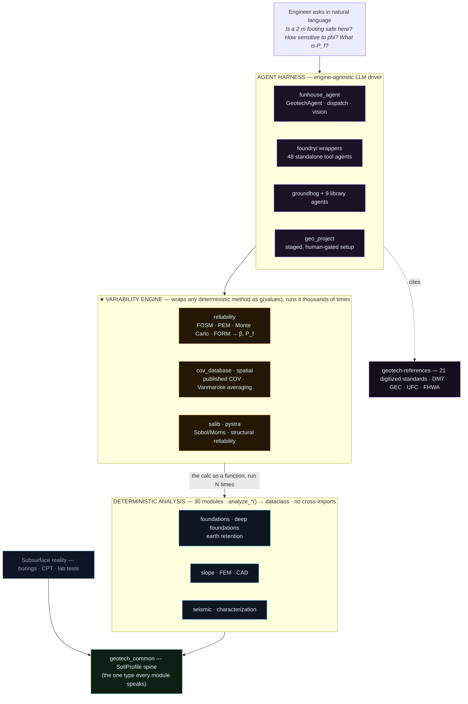

# GeotechStaffEngineer

**A Python toolkit that turns the geotechnical staff engineer's repertoire into composable, machine-callable methods — wraps them in a probabilistic variability engine — and drives them with an engine-agnostic LLM agent.**

30 analysis modules · 21 digitized references · FOSM/PEM/Monte-Carlo/FORM reliability · validated against published benchmarks.

> 📊 **Rich visual overviews** (open in a browser): [Project overview](docs/overview.html) · [Agentic retrieval developer guide](docs/agentic_retrieval_devguide.html)

---

## Soil is uncertain. So you don't calculate once — you calculate thousands of times.

Geotechnical engineering is the science of building **on** and **out of** the ground: foundations, retaining walls, slopes, excavations, embankments. Unlike a steel beam with a certified strength, the geotechnical engineer's material is **the earth itself** — heterogeneous, layered, partly saturated, and sampled at only a handful of points across an entire site.

Because the ground is **variable and only partly known**, a single number is never the answer. Understanding a geotechnical problem means understanding *how the answer moves as the inputs move*. That's what this project is built around.

### What a geotechnical engineer actually does

| Step | Activity | Reality |
|------|----------|---------|
| **1 · Characterize** | Drill borings, push CPT cones, run lab tests | A sparse, noisy picture of strength, stiffness, and groundwater — never the whole truth |
| **2 · Idealize** | Collapse the data into a layered soil profile | Design values of φ, c, γ, water table — each an *estimate with a spread* |
| **3 · Analyze** | Run the method (bearing capacity, settlement, pile capacity, slope stability) | A chain of code-prescribed formulas from DM7, FHWA, UFC, AASHTO |
| **4 · Check & revise** | Compare against the required factor of safety; vary assumptions; re-run | Loop until the design is robust *across* the uncertainty |

Steps 3 and 4 are not one calculation — they are the **same calculation run again and again** across plausible soil states. The engineering judgment is in choosing the range and reading the *spread* of answers, not in any single result.

### Why the answer is a distribution, not a number

Two engineers, same site, can pick φ = 30° or φ = 33° and both be defensible — the soil genuinely varies that much. A bearing capacity that changes materially between those values is not a rounding question; it *is* the question.

- **Parameter uncertainty** — design properties carry coefficients of variation (COV) of 10–40%, far larger than structural materials.
- **Spatial variability** — soil changes boring to boring; a footing averages over its footprint, a long slope samples many weak and strong zones. Scale matters.
- **Model & scenario sweeps** — drained or undrained? Water table high or low? Seismic case? Each is another axis to run the calculation along.

Done by hand, that exploration gets truncated — a couple of cases and a lot of conservatism to cover the gaps. Done by **machine**, the same deterministic method runs ten thousand times across the full statistical picture and returns a **reliability index β** and a **probability of failure P_f** instead of a lone factor of safety.

### Computers have always amplified the engineer

Slide rules and design charts → spreadsheets and FEM → scripting and Monte Carlo → **LLM agents**. Every tool in this lineage did the same thing: it let one engineer explore more of the problem in the time they had. This project is the next step — *not a replacement for judgment, but a force multiplier for it.* Take the methods a staff engineer uses, make every one a clean Python function that returns structured data, wrap the variability tooling around them, and put a reasoning agent on top.

---

## Architecture

One stack, layered so each concern stays independent. Analysis modules never import each other — they all speak one shared `SoilProfile`. The reliability and sensitivity engines wrap *any* deterministic method as a callable. The reference library and the agent harness sit on top.



- **Why a shared spine** — one `SoilProfile` type means modules compose without knowing about each other, and an agent learns one way to describe the ground.
- **Why no cross-imports** — analysis modules are independent, testable leaves; the routing that *combines* them lives in the agent layer.
- **Why variability is its own layer** — it's orthogonal. `reliability` doesn't know what bearing capacity *is*; it knows how to take any callable `g(values)` and characterize how its output scatters. Wrap once, apply everywhere.

---

## ★ The variability engine — the same calculation, thousands of times

This is the heart of "explore the problem, don't point-estimate it." The `reliability` module turns any deterministic analysis into a probabilistic one. Declare the uncertain inputs as random variables, hand it a performance function `g(values) → FOS or margin`, pick an engine — get back the reliability index **β** and probability of failure **P_f**.

```python
from reliability import RandomVariable, monte_carlo, fosm, cov_guidance
from reliability.wrappers import bearing_capacity_reliability

# 1 · Uncertain inputs — pull a defensible COV straight from the literature
cov_guidance("friction_angle")        # → Duncan 2000 / Phoon-Kulhawy guidance
phi   = RandomVariable("phi",   mean=32, cov=0.10, dist="lognormal")
c     = RandomVariable("c",     mean=8,  cov=0.30, dist="lognormal")
gamma = RandomVariable("gamma", mean=18, cov=0.07)

# 2 · The performance function: the DETERMINISTIC module, called per sample
def g(v):                              # v = {"phi":.., "c":.., "gamma":..}
    res = bearing_capacity_analysis(phi=v["phi"], c=v["c"], gamma=v["gamma"], width=2.0)
    return res["factor_of_safety"]     # scalar margin: g >= 1 is "safe"

# 3 · Pick an engine — all four share the same g() contract
mc   = monte_carlo(g, [phi, c, gamma], n=50_000, target=1.0)
fast = fosm(g, [phi, c, gamma])        # first-order, no sampling

print(mc.beta, mc.pf)   # reliability index & probability of failure — the real deliverable
```

| Engine | Cost | What it does |
|--------|------|--------------|
| **FOSM** | cheap | First-Order Second-Moment — propagates means & variances; instant β |
| **PEM** | robust | Rosenblueth Point Estimate — evaluates g() at ± points; handles non-linearity without a derivative |
| **Monte Carlo** | exact-ish | Sample the joint distribution N times, count failures; correlations and all |
| **FORM** | efficient | Native first-order reliability — finds the design point; β at a fraction of MC's calls |

- **`cov_database`** — a queryable knowledge base of published coefficients of variation (Duncan 2000, TC304, Phoon & Kulhawy) keyed by soil property. Ask, don't assume.
- **`spatial`** — Vanmarcke spatial averaging reduces variance over the volume a structure actually loads (`scale_of_fluctuation_guidance`, `variance_reduction`).
- **`salib_agent`** — global sensitivity (Sobol, Morris): *which* input drives the variance? Together they map a problem's full depth and the factors that govern it.

`slope_stability` and the reliability wrappers (`bearing_capacity_reliability`, `axial_pile_reliability`, `slope_reliability`) ship the probabilistic path out of the box.

---

## Module inventory

Thirty analysis modules grouped by discipline, plus the shared layers. Native modules implement the method directly; "agent" modules wrap a trusted third-party library behind the same dict-based API. All units are SI (m, kPa, kN, degrees); every module returns dataclasses with `.summary() → str` and `.to_dict() → dict`.

| Domain | Modules | What they compute |
|--------|---------|-------------------|
| **foundations** | `bearing_capacity` · `settlement` | Shallow footing capacity (Vesic/Meyerhof/Hansen, two-layer); consolidation + immediate settlement |
| **deep foundations** | `axial_pile` · `lateral_pile` · `pile_group` · `drilled_shaft` · `wave_equation` · `downdrag` | Driven & bored pile capacity, p-y lateral analysis, rigid-cap groups, Smith wave-equation drivability, neutral-plane downdrag |
| **earth retention** | `sheet_pile` · `soe` · `retaining_walls` · `ground_improvement` | Cantilever/anchored walls, support-of-excavation, cantilever & MSE walls, aggregate piers / wick drains / vibro |
| **slope · FEM · CAD** | `slope_stability` · `fem2d` · `dxf_import` · `dxf_export` · `pdf_import` | Rigorous limit-equilibrium (GLE/M-P, Bishop/Spencer/Janbu) + probabilistic FOS; 2D plane-strain FEM with strength reduction; geometry I/O |
| **seismic** | `seismic_geotech` · `opensees_agent` · `pystrata_agent` · `liquepy_agent` · `seismic_signals_agent` · `hvsrpy_agent` | Site class, M-O pressures, liquefaction triggering (B&I-2014 / NCEER), 1D site response, ground-motion processing, HVSR |
| **characterization** | `subsurface_characterization` · `gstools_agent` · `swprocess_agent` · `groundhog_agent` | DIGGS/GEF/AGS4 data I/O + plots, geostatistical kriging/random fields, MASW dispersion, 90+ groundhog correlations |
| **variability** | `reliability` · `salib_agent` · `pystra_agent` | FOSM/PEM/MC/FORM + COV database + spatial averaging; Sobol/Morris sensitivity; structural FORM/SORM/MC |
| **shared / setup** | `geotech_common` · `geo_project` · `calc_package` | SoilProfile spine + checks + adapters + plots; staged human-gated model setup; calculation-package report generation |
| **references** | `geotech-references` (21) | Digitized tables/figures/equations + searchable chapter text from DM7, FHWA GEC series, UFC, FHWA standards |

### Library wrapper agents

Each wraps a third-party geotechnical library behind a dict-based API for LLM tool use:

| Module | Library | Purpose |
|--------|---------|---------|
| `opensees_agent` | OpenSeesPy | PM4Sand cyclic DSS, 1D site response |
| `pystrata_agent` | pystrata | 1D equivalent-linear site response |
| `seismic_signals_agent` | eqsig + pyrotd | Earthquake signal processing |
| `liquepy_agent` | liquepy | Boulanger & Idriss (2014) liquefaction triggering — CPT (LPI/LSN/LDI) and SPT |
| `hvsrpy_agent` | hvsrpy | HVSR site characterization |
| `gstools_agent` | gstools | Geostatistical kriging and random fields |
| `salib_agent` | SALib | Sobol and Morris sensitivity analysis |
| `swprocess_agent` | swprocess | MASW surface wave dispersion |
| `pystra_agent` | pystra | FORM/SORM/Monte Carlo reliability |
| `groundhog_agent` | groundhog | Site investigation and soil mechanics |

> The former `pygef_agent`, `ags4_agent`, and `pydiggs_agent` wrappers were folded into `subsurface_characterization` as optional, dependency-backed format adapters — one module now covers ingest + validate + visualize across DIGGS, GEF/BRO-XML, and AGS4.

---

## Engineering rigor

An agent that confidently returns a wrong bearing capacity is worse than useless. The project's discipline is what makes the outputs citable:

- **One unit system, one I/O shape** — everything is SI; every `analyze_*()` returns a dataclass with `.summary()` (human/agent reading) and `.to_dict()` (machine/JSON).
- **Validated against the literature** — flagship modules carry a `VALIDATION.md` with worked checks: `slope_stability` vs Fredlund & Krahn 1977 / ACADS / Duncan; `fem2d` vs Griffiths & Lane and the Prandtl solution (~2%); lateral pile vs a COM624P oracle suite.
- **Tests as a safety net** — each module ships a pytest suite sized to its risk (e.g. `slope_stability` 384, `fem2d` 353, `geotech_common` 288; the reference library alone 3,529). Changes regress against textbook answers.
- **A reviewer in the loop** — the agent can run a second, reference-scoped pass that checks methodology, parameter ranges, and required safety factors against the standards.

---

## Installation

```bash
# Core package (numpy + scipy + geotech-references)
pip install geotech-staff-engineer

# With all optional agent libraries
pip install geotech-staff-engineer[full]

# Or install individual extras
pip install geotech-staff-engineer[plot,groundhog,opensees]
```

## Quick start — three ways in

The same validated methods are reachable at three altitudes.

**A · Deterministic** — import a module, get a dataclass back:

```python
from bearing_capacity import Footing, SoilLayer, BearingSoilProfile, BearingCapacityAnalysis

footing = Footing(width=2.0, length=10.0, depth=1.5, shape="strip")
layer   = SoilLayer(friction_angle=30.0, cohesion=10.0, unit_weight=18.0, thickness=10.0)
profile = BearingSoilProfile(layer1=layer, gwt_depth=5.0)

result = BearingCapacityAnalysis(footing=footing, soil=profile).compute()
print(result.summary())     # readable report
result.to_dict()            # JSON-ready for an agent or a calc package
```

**B · Probabilistic** — the same calc, wrapped to return the distribution:

```python
from reliability.wrappers import bearing_capacity_reliability
out = bearing_capacity_reliability(variables=spec, engine="monte_carlo", n=50_000)
out.beta, out.pf            # the answer's shape, not one point on it
```

**C · Agentic** — describe the problem, let the agent run the methods & cite the standards:

```python
from funhouse_agent import GeotechAgent, NativeToolEngine
agent = GeotechAgent(genai_engine=NativeToolEngine(fh_prompter))   # Claude / Funhouse Prompter / OpenAI-native

agent.ask("2 m strip footing, 1.5 m deep, sand phi=30, c=10, water at 5 m. "
          "Bearing capacity and FOS — and how sensitive is it to phi? Cite the method.")
# → picks bearing_capacity, runs it, sweeps phi, consults DM7/GEC, returns a cited answer
```

At every altitude it's the *same* validated method underneath. The deterministic call is the atom; the variability engine runs that atom across uncertainty; the agent decides which atoms to run and reads the standards back to you.

## Optional extras

| Extra | Libraries |
|-------|-----------|
| `plot` | matplotlib |
| `calc` | jinja2 |
| `groundhog` | groundhog |
| `opensees` | openseespy |
| `pystrata` | pystrata |
| `seismic-signals` | eqsig, pyrotd |
| `liquepy` | liquepy |
| `hvsrpy` | hvsrpy |
| `gstools` | gstools |
| `salib` | SALib |
| `swprocess` | swprocess |
| `pystra` | pystra |
| `subsurface` | pygef, python-ags4, pydiggs (subsurface_characterization format adapters) |
| `pygef` / `ags4` / `pydiggs` | aliases for the individual format-adapter libraries |
| `dxf` | ezdxf |
| `full` | All of the above |

## Unified liquefaction

Liquefaction triggering is exposed to the agent through a single `liquefaction` tool that auto-routes by input type and method:

- **CPT** input (cone resistance `q_c` / sleeve friction `f_s`) → Boulanger & Idriss (2014) CPT procedure via `liquepy`, with LPI / LSN / LDI indices.
- **SPT** input (`N160` blow counts) → Boulanger & Idriss (2014) by default (`method="bi2014"`), or the legacy NCEER / Youd et al. (2001) simplified procedure via `method="nceer2001"` for code-compliance work that cites it.

B&I-2014 is the default for both. The underlying per-module functions remain available directly: `liquepy_agent.analyze_cpt_liquefaction` / `analyze_spt_liquefaction` (B&I-2014) and `seismic_geotech.evaluate_liquefaction` (NCEER/Youd-2001 SPT).

## Related package

[geotech-references](https://pypi.org/project/geotech-references/) — Digitized NAVFAC DM7 and FHWA GEC reference library (installed automatically as a dependency). For how the agent searches and cites it — full-text search, figure + vision read-off, and a scoped consult sub-agent — see the [agentic retrieval developer guide](docs/agentic_retrieval_devguide.html).

## License

MIT
