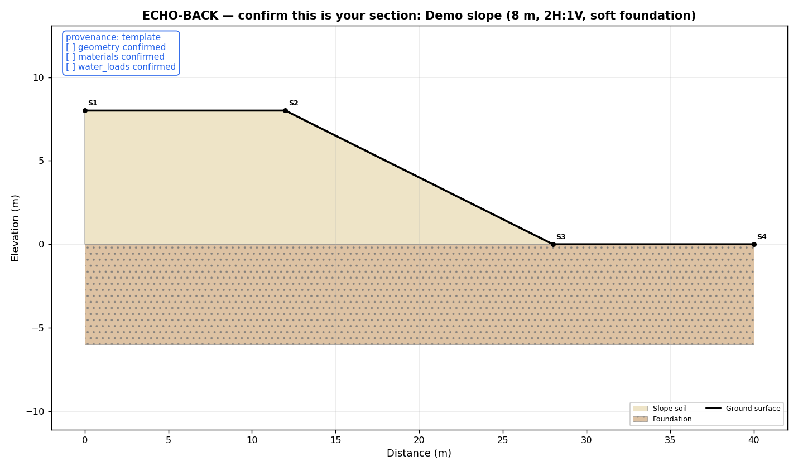
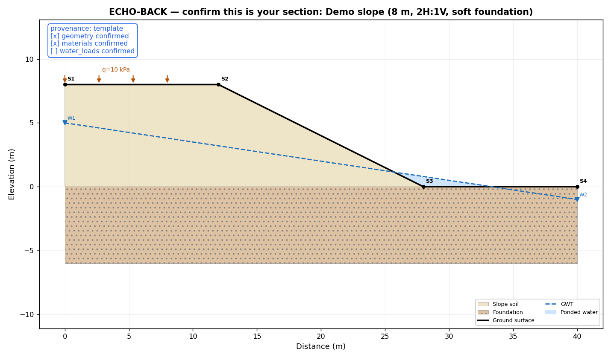

# MODEL-SETUP walkthrough — staged, human-gated (scripted offline demo)

Generated by `geo_project/demo_model_setup.py` with a SCRIPTED fake model (no API calls). It demonstrates the design inversion: the agent never claims to have read geometry correctly — it echoes back a rendered cross-section and the human confirms visually before anything advances. Note the deliberately premature `project_run` in turn 1: the gate refuses it.

## Echo-back artifacts

Geometry stage:



After water/loads (GWT, ponded toe, surcharge):



## Turn 1 — geometry stage (and a refused early run)

**User:** Set up an 8 m high 2H:1V sand slope on 6 m of soft clay, water table partway up, traffic at the crest, and run a Bishop search with reliability.

`agent -> project_new({"template": "simple_slope", "params": {"H": 8.0, "slope_ratio": 2.0, "foundation_depth": 6.0}, "name": "Demo slope (8 m, 2H:1V, soft foundation)"})`

<details><summary>project_new result</summary>

```json
{
  "status": "created",
  "summary": {
    "name": "Demo slope (8 m, 2H:1V, soft foundation)",
    "provenance": "template",
    "n_surface_points": 4,
    "x_range": [
      0.0,
      40.0
    ],
    "layers": [
      {
        "name": "Slope soil",
        "top": 8.0,
        "bottom": 0.0,
        "strength_model": "mohr_coulomb"
      },
      {
        "name": "Foundation",
        "top": 0.0,
        "bottom": -6.0,
        "strength_model": "mohr_coulomb"
      }
    ],
    "has_gwt": false,
    "n_surcharges": 0,
    "kh": 0.0,
    "reinforcement": {
      "nails": 0,
      "anchors": 0,
      "geosynthetics": 0
    },
    "analyses": [],
    "confirmations": {
      "geometry": false,
      "materials": false,
      "water_loads": false
    },
    "n_assumptions": 2
  },
  "validation": {
    "ok": true,
    "n_errors": 0,
    "n_warnings": 0,
    "issues": []
  },
  "next": "
  ... (truncated)
```
</details>

`agent -> project_run({})`

<details><summary>project_run result</summary>

```json
{
  "status": "refused",
  "error": "UNCONFIRMED STAGES \u2014 project_run is gated on human confirmation of every stage.",
  "missing_confirmations": [
    "geometry",
    "materials",
    "water_loads"
  ],
  "directive": "Walk the remaining stage(s): render the echo-back, request_confirmation, and only then run."
}
```
</details>

`agent -> project_render({"filename": "model_setup_echo_back_geometry.png"})`

<details><summary>project_render result</summary>

```json
{
  "status": "rendered",
  "image_path": "docs\\examples\\model_setup_echo_back_geometry.png",
  "vertex_table": "PROVENANCE: template\n\nGround surface (S#: x, z [m]):\n  S1: (0, 8)\n  S2: (12, 8)\n  S3: (28, 0)\n  S4: (40, 0)\nLayers (top -> bottom):\n  1. Slope soil: top 8 m, bottom 0 m\n  2. Foundation: top 0 m, bottom -6 m\nWater: none defined",
  "note": "Show the image (and vertex table) to the user; they confirm VISUALLY. Numbers\u2192image is checkable; image\u2192numbers is never trusted."
}
```
</details>

`agent -> request_confirmation({"stage": "geometry", "summary_markdown": "8 m high slope at 2H:1V over a 6 m foundation layer (template geometry \u2014 crest z=8, toe z=0, section bottom z=-6). Please verify the echo-back PNG and v...})`

<details><summary>request_confirmation result</summary>

```json
{
  "status": "needs_user",
  "stage": "geometry",
  "chat_text": "=== CONFIRMATION REQUIRED: geometry stage ===\n8 m high slope at 2H:1V over a 6 m foundation layer (template geometry \u2014 crest z=8, toe z=0, section bottom z=-6). Please verify the echo-back PNG and vertex table.\n[Echo-back rendering: docs\\examples\\model_setup_echo_back_geometry.png \u2014 open it and verify the section visually]\nPROVENANCE: template\n\nGround surface (S#: x, z [m]):\n  S1: (0, 8)\n  S2: (12, 8)\n  S3: (28, 0)\n  S4: (40, 0)\nLayers (top -> bottom):\n  1. Slope soil: top 8 m, bottom 0 m\n  2. Foundation: top 0 m, bottom -6 m\nWater: none defined\nAssumptions taken so far (confirm or correct):\n  - stratigraphy[Slope soil].material.gamma: 18.0 [placeholder default \u2014 set real unit weight at the materials stage]\n  - stratigraphy[Foundation].material.gamma: 18.0 [placeholder default \u2014 set r
  ... (truncated)
```
</details>

**Agent:** I have set up the section from the template and rendered the echo-back. Please open the PNG, check it against your intent, and confirm the geometry stage (see the numbered questions above).


## Turn 2 — gates: geometry -> materials (edit applied) -> water/loads -> plan -> run

**User:** Geometry approved — looks exactly right. For the materials: phi 32 is fine, but use cu = 55 kPa for the clay (CIU triaxial average), not 60.

`agent -> request_confirmation({"stage": "geometry", "summary_markdown": "Geometry as rendered.", "user_response": {"approved": true, "edits": {}}})`

<details><summary>request_confirmation result</summary>

```json
{
  "status": "confirmed",
  "stage": "geometry",
  "approved": true,
  "edits_applied": [],
  "edits_failed": [],
  "confirmations": {
    "geometry": true,
    "materials": false,
    "water_loads": false
  },
  "validation": {
    "ok": true,
    "n_errors": 0,
    "n_warnings": 0,
    "issues": []
  },
  "note": ""
}
```
</details>

`agent -> cov_lookup({"property": "phi", "soil_type": "sand"})`

<details><summary>cov_lookup result</summary>

```json
{
  "property": "phi",
  "n_rows": 2,
  "rows": [
    {
      "property": "phi",
      "label": "Effective stress friction angle",
      "cov_min_pct": 2,
      "cov_max_pct": 13,
      "cov_mean_pct": null,
      "category": "inherent",
      "soil_type": null,
      "test": null,
      "source": "Duncan (2000) Table 1 [Harr 1984; Kulhawy 1992]"
    },
    {
      "property": "phi",
      "label": "Friction angle (sand)",
      "cov_min_pct": 4.2,
      "cov_max_pct": 12.5,
      "cov_mean_pct": 7.9,
      "category": "site_specific",
      "soil_type": "sand",
      "test": null,
      "source": "ISSMGE-TC304 (2021) Table 1.3 (sand, site-specific)"
    }
  ],
  "note": "COV values are PERCENT \u2014 divide by 100 for the Project's probabilistic.cov fraction. Cite the row's source in the assumption ledger."
}
```
</details>

`agent -> project_patch({"path": "stratigraphy[0].material.phi", "value": 32.0})`

`agent -> project_patch({"path": "stratigraphy[0].material.c_prime", "value": 0.0})`

`agent -> project_patch({"path": "stratigraphy[0].material.gamma", "value": 19.0})`

`agent -> project_patch({"path": "stratigraphy[0].material.probabilistic.phi", "value": {"cov": 0.079, "dist": "lognormal", "source": "ISSMGE-TC304 (2021) Table 1.3 (sand, site-specific), mean COV"}})`

`agent -> project_patch({"path": "stratigraphy[1].material.strength_model", "value": "undrained"})`

`agent -> project_patch({"path": "stratigraphy[1].material.cu", "value": 60.0})`

`agent -> project_patch({"path": "stratigraphy[1].material.gamma", "value": 17.5})`

<details><summary>project_patch result</summary>

```json
{
  "status": "patched",
  "path": "stratigraphy[0].material.phi",
  "op": "set",
  "confirmation_reset": null,
  "confirmations": {
    "geometry": true,
    "materials": false,
    "water_loads": false
  },
  "validation": {
    "ok": true,
    "n_errors": 0,
    "n_warnings": 0,
    "issues": []
  }
}
```
</details>

<details><summary>project_patch result</summary>

```json
{
  "status": "patched",
  "path": "stratigraphy[0].material.c_prime",
  "op": "set",
  "confirmation_reset": null,
  "confirmations": {
    "geometry": true,
    "materials": false,
    "water_loads": false
  },
  "validation": {
    "ok": true,
    "n_errors": 0,
    "n_warnings": 0,
    "issues": []
  }
}
```
</details>

<details><summary>project_patch result</summary>

```json
{
  "status": "patched",
  "path": "stratigraphy[0].material.gamma",
  "op": "set",
  "confirmation_reset": null,
  "confirmations": {
    "geometry": true,
    "materials": false,
    "water_loads": false
  },
  "validation": {
    "ok": true,
    "n_errors": 0,
    "n_warnings": 0,
    "issues": []
  }
}
```
</details>

<details><summary>project_patch result</summary>

```json
{
  "status": "patched",
  "path": "stratigraphy[0].material.probabilistic.phi",
  "op": "set",
  "confirmation_reset": null,
  "confirmations": {
    "geometry": true,
    "materials": false,
    "water_loads": false
  },
  "validation": {
    "ok": true,
    "n_errors": 0,
    "n_warnings": 0,
    "issues": []
  }
}
```
</details>

<details><summary>project_patch result</summary>

```json
{
  "status": "patched",
  "path": "stratigraphy[1].material.strength_model",
  "op": "set",
  "confirmation_reset": null,
  "confirmations": {
    "geometry": true,
    "materials": false,
    "water_loads": false
  },
  "validation": {
    "ok": true,
    "n_errors": 0,
    "n_warnings": 0,
    "issues": []
  }
}
```
</details>

<details><summary>project_patch result</summary>

```json
{
  "status": "patched",
  "path": "stratigraphy[1].material.cu",
  "op": "set",
  "confirmation_reset": null,
  "confirmations": {
    "geometry": true,
    "materials": false,
    "water_loads": false
  },
  "validation": {
    "ok": true,
    "n_errors": 0,
    "n_warnings": 0,
    "issues": []
  }
}
```
</details>

<details><summary>project_patch result</summary>

```json
{
  "status": "patched",
  "path": "stratigraphy[1].material.gamma",
  "op": "set",
  "confirmation_reset": null,
  "confirmations": {
    "geometry": true,
    "materials": false,
    "water_loads": false
  },
  "validation": {
    "ok": true,
    "n_errors": 0,
    "n_warnings": 0,
    "issues": []
  }
}
```
</details>

`agent -> request_confirmation({"stage": "materials", "summary_markdown": "Slope soil: drained sand, phi=32 deg (ASSUMED \u2014 typical compacted granular fill; site-specific COV ~7.9% per ISSMGE-TC304 Table 1.3), c'=0, gamma=19. F...})`

<details><summary>request_confirmation result</summary>

```json
{
  "status": "confirmed",
  "stage": "materials",
  "approved": true,
  "edits_applied": [
    "stratigraphy[1].material.cu"
  ],
  "edits_failed": [],
  "confirmations": {
    "geometry": true,
    "materials": true,
    "water_loads": false
  },
  "validation": {
    "ok": true,
    "n_errors": 0,
    "n_warnings": 0,
    "issues": []
  },
  "note": ""
}
```
</details>

`agent -> project_patch({"path": "water.gwt_points", "value": [[0.0, 5.0], [40.0, -1.0]]})`

`agent -> project_patch({"path": "loads.surcharges", "op": "append", "value": {"q": 10.0, "x_start": 0.0, "x_end": 8.0, "label": "crest traffic"}})`

<details><summary>project_patch result</summary>

```json
{
  "status": "patched",
  "path": "water.gwt_points",
  "op": "set",
  "confirmation_reset": null,
  "confirmations": {
    "geometry": true,
    "materials": true,
    "water_loads": false
  },
  "validation": {
    "ok": true,
    "n_errors": 0,
    "n_warnings": 0,
    "issues": []
  }
}
```
</details>

<details><summary>project_patch result</summary>

```json
{
  "status": "patched",
  "path": "loads.surcharges",
  "op": "append",
  "confirmation_reset": null,
  "confirmations": {
    "geometry": true,
    "materials": true,
    "water_loads": false
  },
  "validation": {
    "ok": true,
    "n_errors": 0,
    "n_warnings": 0,
    "issues": []
  }
}
```
</details>

`agent -> project_render({"filename": "model_setup_echo_back_full.png"})`

<details><summary>project_render result</summary>

```json
{
  "status": "rendered",
  "image_path": "docs\\examples\\model_setup_echo_back_full.png",
  "vertex_table": "PROVENANCE: template\n\nGround surface (S#: x, z [m]):\n  S1: (0, 8)\n  S2: (12, 8)\n  S3: (28, 0)\n  S4: (40, 0)\nLayers (top -> bottom):\n  1. Slope soil: top 8 m, bottom 0 m\n  2. Foundation: top 0 m, bottom -6 m\nGWT (W#: x, z [m]):\n  W1: (0, 5)\n  W2: (40, -1)\nSurcharges:\n  Q1: 10 kPa over x = 0 to 8 m (crest traffic)",
  "note": "Show the image (and vertex table) to the user; they confirm VISUALLY. Numbers\u2192image is checkable; image\u2192numbers is never trusted."
}
```
</details>

`agent -> request_confirmation({"stage": "water_loads", "summary_markdown": "GWT from z=5 at the crest to z=-1 beyond the toe (dashed blue on the render); 10 kPa traffic surcharge over the crest 8 m; kh=0 (static). No reinforcement...})`

<details><summary>request_confirmation result</summary>

```json
{
  "status": "confirmed",
  "stage": "water_loads",
  "approved": true,
  "edits_applied": [],
  "edits_failed": [],
  "confirmations": {
    "geometry": true,
    "materials": true,
    "water_loads": true
  },
  "validation": {
    "ok": true,
    "n_errors": 0,
    "n_warnings": 0,
    "issues": []
  },
  "note": ""
}
```
</details>

`agent -> project_patch({"path": "analyses", "op": "append", "value": {"type": "le", "name": "LE-bishop", "method": "bishop", "n_slices": 30, "search": {"nx": 6, "ny": 6}, "probabilistic": {"kind": "fosm"}}})`

<details><summary>project_patch result</summary>

```json
{
  "status": "patched",
  "path": "analyses",
  "op": "append",
  "confirmation_reset": null,
  "confirmations": {
    "geometry": true,
    "materials": true,
    "water_loads": true
  },
  "validation": {
    "ok": true,
    "n_errors": 0,
    "n_warnings": 0,
    "issues": []
  }
}
```
</details>

`agent -> request_confirmation({"stage": "analysis_plan", "summary_markdown": "Plan: Bishop circular search (6x6 center grid, 30 slices) + FOSM reliability using the cited phi COV (7.9%, lognormal).", "user_response": {"approved": ...})`

<details><summary>request_confirmation result</summary>

```json
{
  "status": "confirmed",
  "stage": "analysis_plan",
  "approved": true,
  "edits_applied": [],
  "edits_failed": [],
  "confirmations": {
    "geometry": true,
    "materials": true,
    "water_loads": true
  },
  "validation": {
    "ok": true,
    "n_errors": 0,
    "n_warnings": 0,
    "issues": []
  },
  "note": ""
}
```
</details>

`agent -> project_run({})`

<details><summary>project_run result</summary>

```json
{
  "status": "complete",
  "results": {
    "LE-bishop": {
      "type": "le",
      "method": "bishop",
      "FOS": 1.3001863326868468,
      "n_surfaces_evaluated": 36,
      "critical": {
        "xc": 24.0,
        "yc": 12.0,
        "radius": 11.997941944032014,
        "x_entry": 12.847343511142101,
        "x_exit": 27.152655775803524
      },
      "probabilistic": {
        "kind": "fosm",
        "fos_mlv": 1.3001863326868468,
        "sigma_f": 0.12783284814324325,
        "cov_f": 0.09831886778803121,
        "beta_normal": 2.3482722715406656,
        "beta_lognormal": 2.6273544654112,
        "pf_normal": 0.009430364320273554,
        "pf_lognormal": 0.004302582133955013,
        "variables": {
          "phi:Slope soil": {
            "cov": 0.079,
            "dist": "lognormal"
          }
        }
      }
    }
  }
}
```
</details>

**Agent:** All three stage gates were human-confirmed, validation is clean, and the run is complete — the Bishop FOS and FOSM reliability are in the result above. The full assumption ledger (template defaults, assumed phi with its TC304 citation) is recorded on the project document.


## Outcome

- Bishop critical-circle FOS: **1.300**
- FOSM: beta_LN = 2.63, pf(lognormal) = 0.43% (phi COV 7.9%, ISSMGE-TC304 Table 1.3, cited in the assumption ledger)
- Confirmation gates at run time: {'geometry': True, 'materials': True, 'water_loads': True}
- Clay cu after the user's approve-with-edit: 55.0 kPa
- Assumption ledger entries: `stratigraphy[Slope soil].material.gamma` = 18.0 [placeholder default — set real unit weight at the materials stage]; `stratigraphy[Foundation].material.gamma` = 18.0 [placeholder default — set real unit weight at the materials stage]; `analyses` = analysis plan approved by user [request_confirmation(analysis_plan)]

Tool-call ordering enforced end-to-end (store history): project_new: Demo slope (8 m, 2H:1V, soft foundation) -> project_render: docs\examples\model_setup_echo_back_geometry.png -> request_confirmation: geometry -> approved -> project_patch: set stratigraphy[0].material.phi -> project_patch: set stratigraphy[0].material.c_prime -> project_patch: set stratigraphy[0].material.gamma -> project_patch: set stratigraphy[1].material.strength_model -> project_patch: set stratigraphy[0].material.probabilistic.phi -> project_patch: set stratigraphy[1].material.cu -> project_patch: set stratigraphy[1].material.gamma -> request_confirmation: materials -> approved (with edits) -> project_patch: set water.gwt_points -> project_patch: append loads.surcharges -> project_render: docs\examples\model_setup_echo_back_full.png -> request_confirmation: water_loads -> approved -> project_patch: append analyses -> request_confirmation: analysis_plan -> approved -> project_run: executed
