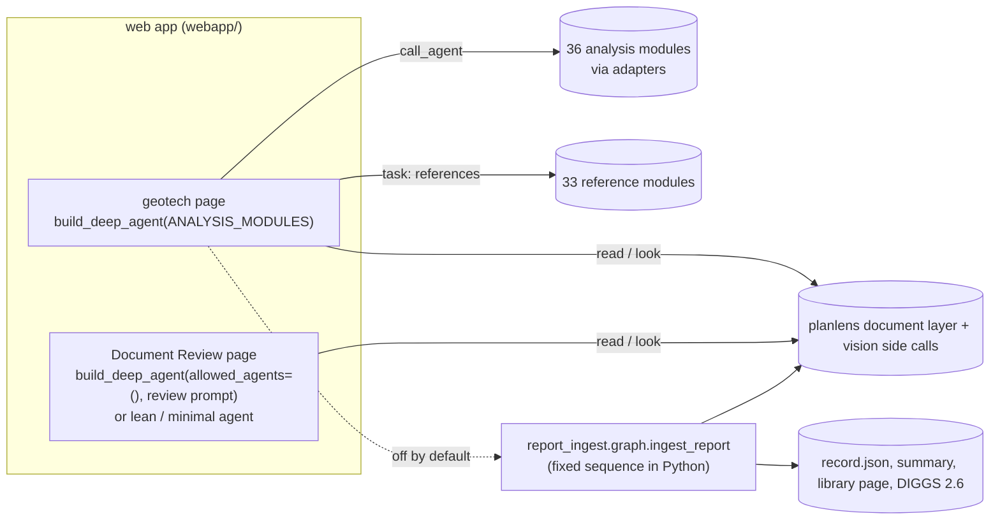

# How the AI harnesses work — theory of operation

This folder describes, from the code and from recorded runs, how the
project's AI harnesses actually work: who decides what happens next, what the
model is shown, what is fixed in code, how data flows, how runs fail and why.
It is written for the owner — an engineer, not a software developer — as a
lasting reference to build future work on. Opinions on what should change are
kept in a short "Observations" section at the end of each document; the body
is description.

Written 2026-10-04 against GeotechStaffEngineer commit `1085ddb` (branch
`release/5.32.0`, the 5.32.0 release commit; `funhouse_agent/` and `webapp/`
are identical to `23d7e33`, where reading began) and planlens commit
`999f82c` (branch `release/0.11.0`).
The recorded runs used released **5.31.0** (geotech evaluation, report
ingest) and pre-releases **5.32.0rc2/rc3** with planlens 0.11.0rc2 (Document
Review suite). Where the code has changed since those runs in a way that
matters, the documents say so.

---

## The three harnesses, and how they relate

| | GeotechStaffEngineer agent | Document Review agent | Report-ingest pipeline |
|---|---|---|---|
| What it does | Answers geotechnical questions by running the package's analysis modules and consulting the design references | Answers questions about any uploaded PDF by reading its text and looking at its pages; writes memos and marked-up PDFs | Turns one geotechnical report PDF into a structured, cited record and its exports (summary, library page, DIGGS 2.6 XML) |
| Who decides the next step | **the model** (tool-calling loop) | **the model** (tool-calling loop) | **Python** (a fixed sequence); models are called for bounded jobs inside it |
| Built on | deepagents / LangChain `build_deep_agent` | the same builder (default), or a lean/minimal LangChain agent behind a switch | its own engine layer (`report_ingest/engine.py`), planlens, no agent framework |
| Where it runs | web app, geotech page | web app, Document Review page (the default page) | notebook cell `score_on_cluster`, or as a sub-agent of the geotech agent (off by default) |
| Its evaluation | `funhouse_agent/deep/eval_harness.py` (106 questions) | `funhouse_agent/review_eval/` (37 tasks, switchable arms) | `report_ingest/cluster_scoring.py` (stages against hand truth) |
| Recorded evidence | `b2all/geotech_eval/` | `brief3/out_sol_532/` + `module_work/review_eval_results/` | `b2all/stage_b…e/` |
| Document | `geotech_agent.md` | `document_review.md` | `report_ingest.md` |

The two agents share almost all of their machinery — the builder, the
tool-result caps, the vision tools and their "side call", the planlens
document tools, the web app's turn handling — described once in
`shared_machinery.md`. In its default form the Document Review agent **is**
the geotechnical agent with the analysis modules taken away and the prompt
replaced.

The report-ingest pipeline is a different kind of thing: a deterministic
program that calls models, not a model that calls programs. It touches the
agents in two places only: it can be attached to the geotech agent as a
sub-agent with no model of its own (`report_ingest/subagent.py`), and a
second small agent (`report_library`, `report_ingest/library_agent.py`)
answers questions across reports already ingested. Both are off by default.

---

## Reading guide

1. **`shared_machinery.md`** — read first. The tool-calling loop, what a
   model call contains, what persists between calls and between turns, the
   result-size caps, model-call budgets and step caps, and the "eyes": how a
   page becomes an image, how big, and why the reasoning model usually never
   sees it.
2. **`document_review.md`** — the Document Review page: its three agent
   builds, its prompt and tools, the evaluation suite, and the eight failure
   modes visible in the brief-3 traces.
3. **`geotech_agent.md`** — the geotechnical agent: catalog, dispatch,
   sub-agents, and the eight failure modes visible in the 106-question run.
4. **`report_ingest.md`** — the pipeline: stage sequence, every kind of model
   call and what it is shown, the floor-and-model merge, the writers, the
   scoring harness, and what the recorded stages show.

Each harness document has the same sections: boundaries; what the model is
shown; control loop; deterministic versus model; data path; failure modes
with mechanisms and evidence; invariants; open questions; observations.

---

## How the evidence was used

* **Code** is cited as `path:line` in this repository at `1085ddb` unless a
  version is named (`v5.31.0:` for what ran in brief 2). planlens is cited as `planlens/...` in its own repository.
* **Recorded runs** are kept in
  `module_work/field_feedback/2026-10-04_foundry_evidence/raw/` (gitignored:
  they hold values read out of the client reports, so they are local only and
  never committed): `b2all/` (brief 2: 5.31.0 report ingest stages b–e and
  the geotech evaluation) and `brief3/` (5.32 Document Review suite). Paths
  in the documents are relative to that folder. The committed copies of the
  result TABLES are in `module_work/review_eval_results/`; the traces are not
  committed.
* **Sampling** is stated in each document. In short: for the two agents,
  every failed task or keyed question was read in full and selected passing
  runs were read for contrast; for report ingest, the stage tables, every
  per-report run and QA file (by counts) and selected item files were read;
  everything countable (tool calls, model calls, tokens, zoom outcomes, QA
  kinds) was counted by script over all runs.
* **Prompts as the model sees them** were rendered offline by building each
  agent around a recording fake model (no network) and capturing its first
  request; sizes quoted are from that render on the local install (deepagents
  0.6.8), which differs in detail from the Foundry install (0.7.13).
* **Hard rules followed**: no content from client reports (reports are named
  R09, R21…; measurements are counts and rates), no hostnames, dataset paths
  or credentials (several log files contain them), nothing from any `raw/`
  folder, tokens and seconds rather than dollars.

---

## Glossary

| Term | Meaning here |
|---|---|
| **agent / harness** | A model plus the code around it that decides what it sees, what it may call, and when it stops. |
| **model call** | One request to the language model: system prompt + messages + tool schemas in, text and/or tool calls out. |
| **tool** | A Python function the model may ask to run, described to it by a name, a description and a parameter schema. Its result comes back as text. |
| **turn** | Everything between a user message and the answer: usually several model calls and tool calls. |
| **sub-agent** | A second agent the primary hands a self-contained job to through the `task` tool; it sees only the job description and returns one message. |
| **side call** | A one-shot model call made INSIDE a vision tool: one image + one prompt, no conversation. Its text is the tool's result. |
| **inline image** | The alternative to a side call (switch-gated): the image is put in front of the reasoning model itself at its next call. |
| **budget** | A limit on model calls that ends gracefully (the last call must answer). |
| **step cap / recursion limit** | LangGraph's limit on graph steps; hitting it raises an error. |
| **floor** | In report ingest: what the deterministic reader (log grid, lab tables, calc patterns) found before any model call; the model may add and correct with evidence, never drop. |
| **arm** | In the review suite: a named set of switches, run over the same tasks for comparison. |
| **brief 2 / brief 3** | The two recorded Foundry campaigns (5.31.0; 5.32.0rc2/rc3). |
| **0-based / viewer page** | Tools count pages from 0; a PDF viewer and every citation count from 1. |

---

## The central picture, in one paragraph

All three harnesses rest on the same division of labour — let code do what
code can do exactly (text extraction, page classification by rules,
arithmetic, units, file writing, result-size discipline) and ask a model only
for judgement — but they draw the line in different places. In the two agents
the MODEL holds the plan: it chooses modules, pages, prompts and when to stop,
and code only shapes what it can see and caps what it may spend. In report
ingest CODE holds the plan, and models fill bounded slots under a rule that
keeps the deterministic reading as a floor. The recorded failures cluster at
boundaries where information has to cross from one model call to another, or
between a model and code: a location carried as 0-999 numbers in prose from a
vision side call to the reasoning model; a capability that exists in code but
not in the one-line catalog the model reads; a "verification" done by the same
model on the same image that made the claim; a checker the agent learns to
satisfy rather than the task; a structured answer that does not fit its
output limit; a label policy measured on one set of reports and applied to
another; and scorers that measured a different slot from the one the product
filled. Each harness document traces these to the lines of code involved.

---

## The findings that matter most for future work

1. **The vision side-call boundary** (`shared_machinery.md` §5.1,
   `document_review.md` F1-F3). The reasoning model never sees a page by
   default; it reads another call's prose, and every location it acts on is a
   number it copied out of that prose. About a third of zooms built that way
   missed their target; a look-alike read once was "verified" by the same
   reader; and a model-judged markup check was satisfied by widening rings.
2. **The catalog is the agent's whole map** (`geotech_agent.md` G1-G3). Three
   of six keyed failures in the 106-question run were capabilities that
   exist but are named in no catalog or method brief the model reads; when
   the model gives up looking it computes by hand, against its own prompt.
3. **Measurement is the weak link in report ingest** (`report_ingest.md`
   P1-P3, P7). One structured answer that overflowed its token limit failed a
   whole report; the default label policy lowered accuracy on the reports it
   was run on; the largest apparent reader losses were scorer faults; two
   readers have no blind test at all.
