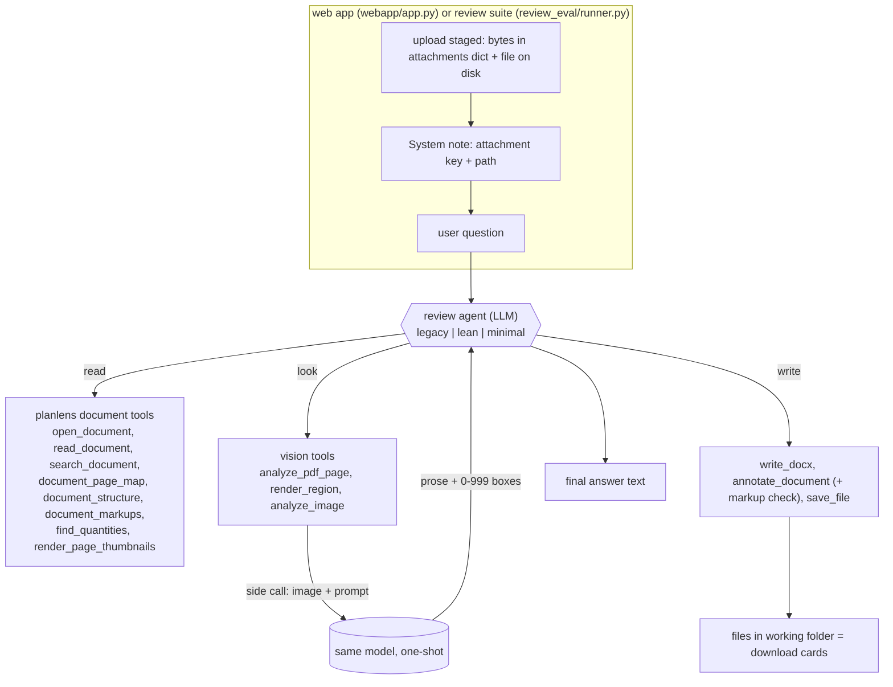

# Document Review harness: theory of operation

The Document Review page is an LLM agent that answers questions about an
uploaded PDF (a drawing set, a specification, a report, a calculation package)
by **reading** its text layer and **looking** at its pages, and that can hand
back a Word memo or a marked-up copy of the PDF. It runs in the same web app,
on the same agent loop, as the geotechnical agent; read `shared_machinery.md`
first for the loop, the limits and the vision path.

Evidence: the recorded Foundry runs of the review suite on 5.32.0rc2/rc3 with
GPT-5.6 Sol at full resolution (`brief3/out_sol_532/`, 37 tasks × 3 arms plus
repeats and a resolution arm; every run has a full event trace
`runs/<arm>/<task>/activity.jsonl` and a `run.json`), and the earlier 5.31.0
result tables (`module_work/review_eval_results/2026-10-02_foundry_5.31.0/`,
tables only, no traces). Paths below that start `brief3/` are under the
local evidence folder named in the README
(`module_work/field_feedback/2026-10-04_foundry_evidence/raw/`).

---

## 1. What it is, in one picture

The model decides which pages to read or look at, in what order, with what
prompt, and when it is done. Code decides what each tool returns, how large it
may be, what the vision side call is told, and (in the lean and minimal
builds) how many model calls a request may use.

---

## 2. Boundaries: three agents behind one page

The page profile is `DOCUMENT_REVIEW` (`webapp/profiles.py:195-224`). It
passes `allowed_agents=()`, `reference_mode="off"`, no calc sub-agent, the
review system prompt, and `review_page=True` to `build_deep_agent`. What is
built then depends on one environment switch, read at build time
(`funhouse_agent/review_flags.py:112-121`; `deep/agent.py:934-954`):

| `GEOTECH_REVIEW_AGENT` | Agent | Built by | Suite arm(s) |
|---|---|---|---|
| unset (default; **what users get**) | the geotech deepagents builder minus the modules ("legacy") | `deep/agent.py:956-1203` | `baseline`, `baseline_high` |
| `lean` | a hand-chosen `create_agent` with review tools only, a `page_reader` helper, a 40-call budget | `deep/review_agent.py:293-417` | `lean`, `grounded`, `inline`, `sweep`, `overview`, `geometry`, `digest` |
| `minimal` | a looking-only agent: page/zoom tools shown inline, `page_count`, a `page_looker` helper, two output tools | `deep/minimal_agent.py:232-285` | `minimal` |

Further switches (all OFF by default) add behaviour to the lean agent only:
`GEOTECH_VISION_TEXT_CONTEXT`, `GEOTECH_VISION_STRUCTURED`,
`GEOTECH_VISION_INLINE`, `GEOTECH_REVIEW_SWEEP`, `GEOTECH_REVIEW_FINDINGS`,
`GEOTECH_REVIEW_OVERVIEW`, `GEOTECH_REVIEW_GEOMETRY`, `GEOTECH_REVIEW_DIGEST`
(`review_flags.py:14-67`). An **arm** is a named set of switches
(`review_flags.py:177-195`); `sweep` = lean + text context + structured
locations + `sweep_pages`.

The page also does one thing no other page does: after an upload it sends an
automatic **orientation turn** in the user's name ("give me a short
orientation … do not review it yet", `profiles.py:37-46`), except when the
upload is only images in a conversation already under way
(`profiles.py:103-121`). The recorded suite runs did NOT send it
(`runner.py:178-180`, `orientation=False` by default).

---

## 3. What the model is shown

### 3.1 System prompt

The legacy agent's prompt is `DOCUMENT_REVIEW_PROMPT`
(`funhouse_agent/deep/prompt.py:273-411`) followed by deepagents' generic
sections (planning, scratch filesystem, "Large Tool Results", the `task`
spawner with "Whenever possible, parallelize…"); rendered locally it is
15,304 characters (`shared_machinery.md` §2.1). Its own rules, in order:

1. open every PDF with `open_document` first (page map, structure, markups);
2. decide which pages the question covers, then LOOK at every one of them;
   contact sheets are for finding your way, never for skipping pages, "and
   cost is never a reason to look at fewer pages";
3. text tools are supporting evidence, never a filter; a search miss never
   takes a page off the list;
4. say what you covered; "not found" means not found in what you examined;
5. on CAD sheets the words are often in the text layer; never call a PDF too
   blurry before zooming;
6. say how an ambiguous request was read;
7. cite as the reader counts: sheet number, else printed page, else PDF page
   = tool page + 1;
8. deliverables as files: `write_docx` or `annotate_document`, each mark
   anchored by a quote or by the `view` + `image_box` of the look that found
   it, "never by a location from memory"; fix any mark the check reports
   misplaced;
9. you are not the designer of record; no calculation tools on this page.

The lean prompt is the same text without the scratch-filesystem paragraph and
without deepagents' sections, plus a short `write_todos` note — 8,164
characters. The minimal prompt is 1,637 characters of its own
(`minimal_agent.py:45-71`): read by LOOKING, zoom before calling anything
unreadable, split long sets among helpers, cite tool page + 1.

### 3.2 Tools

| Tool group | Legacy | Lean (`sweep`) | Minimal |
|---|---|---|---|
| deepagents scratch FS (`ls`, `read_file`, `write_file`, `edit_file`, `glob`, `grep`) | yes | — | — |
| `write_todos` | yes (4,377-char schema) | yes (590) | — |
| `task` | deepagents `general-purpose` (7,570) | `page_reader` (803) | `page_looker` (574) |
| planlens reading tools (8) + `annotate_document` | yes | yes | `annotate_document` only, wrapped as `mark_up` |
| `analyze_pdf_page`, `render_region`, `analyze_image` | side call | side call (inline with the switch) | inline |
| `find_like` | yes where OpenCV loads | same | — |
| `read_pdf_text`, `read_text_file`, `list_files`, `save_file`, `write_docx` | yes | yes (no `read_pdf_text`) | `write_docx` only |
| geotech-only `read_reference_figure`, `view_worked_example_source` | **yes** (inherited, cannot work here) | — | — |
| `sweep_pages` | — | yes | — |
| `page_count` | — | — | yes |

Descriptions: the legacy agent sees the geotech page's descriptions — the
core look tool `analyze_pdf_page` has one line, "Render a PDF page and
analyze it using vision." (`deep/tools.py:1151-1153`), and the `render_region`
one tells it to get coordinates "from the `drawing_ir` module first", a tool
this page does not have (`deep/tools.py:1161-1172`);
lean and minimal replace those with page-specific text
(`review_agent.py:80-156`; `minimal_agent.py:83-116`). `find_like` was hidden
on Foundry because OpenCV aborts the process there (`brief3/README.txt`;
`deep/tools.py:158-177`). *Since 2026-10-07 (unreleased):* a numpy matcher
runs it where OpenCV cannot load (planlens `d7d6657`, app `ba12760`).

### 3.3 Tool results (what comes back)

* **planlens reading tools** (`funhouse_agent/document_tools.py:235-265`)
  return compact JSON budgeted by planlens itself and paged with `next`
  cursors. `open_document` gives a handle, page counts by kind, `pages_to_view`,
  and `duplicate_pages`. Results that describe a picture-like page carry a
  `! look:` line naming the app's vision tools (`document_tools.py:79-90`).
* **vision tools**, in the side-call mode, return the side call's prose
  (typically 0.8–1.2 thousand characters for a whole page in brief 3) plus the
  view payload (`shared_machinery.md` §5.1). In the inline mode they return an
  `image_id` and a note; the image itself is shown at the next call, if it is
  among the newest two (§5.3 there).
* **`annotate_document`** writes the marks onto a copy, then (`check=True`,
  the default) renders a crop of the MARKED copy round each mark placed by a
  box or point and asks a side call whether the red mark encloses what its
  label or comment names; the result gains a `check` block with
  `confirmed`, `misplaced` (what was actually seen) and a note "Do not hand
  the file over as it is" (`deep/tools.py:1025-1062`;
  `funhouse_agent/markup_check.py:1-18, 124-221`). Marks anchored by a quote
  are not checked (the text layer anchors them exactly).
* **`sweep_pages`** (sweep arm) sends the same question about each page, in
  parallel (6 workers, ≤ 60 pages a call), to a TEXT call (the page's first
  12,000 characters of text) or a LOOK call (drawing, figure, scan, form, or
  < 40 characters of text), asks for a JSON verdict per page, and returns the
  relevant pages with page boxes, the pages with nothing found, and the unsure
  ones (`funhouse_agent/deep/sweep.py:24-180`).

---

## 4. Control loop

### 4.1 Who decides

Everything about coverage is the model's choice. Nothing in code enumerates
the pages in scope or checks that each was looked at; the prompt asks for it
(rule 2 above) and the answer's "I visually inspected all 24 sheets" is the
model's own claim. The exceptions are `sweep_pages`, which enumerates pages in
code once called, and the markup check, which looks at every geometric mark.

### 4.2 State during a turn

* the message list (prompt, user message, model replies, tool results);
* the planlens toolkit's open documents, by handle, process-wide
  (`document_tools.py:13-15, 224-233`);
* the attachments dict (bytes by key) and the working folder on disk
  (`webapp/core.py:493-552`; the suite points the working folder at the run
  folder, `runner.py:58-71, 168`);
* in the legacy agent, deepagents' scratch files and todo list (in graph
  state, lost at the end of the turn);
* in inline mode, the process-wide image store (96 images).

### 4.3 State across turns

Only the answer text (`shared_machinery.md` §3.3). The suite runs each
(arm, task) in a fresh conversation and, except for tasks with follow-ups, a
single turn (`runner.py:135-245`).

### 4.4 How a turn ends

| Agent | Normal end | Bound |
|---|---|---|
| legacy | the model replies without tool calls | step cap 50 per turn → `GraphRecursionError` (scored as empty answer, "step cap") |
| lean / minimal | same | 40 model calls → forced final answer without tools; step cap raised to 350 so the budget binds first |
| `page_reader` / `page_looker` | the helper's last text | 14 model calls → forced "return what you have" |

No step cap or budget fired in brief 3: the RESULTS tables show 0 errors and
0 step caps in every arm (`brief3/out_sol_532/RESULTS_main.md`,
`RESULTS_repeats.md`). The minimal arm's HELPERS did hit their 14-call budget:
their returned text says "Could not conclusively check reader pages 3-5
before the review limit" (`brief3/out_sol_532/runs/minimal/set-3600-psi/activity.jsonl`,
`task` results).

---

## 5. Deterministic versus model

| Decided in code | Left to the model |
|---|---|
| page kind (text, drawing_sheet, form, figure, scanned…), page map, structure, printed numbers, duplicates — planlens rules | which pages are in scope; which to read, search, look at, zoom |
| text extraction, located lines with boxes, tables, markup records, unit-bearing quantities — planlens | what to ask each look (the side call answers only that prompt) |
| image size and detail (budget, probe), tiling trigger | whether a side call's claim is believed or verified |
| conversion of `view` + 0–999 `image_box` to PDF points (`vision_view.image_box_to_page`) | which numbers to copy into `image_box` |
| where a mark goes once its box is given; whether the check confirms it (a side call) | where the box is; whether to redo misplaced marks |
| result caps, budgets, step caps | when the answer is complete; what the answer claims was covered |
| `sweep_pages`: which pages are read as text vs looked at; per-page JSON parse | the question asked of every page; what to do with "unsure" pages |

---

## 6. What actually happened in the recorded runs

### 6.1 How the sample was chosen

All 37 tasks were run under `baseline`, `sweep` and `minimal`; the two new
tasks (`set-long-rare-tag`, `produce-circle-tags`) three times per arm; 17
drawing tasks under `baseline_high`. I read in full: the failed runs
`baseline_r2/produce-circle-tags`, `sweep_r3/set-long-rare-tag` and
`minimal/set-3600-psi`; the passing runs `baseline/set-long-rare-tag` and
`baseline/produce-circle-tags`; the answers and check details of all ten runs
of `set-long-rare-tag`; and the first page look of one `sweep` single-sheet
run. The other `minimal` miss is taken from the run notes, not read. Counts across all runs come from a script over every
`activity.jsonl` (model calls by `n_messages`, tool counts, input tokens), and
zoom outcomes from a regular expression over every `render_region` answer,
spot-checked by reading twelve flagged answers.

### 6.2 Overall shape of a legacy turn (`baseline`)

Typical of 37 runs: `open_document` → (`write_todos`) → a burst of
`analyze_pdf_page` calls issued **in one model step** (12 in parallel in
`baseline/set-long-rare-tag`, t = 12 s and again at t = 52 s) → `render_region`
zooms on what the side calls reported → answer. Across the 37 `baseline`
runs: median 4 primary model calls per run (max 14), 335 vision side calls,
tool calls led by `analyze_pdf_page` 120, `render_region` 84,
`search_document` 39, `open_document` 37, `read_document` 28. The legacy agent
**never used `task`** in 37 runs, and never used the scratch filesystem.
Input tokens over the 35 original tasks: 4.53 M (`RESULTS_main.md`).

### 6.3 Failure modes, with mechanisms

**F1. Locations are lost crossing the side-call boundary.** The reasoning model
learns where something is only from 0–999 numbers the side call writes in
prose about a whole-page image. On an 11×17 sheet one grid unit is about
1.2 pt across; in the cases examined the side call's boxes were 15–20 pt off,
and a tight zoom made from them showed empty paper. In
`baseline/set-long-rare-tag` the first zooms on four reported callouts
(t = 85 s) came back "The image appears blank" / "No tag reading FPG is
visible" on three of four; the agent recovered by choosing wider boxes by
hand (t = 92 s), which found the tags 15–20 pt from the first boxes. The
passing `baseline/produce-circle-tags` run shows the same thing and the way
out: all seven first zooms on whole-page boxes came back blank or "cannot
verify" (t = 35–48 s); the agent then zoomed on 80 × 55 pt windows it chose
itself, took the tag boxes from THOSE zoomed images, and placed rings
19–22 pt wide that the check confirmed 7/7. Over all
four `baseline*` arms, 43 of 140 zooms given as `view` + `image_box` (31 %)
came back saying the target was not in the crop, blank or cut off; in the
three `sweep*` arms, where boxes arrive as PDF points (structured `located`
boxes and text-layer boxes), 9 of 98. (Regex count over the side-call answers;
spot-checks show most flagged cases are genuine off-target crops, a few are
honest "not here" verifications.) Mechanism:
`vision_view.py:241-281` and the grid instruction (`vision_view.py:93-100`)
leave box precision to the side call; nothing measures it.

**F2. A confident misread is accepted as verified.** Every sheet of the
24-sheet fixture carries three FBG callouts, some rotated 90°; the three FPG
callouts are never rotated (`planlens/testing/tag_fixtures.py:189-212`).
Page 19 has no FPG callout, only the look-alikes. **Eight of the ten recorded
answers to this task list page 19** — every `baseline`, `sweep` and
`baseline_high` run and `minimal_r3`; no run produced exactly {4, 12, 20}
(`runs/*/set-long-rare-tag/run.json`, `pages_listed` detail). In the traces the
side call reported "Exact rotated tag: FPG", read "character by character:
F-P-G", and the agent wrote "verified each listed tag"
(`baseline/set-long-rare-tag/activity.jsonl` t = 99 s;
`sweep_r3/set-long-rare-tag/activity.jsonl` t = 75 s). Mechanisms: the
confusable list in the grid instruction names `B/8` but not `B/P`
(`vision_view.py:93-100`); the "verification" zoom is another side call of the
same model on the same lettering, so it repeats the first read rather than
checking it; and the suite passes the answer — 3 of 4 pages right is precision
0.75, exactly the threshold (`review_eval/tasks.py:825-842`).

**F3. The agent satisfies its own checker instead of the task.**
`baseline_r2/produce-circle-tags` took 1,220 s and 7 `annotate_document`
calls. The first six checks reported most rings misplaced (0/7, 0/7, 0/7,
2/7, 4/7, 5/7 confirmed); each time the agent re-placed rings from whole-page
boxes, growing them, until the seventh check confirmed 7/7. The rings as
written were 73–125 pt wide (the `written` boxes in the last
`annotate_document` result) round tags whose lettering is 0.06 in (4.3 pt)
high and about 10 pt long; the suite's own deterministic check found **0 of 7
rings on a target** because it rejects a mark more than 60 times the target's
area
(`review_eval/checks.py:411-468`). The answer said all seven were circled. The
rc3 check asked only "does the ring enclose what it names"; a wide enough ring
always does. Fixed after the run: the check now also asks whether the mark is
drawn closely round the thing (commit `4ea4bd0`, `markup_check.py:49-68`).
*Since 2026-10-07 (unreleased):* that question was too strict on GPT-5.4,
so the size is now measured instead (`cc697e6`). planlens also refuses a small
mark read off a view wider than 300 pt (`08a1d53`); see the README,
"Changed since this was written". One
side call in this run took 904 s (t = 207 → 1,098 s): an infrastructure stall,
not agent behaviour.

**F4. Images the inline agent never sees.** The minimal agent and its helpers
look inline: only the newest **two** images named by tool results are shown at
the next call (`inline_images.py:45-62`; `inline_store.py:31`). The helpers
routinely issued 5 page looks in one step
(`minimal/set-3600-psi/activity.jsonl` t = 6 s: pages 0–4 and 5–9 in two
helpers), so at the next call only two of each five page images were put in
front of the model; the other three exist only as an `image_id` in a tool
result unless the model asks for that page again. In this run pages 2–9 were
each requested two or three times and zoomed 14–20 times (157 `render_region`
calls, 1.23 M input tokens); the helpers ran into their 14-call budget and
reported "Could not conclusively check reader pages 3-5 before the review
limit" and that page wording was "not retained legibly before the tool
limit". The run found 1 of the 3 sheets that specify the concrete strength.
Across the 35 original tasks the minimal arm used 18.45 M input tokens
against baseline's 4.53 M and passed 33 (`RESULTS_main.md`). The other minimal
miss (`fixture-markups`) asked for a reply's author, which lives in the
annotation data, not on the drawn page — invisible to an agent with no
markup-reading tool (`review_eval_results/2026-10-04_foundry_5.32.0rc3/NOTES.md`).

**F5. planlens marks distinct stroke-drawn sheets as duplicates.**
`open_document` on the 24-sheet fixture returned
`"duplicate_pages": "1-2,4-23"` (every run of `set-long-rare-tag`). The pages
have no text layer and the same vector-path count, and the duplicate key is
built from kind + text lines + path count (`planlens/planlens/document/document.py:436-441`),
so empty-text sheets hash alike. The agents in these runs looked at every page
anyway; the field is an invitation to skip pages that differ.

**F6. Parallel fan-out and its costs.** The legacy primary issued 10–12 page
looks per step (§6.2). At full resolution each whole-page side call cost about
12,100 input tokens; a 24-sheet pass is about 290,000 input tokens before any
zoom (`baseline/set-long-rare-tag`: 442,114 input tokens for the run). Before
rc3 the fan-out (looks × tiles × markup checks) overflowed the client's
connection pool and aborted the process on Foundry, which is why the
in-flight cap of 8 exists (`shared_machinery.md` §5.4).

**F7. Resolution matters on drawn lettering only at the margin.** At
`openai-high` (~1,270 tokens a page) the 15 drawn-lettering tasks still all
passed, but on the 24-sheet task the agent added two wrong pages (9 and 22)
that full resolution did not (`RESULTS_resolution.md`, `RESULTS_repeats.md`).
At high, `analyze_pdf_page` tiles far more often (465 side calls in 17 runs).

**F8. Scorer faults look like agent failures.** `sweep_r3/set-long-rare-tag`
answered with a bulleted page list ("- **4**", "- **12**"…); the rc3 check
could not read bullets and recorded "pages named []". Fixed after the run
(commit `7e605ba`); rescored, it passes with the same page-19 error as F2
(`NOTES.md`). Two 5.31 failures had the same cause (`runner.py:248-263` exists
to rescore saved runs without model calls).

### 6.4 What the earlier 5.31.0 runs add (tables only)

On the chat route (images ~768 px, probed as a tile model `gpt-4.1-high`)
GPT-5.6 Sol passed 35/35 in `baseline`, 34/35 in `lean`, `grounded` and
`digest`, 32/35 in `inline`, 35/35 in `sweep` and `geometry`
(`out_sol_RESULTS_rescored.md`). The inline arm lost three locate tasks whose
answers are small dimensions on single sheets. At that resolution 469 of 706
page looks were tiled 3×3 or 4×4 (`collected_vision.csv`). These are tables
without traces, so the mechanism of the inline losses is not established here
(see Open questions).

---

## 7. The evaluation suite as a harness

* **Tasks** (`funhouse_agent/review_eval/tasks.py`, 37 at HEAD): a question,
  document ids, a category, a document type, deterministic checks and a
  `truth` note saying where the expected value was read by hand. 15 tasks are
  on single Mecklenburg detail sheets (one page each, lettering drawn as
  lines); 6 use the same ten sheets bound as a set; 10 use four UFC criteria
  documents (one up to 228 pages); 2 use calculation packages; 4 use
  synthetic planlens fixtures (a marked-up set, a submittal with a duplicated
  page, the 3-sheet tag set, the 24-sheet tag set).
  All are `split="open"`; a blind set is designed to come from a private file
  (`tasks.py:31-36`).
* **Checks** (`review_eval/checks.py:506-519`): `contains_all/any`,
  `not_contains`, `set_match`, `labelled_set`, `cites`, `file_produced`,
  `pdf_markups`, `markups_on_targets` (rings on the fixture's true tags,
  centre-inside with 4 pt slack, ≤ 60× target area), `pages_listed`
  (recall/precision of viewer page numbers), `docx_contains`, `tool_used`;
  plus two automatic checks on every task: no "too blurry"/"send a better
  file", no "page 0" citation (`tasks.py:57-76`).
* **Runner** (`review_eval/runner.py:135-245`): per (arm, task) a fresh
  conversation built exactly like the page (`build_page_agent`,
  `runner.py:79-88`), the page's own attachment note, the question streamed
  through `core.stream_turn` with the app's step cap of 50, an
  `ActivityLogger`, then checks on the final answer and produced files. A
  `GraphRecursionError` is scored as the page's behaviour, any other exception
  is retried on the next run (`runner.py:199-215, 266-268`).

What a pass means: the answer text contains the expected tokens (or names the
expected pages within tolerance), and any required file exists and passes its
file check. A pass does not mean the answer's coverage claims are true
(F2 passes with a wrong page) or that the answer is free of extra claims.

---

## 8. Invariants and whether they held

| Invariant | Held? |
|---|---|
| Tools count pages from 0; answers cite page + 1 | Held: the "no page 0" check passed in every brief-3 run; results carry `pdf_page`. |
| A mark placed by geometry is checked before hand-over | Held as a mechanism; defeated as a guarantee in F3 (the check could be satisfied by widening). |
| A vision answer that brackets an uncertain character is zoomed before use | Not testable in brief 3: no bracketed reads appear in the sampled FPG answers; the misread in F2 was unbracketed. |
| The model looks at every page in scope | Held on the 24-sheet task in `baseline` and `sweep` (all 24 pages looked at or swept); not held for the minimal helpers (F4). |
| Side-call boxes are good enough to zoom on | Not reliably (F1). |
| The suite measures what users get | Partly: the default agent and step cap match the page, but no orientation turn was sent, documents are short, and on Foundry `find_like` was hidden and images were full-size via the operator's adapter. |

---

## 9. Open questions

1. **How precise are side-call boxes?** F1 is inferred from text answers.
   Measuring it needs the fixture truth boxes (available from
   `planlens.testing.tag_fixtures`) set beside the `image_box` values in the
   traces — a script, no model calls.
2. **Why did `inline` lose three locate tasks in 5.31?** The tables do not
   say; the 5.31 `activity.jsonl` files would (were they kept?). The
   two-image window (F4) is a candidate.
3. **Does B/P confusion explain page 19 every time?** The fixture says page
   19 has only FBG; a zoom image saved from one of those calls would settle
   whether the lettering or the read is at fault.
4. **What do real long sets do?** The suite's only long drawing set is
   synthetic; the field case that motivated it (85 sheets) is not in the
   suite.
5. **Does the orientation turn change later answers?** It is part of every
   real session and of none of the recorded runs.

---

## Observations (opinion)

* The harness is strong where the model reads text and weak where it must
  carry a location from one model call to another. Every recorded wrong
  answer on the drawing fixtures went through that boundary (F1, F2, F3).
* The markup check showed the general risk of a model-judged check inside the
  loop: an agent told "misplaced" until it is not will find the cheapest way
  to make the judge say yes. Deterministic checks (area, overlap with
  text-layer or geometry boxes) are harder to game where they apply.
* `minimal` cost about four times the tokens of `baseline` for fewer passes;
  the text and markup tools are carrying real weight, and the inline window
  of two is a likely contributor to the loss.
