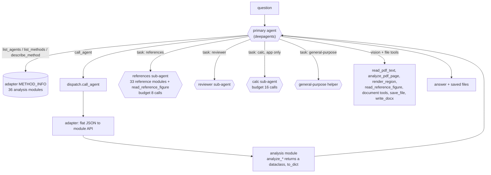

# GeotechStaffEngineer agent: theory of operation

The GeotechStaffEngineer agent answers geotechnical questions by **choosing and
running the package's own analysis code** — bearing capacity, settlement,
slope stability, piles, walls, FEM, liquefaction and the rest — through a
four-tool dispatch layer, and by **delegating reference lookups** (DM7, the
FHWA GEC series, UFCs, chart read-offs) to a sub-agent. It is served on the
geotech page of the web app and measured by a 106-question evaluation.
Read `shared_machinery.md` first for the loop, the result caps, the budgets and
the vision path.

Evidence: the 106-question evaluation on 5.31.0 with GPT-5.4 on Foundry
(`b2all/geotech_eval/`: `geo_eval_merged.json` with per-question answers,
traces of the PRIMARY agent's tool calls with arguments and error flags, token
usage; `per_question.csv`; `foundry_logs/`). The traces do NOT contain tool
results or sub-agents' internal calls (`eval_harness.py:497-560` builds them
from the primary's messages only). I read all 106 rows of `per_question.csv`,
aggregated tool usage over all traces with a script, and read in full the six
keyed failures, the six questions the harness flagged for "hallucination on
error", the five slowest and the six most expensive questions.

---

## 1. What it is

The model decides which module and method to use, what parameters to pass,
whether to consult the references, whether to plan with `write_todos`, and
when the answer is finished. Code decides the catalog the model sees, how a
guessed method or parameter name is redirected, what each calculation returns,
and the budgets of the sub-agents. **All engineering numbers are supposed to
come from `call_agent`**; the prompt forbids hand calculation
(`funhouse_agent/system_prompt.py:67-79`), but nothing in code enforces it.

---

## 2. Boundaries and configurations

`build_deep_agent` (`funhouse_agent/deep/agent.py:692-1203`) with
`allowed_agents=ANALYSIS_MODULES` (default). Two configurations matter:

| | Library default (the evaluation) | Web app geotech page |
|---|---|---|
| Built by | `eval_harness.run_suite` → `build_deep_agent(model=model)` (`eval_harness.py:1181`) | `webapp/core.py:493-552` with `behavior_build_kwargs` (`core.py:1335-1352`) |
| Sub-agents | `references`, `reviewer`, `general-purpose` | + `calc` (route_calc on by default) |
| Prompt extras | none | calc-delegation nudge (`deep/agent.py:460-481`), analysis-depth preset if chosen, SharePoint/email/feedback tool text |
| Step cap | none in effect (deepagents default 9,999) | 50 per turn |
| History | none: one question, one invoke | final answers of earlier turns, as text |
| Auto-continue | no | up to 2 |

So the recorded evaluation measured the library default, not the page. The
calc sub-agent, the step cap and the replay of earlier answers were absent.

Off by default in both: the `model_setup` sub-agent (staged LE/FEM model
building), `report_ingest` and `report_library` (`deep/agent.py:707-725,
1006-1117`); persistent `/memories/`; the second summarizer.

---

## 3. What the model is shown

### 3.1 System prompt (about 29–31 thousand characters)

Built by `build_domain_prompt` (`funhouse_agent/deep/prompt.py:224-261`) from
`build_system_prompt` (`funhouse_agent/system_prompt.py:207-216`):

1. **Role and habits** (`system_prompt.py:10-46`): an engineer for the U.S.
   Government; run multiple analyses varying uncertain parameters; distinguish
   best-estimate from design values; always comment on confidence; check
   inputs are physically reasonable before calculating and outputs against
   rules of thumb after; cite sources.
2. **DIGGS workflow** (`system_prompt.py:48-65`). *Since 2026-10-07
   (`3d1cd44`, unreleased):* it points at `subsurface.write_diggs`, which
   writes schema-checked DIGGS 2.6, and forbids hand-typed DIGGS XML.
3. **"CRITICAL: Always Use Your Tools for Calculations"** — never compute,
   "not even simple ones" (`system_prompt.py:67-79`).
4. **Tool discipline** — call `describe_method` before first use, use only
   documented parameters and allowed values; examples of common traps
   (`system_prompt.py:81-98`).
5. The text-protocol sections (`## ReAct Protocol` through `## Rules`) are
   **stripped** by a regex (`deep/prompt.py:247-256`). This also removes two
   paragraphs the native agent would need: "Reading values off published
   charts … call `read_reference_figure`" (`system_prompt.py:119-124`) and
   Rule 8, "Calc packages: use the `calc_package` module" (`system_prompt.py:169-173`).
   The first survives in the `read_reference_figure` tool description and in
   the references sub-agent's prompt; the second partly in the "Working Style"
   section.
6. **Module catalog**: a table of the 36 analysis modules with a one-line
   `brief` each (`system_prompt.py:179-200`; briefs in
   `funhouse_agent/adapters/__init__.py`). This table is the model's only
   map of what exists before it calls `list_methods`.
7. **"Working Style"** (`deep/prompt.py:22-176`): plan with `write_todos`;
   show figures by saving them; calc packages get a profile figure; the
   scratch filesystem is not the real disk; how to read real files and PDFs
   (the document-review reading rules in compressed form); theory names are
   not method names; consult a worked example before a nontrivial calc.
8. deepagents' sections (`shared_machinery.md` §2.1), ending with the `task`
   spawner text listing the sub-agents and "Whenever possible, parallelize".

### 3.2 Tools (32 in both configurations; about 38 thousand characters of schema)

* **Dispatch** (`funhouse_agent/deep/tools.py:397-581`): `list_agents`,
  `list_methods(agent_name, category)`, `describe_method(agent_name, method)`,
  `call_agent(agent_name, method, parameters)`. All scoped to the 36 analysis
  modules; a reference module named by the primary is refused as unknown
  (`dispatch.py:762-767`).
* **Files and vision** (`tools.py:603-1229`): `list_files`, `read_pdf_text`,
  `read_text_file`, `analyze_image`, `analyze_pdf_page`, `render_region`,
  `find_like`, `read_reference_figure`, `view_worked_example_source`, the
  planlens document tools, `annotate_document`, `save_file`, `write_docx`.
* **deepagents**: `write_todos`, six scratch-filesystem tools, `task`.
* **App only**: SharePoint tools, `email_file`, `record_feedback` when
  configured (`webapp/core.py:509-546`).

### 3.3 What a tool returns

* `list_agents` — the scoped catalog as JSON (3,810 characters for the 36
  analysis modules).
* `list_methods` — methods by category with each method's one-line brief
  (`dispatch.py:329-397`); e.g. 4,792 characters for `slope_stability`.
* `describe_method` — the adapter's `METHOD_INFO` entry: category, brief,
  parameters (type, required, description, `allowed_values`) and returns
  (`dispatch.py:399-413`). Median 1,471 characters over 185 analysis methods;
  **five `slope_stability` entries exceed the 8,000-character cap** and reach
  the model truncated with the "search narrower" marker:
  `rapid_drawdown_fos` 9,078, `search_rapid_drawdown` 9,280,
  `monte_carlo_fos` 8,648, `fosm_fos` 8,472, `analyze_slope` 8,051 (measured
  on the 5.31.0 adapter, unchanged at HEAD). There is no narrower way to
  describe one method, so the nudge has nothing to point at.
* `call_agent` — the module's result, `dataclass.to_dict()` as JSON, **not
  capped** (`tools.py:198-216, 499-539`); a strip-footing bearing-capacity
  call returns 584 characters with 30 keys (q_ultimate_kPa, Nc, Nq, …).
  Large results (method dumps, calc packages) are capped only by deepagents'
  80,000-character eviction.
* An error is `{"error": "..."}`. For a wrong method name the dispatch layer
  first tries a curated alias (78 at HEAD), then a cross-module redirect
  (36), then a "selector value, not a method" directive, then "Did you mean"
  with the three closest names and the full list (`dispatch.py:735-806`,
  `482-732`). An adapter exception becomes `"<Type>: <message>"`
  (`dispatch.py:799-806`).
* `task` — the sub-agent's final message, as the tool result.

### 3.4 Sub-agents (what they are shown)

| Sub-agent | Prompt | Tools | Budget |
|---|---|---|---|
| `references` | `CONSULTANT_FRAMING` ("REFERENCE LIBRARIAN … CITE … only references your tools returned … never infer chart values from memory … Do NOT perform engineering calculations") + a concision rule (`reviewer.py:260-271`; `deep/agent.py:82-87, 315-342`) | dispatch tools scoped to the 33 reference modules (cap 16,000 for reference text) + `read_reference_figure` | 8 model calls, last one forced to answer |
| `reviewer` | `REVIEWER_DEEP_PROMPT`: PASS / FLAG / REVISE review against the references (`reviewer.py:100-131`; `deep/agent.py:549-587`) | reference dispatch tools | none |
| `calc` (app only) | `_CALC_PREAMBLE` + `_CALC_FRAMING`: run the numbers, build the deliverable with figures, save everything, never write placeholders (`deep/agent.py:379-456`) | analysis dispatch tools + `save_file`, `list_files`, `read_pdf_text`, `read_text_file` | 16 |
| `general-purpose` | deepagents' stock prompt (short; none of the domain rules) | the primary's tools | none |

Each sub-agent sees ONLY the `description` the primary writes in the `task`
call; it does not see the conversation, and deepagents does not pass the
primary's system prompt down (the reason the calc sub-agent carries its own
figure rules, `deep/agent.py:371-378`). Note that `CONSULTANT_FRAMING` ends
with "Question: " because it was written for the v1 agent, which appended the
question to it; as a system prompt it ends with a dangling label.

---

## 4. Control loop

1. The question (plus any upload note) goes to the primary.
2. The model opens with `list_methods` (56 of 106 questions), `write_todos`
   (38) or a `task` delegation (10); 52 questions use `write_todos` at some
   point, typically opening and closing a todo list around
   `list_methods` → `describe_method` → `call_agent`, then the answer. Over the 106 questions the primary made 702
   tool calls: `write_todos` 191 (27 %), `call_agent` 170, `describe_method`
   148, `list_methods` 141, `task` 40, the scratch tools 6, `list_files` 4,
   `open_document` 1, `list_agents` 1. Each tool-calling step is a full model
   call carrying the ~29 K-character prompt and ~38 K characters of schemas;
   the 3-step BC-1 cost 48,178 input tokens.
3. Sub-agents run inside a `task` call and return text. In the evaluation the
   primary delegated to `references` 29 times and to `general-purpose` 11
   times, and **never to `reviewer`** — the reviewer exists only if the
   primary chooses it, and it did not.
4. The turn ends when the model replies without a tool call. In the app a
   50-step cap or an auto-continue can intervene; in the evaluation neither
   applies.

State during a question: the message list, deepagents' todo list and scratch
files, the adapter caches (e.g. the subsurface `site_key` cache,
`adapters/subsurface_adapter.py:42-66`), files written to disk. Across turns
in the app: the earlier answers' text only.

---

## 5. Deterministic versus model

| Code | Model |
|---|---|
| All engineering arithmetic inside the modules; units SI unless a module documents otherwise | Which module and method answer the question |
| Parameter validation and its error text (adapter) | Parameter values, including defaults the user did not state |
| Alias/redirect of guessed names (curated, `dispatch.py:482-732`) | Interpreting `allowed_values` and briefs |
| Result caps, sub-agent budgets | Whether to consult references, and what to ask |
| Figure rendering, calc-package layout (calc_package module) | Whether a result is plausible; what to report; confidence statement |
| — | Whether to compute by hand when no tool is found (forbidden by prompt, done anyway: §7) |

---

## 6. Data path

Question text → model chooses `call_agent(agent_name, method, parameters)` →
`StructuredTool` validates the call against `_CallAgentArgs` and hoists stray
top-level keys into `parameters` (`tools.py:370-395, 517-525`) →
`dispatch.call_agent` (`dispatch.py:735-806`) canonicalises the module name,
loads the adapter lazily, resolves the method → adapter function turns flat
JSON into the module's typed call → the module computes and returns a
dataclass → `to_dict()` → `json.dumps(default=str)` → the model.
Units are SI throughout the dispatch contract (the `call_agent` description
says so, `tools.py:566-575`); pavement design is US customary by
documented exception. An `attachment_key` parameter is NOT resolved on the
deep path: `call_agent` passes `attachments=None` (`tools.py:532`), so a
module that wants `attachment_key` (e.g. `parse_diggs`) errors unless the
model passes the file path instead — which the upload note supplies.

---

## 7. Failure modes in the recorded evaluation

Overall: 62 of 68 keyed questions passed (91.2 %); 41 of 106 questions had at
least one errored tool call (70 errored calls); 0 exceptions; median 88,911
tokens and 62 s per question, total 10.35 M tokens
(`geo_eval_merged.json` metrics; `per_question.csv`). Latency includes
Foundry rate-limit retries (470 retries over 1,396 calls,
`foundry_logs/20261002T022428Z_build.json`), so per-question times are not
intrinsic.

**G1. The method exists but the model cannot find it, and then computes by
hand.** NMK-2 asks for a Newmark sliding-block displacement for one
rectangular pulse. `slope_stability.newmark_displacement` exists, but the
5.31.0 catalog brief for `slope_stability` reads "Slope stability
(Fellenius/Bishop/Spencer, circular+noncircular, grid search)"
(`git show v5.31.0:funhouse_agent/adapters/__init__.py`, line 221). The agent
listed `seismic_geotech`, `worked_examples`, `seismic_signals` and `pynite`,
asked a `general-purpose` helper, found nothing, and **worked it by hand**
despite the prompt: ½(a − k_y g)T² = 0.519 m. The expected 0.794 m includes the
sliding that continues after the pulse until the relative velocity is zero
(1.038²/(2 × 1.962) = 0.275 m) — the very error the "never calculate" rule
exists to prevent. SPL-3 (Ito & Matsui force on a stabilizing pile) is the
same shape without the hand calculation: Ito–Matsui exists only as an option
inside `analyze_slope`'s `stabilizing_piles` parameter
(`adapters/slope_stability.py:483`), not as a method; the agent concluded
"this environment does not expose a built-in Ito–Matsui method" and declined.
PAV-5 (UFC rigid pavement, Figure F-1) delegated to the `references`
sub-agent, which could not read the chart, and the agent declined — the
analysis module implements Figure F-1 (`pavement_design/ufc.py`). Mechanism:
the catalog briefs and method briefs are the model's whole map; a capability
named in neither is invisible, and the model's fallback is its own
arithmetic or a refusal. (Findability briefs for Newmark, composite pile EI
and UFC pavements were added after the run, commit `ee154c4`.)

**G2. Right numbers from the wrong tool.** CEI-2 (uncracked composite EI of
a round RC pile) used `section_props` for circles and `concrete_props`'
rectangular section, then combined them in prose: 1.94 × 10⁵ kN·m² against
175,652 expected (+10.4 %, tolerance 10 %). The composite-EI method in
`lateral_pile` was not found (same mechanism as G1).

**G3. A truncation marker the model reads as an eviction.** RDD-4: the
`describe_method` result for `rapid_drawdown_fos` (9,078 characters) was cut
at 8,000 with "Do NOT re-request this same item". deepagents' prompt says large
results are saved under `/large_tool_results/<tool_call_id>`. The model tried
`read_file('/large_tool_results/<id>.txt')` for a result that had been
truncated, not saved, got "not found", re-requested the same description
anyway, then called the method correctly (FOS 1.4413; the question passed).
Mechanism: two independent "your result was too big" stories (§3.3 and
`shared_machinery.md` §2.1) that do not agree. The scratch guard now answers
such a read with what is saved (commit `ee154c4`,
`deep/scratch_guard.py:17-26`).

**G4. Follow-up questions asked without their history.** LP-2 ("Repeat the
lateral analysis of the 0.5 m pile … but fixed-head") arrives in a fresh
invoke. The agent ran `grep` on "." four times looking for the earlier case
(refused by the scratch guard each time) and asked the user for the inputs.
This is an artifact of the evaluation running each question alone
(`shared_machinery.md` §3.3), not of the page.

**G5. Environment errors handled honestly, at a cost.** The Foundry
environment had numpy 1.26.4 while the package declares ≥ 2.0; 30 calls in 17
questions failed with `np.long` / `np.trapezoid` AttributeErrors
(`per_question.csv`, `numpy2_errors`). In every case read, the answer said the
tool failed and gave no invented number (CON-1, MRS-1, SA-1). In 5 of these
questions (SA-1, FEM-2, CON-1, FTG-1, MRS-1) the agent spawned a
`general-purpose` helper to "investigate a workaround" for the library error,
which can only spend tokens. Two keyed
questions failed this way (CON-1, MRS-1).

**G6. The "hallucination on error" metric mostly flags recoveries.** Six
questions were flagged (`metrics.p1_question_ids`); four recovered after a
guessed method name (AP-3 `driven_pile_capacity`, REF-4
`apparent_earth_pressure` on the wrong module, INF-1
`infinite_slope_analysis`) or a validation error (RW-2), and the two
"unrecovered" are G3 and G4. The heuristic counts an answer that does not
mention an earlier error as a hallucination (`eval_harness.py:584-628`); in
the cases read none invented a result.

**G7. Planning overhead.** `write_todos` is the most-called tool (191 of 702
primary calls); a typical 3-method job opens and closes a todo list, adding
two full model calls. The prompt asks for it on multi-step jobs
(`deep/prompt.py:25-29`) and deepagents' prompt adds its own planning section.

**G8. The reviewer is never asked.** 0 of 106 questions delegated to
`reviewer`. Whether the app's users see reviews is a matter of the model's
choice; no code path calls it after a calculation (the v1 agent's automatic
review, `reviewer.py:168-257`, is not used by the deep agent).

---

## 8. Invariants and whether they held

| Invariant | Held? |
|---|---|
| Numbers come from tools, not the model | Not always: NMK-2 hand calculation (G1), CEI-2 combination in prose (G2). |
| A tool error is reported, never covered | Held in every case read (G5, G6). |
| The primary never touches reference modules directly | Held by code (`dispatch.py:762-767`); the trace shows no reference module in a primary `call_agent`. |
| Every method can be described within the cap | Not held for five slope methods (§3.3, G3). |
| Units are SI at the dispatch boundary | Held in the traces read (all parameters in m, kPa, kN/m³, degrees). |
| The evaluation measures the app | Not held: different sub-agents, no step cap, no history (§2). |

---

## 9. Open questions

1. **Does the calc sub-agent (on in the app, off in the evaluation) change
   correctness or cost?** A run of the same 106 questions with
   `enable_calc_subagent=True` and `recursion_limit=50` would say.
2. **What did the `references` sub-agent actually do in its 29 consults?**
   Its calls are not in the trace; the activity logger used by the app and
   the review suite would capture them (`webapp/activity_log.py`), the
   evaluation's `_v2_to_qa` does not.
3. **How often does the model compute by hand without saying so?** Only
   NMK-2 is visible because it failed; a check for answers whose numbers do
   not appear in any `call_agent` result would measure it.
4. **How much of the 10.35 M tokens is fixed overhead?** Each primary call
   carries roughly 60–70 K characters of prompt and schemas; counting calls
   per question from an activity log would separate overhead from content.

---

## Observations (opinion)

* The catalog briefs are load-bearing: they are the only index the model
  reads before choosing a module, and three of the six keyed failures trace
  to a capability missing from them.
* The "never calculate" rule is the right rule with no backstop; the failure
  case is exactly when the model has given up finding the tool.
* The evaluation is a library test of a configuration users never run; a
  second arm with the app's settings would make its numbers speak for the
  page.
