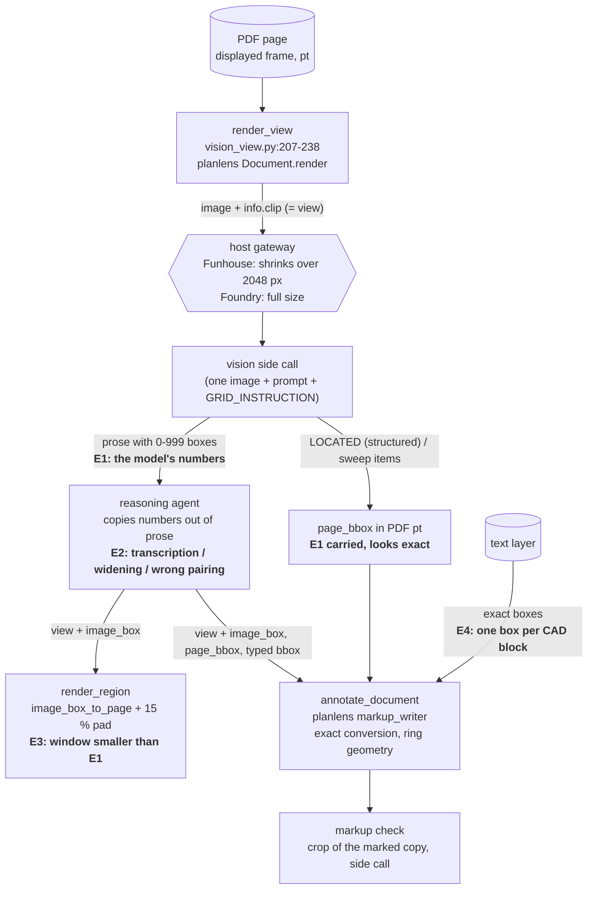

# Locating things on a page: where location error enters

How the Document Review agent finds WHERE something is on a PDF page, end to
end, and every place where error can enter. Written 2026-10-07 against
GeotechStaffEngineer `master` at `e034d01` (code identical to `4dd8fcd`) and
planlens `main` at `059bc79` (0.11.0). Code is cited as `path:line`; planlens
paths start `planlens/`.

The question came from the live checks of 2026-10-07: asked to circle the 7
GCE callouts on a synthetic sheet, the agent missed with every circle placed
from a whole-page look (30-75 pt off) and hit, within 0-5 pt, with circles
placed from a zoom. A first look suggested the whole-page error is systematic
(GPT-5.4: x about right, y about 0.88 of the true value; GPT-5.6 Sol: both
about 0.92). This document checks that, finds where it comes from, and gives
a notebook cell that measures it directly.

A separate review of the same Funhouse traces
(`module_work/review_eval_results/2026-10-07_funhouse_5.32.0_check1/TRACE_REVIEW.md`,
cited below as **TRACE_REVIEW**) covers the runs step by step. It is cited
here, not repeated.

---

## 0. In short

* **The conversion code is exact.** Rendering, `view`, the 0-999 conversion,
  tiles, the marked-up copy, rotated pages and offset CropBoxes were all
  checked offline against the fixture: errors are at most about 1 pt (§2).
* **The error is in the numbers the vision model writes.** On a whole-page
  image its 0-999 boxes are a *scaled-down copy* of the truth, shrunk toward
  the top-left corner. The shrink is a scale, not a shift: the offset is close
  to zero, and the error grows with distance from the top edge. A tag near
  the top is a few points off. A tag near the bottom is 40-70 pt off (§3.2,
  §3.3).
  * GPT-5.4 (Funhouse): x scale 1.00, y scale 0.86-0.88 in 7 of 11 answers
    (0.955-1.04 in the other 4).
  * GPT-5.6 Sol (Foundry), whole page sent at full size (3957 x 2560 px): x
    scale 0.90-1.04, y scale 0.875-0.96. In six of eight answers the points
    fit that answer's scale to within 0-1 grid units.
* **It depends on the image, not on the page content.**
  * For Sol, the same sheet sent at 1979 x 1280 px came back almost exact
    (median error 7 pt, against 31 pt at full size).
  * Full-width bands of the same sheet at 3060 px wide (5,000 patches or
    fewer) came back exact (median 1.6 pt).
  * Tiles rendered near the 10,000-patch limit shrank like the whole page.
  * Zoom windows were accurate for both models: Sol median 0.2 pt, GPT-5.4
    median 5 pt (§3.2).
* **Funhouse's 2,048-px downscale (TRACE_REVIEW §3.1) does not explain the
  GPT-5.4 shrink.** Shrinking an image evenly keeps its shape, and a 0-999 box
  over the image does not change when the image is resized. Sol, at about the
  same size, was nearly exact. The downscale matters in other ways: lettering
  arrived at 7 px, auto-tiling never fired, and `view_px` misreports the image.
  One unexplained coincidence: GPT-5.4's y answers fit a 2048 x 1536 (4:3)
  frame over a 2048 x 1325 image. The cell in §5 tests this (§4.3).
* **The harness let the error through to the page.** Three things did it.
  * The prompt and the tool text tell the agent to anchor a mark by "the
    `view` and `image_box` of the look that found it". That is usually the
    whole-page look.
  * A zoom on a reported box is padded by only 15 % of the *box*, much less
    than the error.
  * Tiling, the one automatic route to smaller views, did not fire on
    Funhouse.
  
  Structured `page_bbox` results carry the same error while looking exact
  (§4.4).
* **Top three recommendations** are in the Observations: place marks and
  `page_bbox`es only from a small view (a two-step locate inside the tools);
  size the zoom window by the source view's error, not the box; and send
  whole-page looks at a modest image size, with tiling working from the size
  actually received. Then run the cell in §5.

---

## What changed (2026-10-07, after the measurement in §5.1)

Built on GeotechStaffEngineer `master` (on top of `ba12760`) and planlens
`main` (on top of `d7d6657`), uncommitted for the lead's review. Each item
has offline tests; none has run on a live model yet (§5.2 is the check).

1. **Pixel boxes from the vision call, converted in code.** Every look
   (`analyze_pdf_page` and its tiles, `render_region`, the chart read-offs,
   `sweep_pages`, the markup check) tells the side call the image's size and
   asks for `px=[x0, y0, x1, y1]` in pixels of it (`vision_view.PIXEL_INSTRUCTION`).
   The tool rewrites every pixel box in the answer as a 0-999 box on the same
   image, converted with the size it SENT, never the size the model states
   (`vision_view.boxes_to_grid`), so the agent still reads one convention and
   still passes `view` + `image_box`. A structured `LOCATED` item's `px` and
   the markup check's `thing_px` are converted exactly
   (`vision_view.px_box_to_page`). An old-style 0-999 answer still parses: an
   untagged box is taken as pixels only when the answer is in pixels (a `px=`
   tag, or a value past 999) and the box is shaped like one. Chart read-offs
   convert tagged boxes only, so a list of four readings is never rewritten.
   The result's `boxes` line says which happened. Text-layer context, when
   switched on, is given in the same pixels.
2. **Never more than the host delivers.** Every render is held to 2,048 px on
   its long side (`vision_view.DEFAULT_MAX_PX`; `GEOTECH_VISION_MAX_PX`
   overrides, `none` lifts it), keeping the budget's `detail`
   (`original`, which Funhouse needs to deliver 2,048 px at all). So
   `view_px`, `text_px`, the legibility line and auto-tiling all use the image
   the model gets: the tag sheet now tiles 3 x 3 on its own. The probe sends
   a fifth image where `original` is honoured, a blank 3072 x 1024 px: whole,
   it costs 0.75 of the 2,048 px square; shrunk to 2,048 px, 0.34. Its
   `max_edge` caps renders even if the owner lifts the default. An edge
   below 2,048 px is not told apart (the square shrinks with it).
3. **Tiles.** `tiles` accepts `auto`, `off`, N or `"NxN"` (N 2-4). A larger N
   is held to 4 and the result says so (`tiles_note`). Anything else returns
   an error naming what is accepted, before any call is spent. The default
   agent's tool description now lists the values.
4. **Zoom windows sized by the source view.** `render_region(view=,
   image_box=)` pads the box by the location error of the view it came from:
   a tenth of that view each way, at least 12 pt, or 15 % of the box when that
   is more (`vision_view.zoom_pad`). From a whole sheet that is about 122 x
   79 pt each side, against 3-7 pt before. Every result carries a
   `precision` line (`vision_view.precision_note`). For a view wider than
   300 pt it says the box is for finding where to zoom, not for placing a
   mark. A structured or sweep item read off a wide view comes with a
   `zoom_bbox`, the box already padded.
5. **No mark from a wide view.** planlens `write_markups` skips, per mark and
   with the reason, a `view` + `image_box` anchor whose view is wider than
   300 pt when the mark is under a quarter of the view's longer side
   (`VIEW_ANCHOR_MAX_PT`, `VIEW_ANCHOR_MIN_FRACTION`). It also skips one whose
   box is the whole view (`WHOLE_VIEW_FRACTION`, 95 % both ways). The reason
   tells the agent to zoom and anchor on the zoom. The thresholds come from
   the measurements in §3 and §5.1: boxes off whole sheets were 14-90 pt
   off, boxes off views of 80-350 pt were 0.2-5 pt off. A callout's text box
   beside its `points_at` is not judged.
6. **Quote anchors land on the quoted line.** For a matched text object with
   no word boxes that prints over several rows (a CAD notes column stored as
   one hidden string), planlens finds the printed rows from the ink inside
   the object's box (`markup_writer._ink_rows`). It then picks the row(s)
   the quote is on by its position in the string, weighted by how much
   lettering each row holds; AutoCAD's doubled first line of a
   hanging-indent paragraph is undone first (`_undoubled`). On sheet 10.31A,
   eight test quotes all land on their own row. The 8.33 % callout now
   points at (60, 227), on the line at y 224-230; before, it pointed at
   (37, 147). Found on the way: a sticky note on a `/Rotate` 90/180/270
   page hung one icon size (16 pt) off its spot (the r2 note of TRACE_REVIEW
   §2.5). Now corrected.
7. **Wording.** The review prompt, the `annotate_document` note, planlens'
   own description, the markup check's advice and the sweep note now say to
   anchor a mark by the view and `image_box` of the ZOOMED look in which the
   thing is legible; a whole-page box says where to zoom.

**Not changed:** the inline route (`GEOTECH_VISION_INLINE`), where the main
model writes 0-999 boxes itself (planlens' refusal still covers its marks);
`find_like`'s `view` + `image_box` example box (a box read off a wide view
makes a poor template, a candidate for the same rule).

---

## 1. The routes, end to end



**E1** (the model's numbers) is the measured, systematic error. **E2-E4** are
how the harness handles, amplifies or adds to it.

### 1.1 Looking: a page or region becomes an image

* **Render.** `vision_view.render_view` (`funhouse_agent/vision_view.py:207-238`)
  calls planlens `Document.render` (`planlens/document/document.py:971-1093`).
  * With no `bbox` the clip is the whole page rect. With a `bbox` it is that
    box padded by `pad_frac` × max(w, h, 20 pt) on each side and clamped to the
    page (`planlens/ir/render.py:50, 72-102`).
  * The image is the largest that fits the image **budget**
    (`planlens/document/budget.py:104-117, 226-255`), up to 1,200 dpi
    (`document.py:180`).
  * `info["clip"]` is the clip actually rendered. It becomes the result's
    `view` (`vision_view.py:241-256`).
* **Which budget.**
  * An environment setting wins. Otherwise the probe's measurement decides,
    and under the default `robust` policy it is the *detailed* budget
    (`vision_view.py:61-67, 144-163`).
  * On both hosts that was `openai-original`: 6,000 px and 10,000 patches. An
    11 x 17 sheet renders at 3957 x 2560 px.
  * **What the model actually receives differs by host.** Funhouse shrinks
    anything over 2,048 px to 2,048, so the sheet arrives at about 2048 x 1325.
    Foundry passes it at full size (TRACE_REVIEW §3.1).
  * The probe never sends anything over 2,048 px, so it cannot see the
    Funhouse cap (TRACE_REVIEW C2). The image goes to the model unchanged by
    the app (`deep/vision_engine.py:132-192`; `deep/databricks_bridge.py:83-90`
    passes the image block through as it is).
* **What the side call is asked.** The agent's `prompt`, then
  `GRID_INSTRUCTION`:
  > "give it as a box [x0, y0, x1, y1] on a 0-999 grid over the whole image
  > (origin at the top-left corner, x to the right, y down)"

  (`vision_view.py:93-100`, assembled by `vision_tools.py:837-849`). The
  instruction gives no image size and no scale. The side call has no idea the
  box will place a mark.
* **What comes back.**
  * The prose answer. The agent has to copy boxes out of it, and the boxes
    come in many shapes: tag only, tag plus leader, tables with several boxes
    per row, and sometimes "page_bbox" figures the side call made up.
  * `view`, `view_px`, the budget, the detail, a `legibility` line and
    `zoom_hint`:
    > "to zoom on something the analysis located, call render_region(...,
    > view=<this view>, image_box=<its 0-999 box>, ...)"

    (`vision_view.py:103-105, 241-278`).
  * Nothing says how precise the box is.
* **Tiles.**
  * `analyze_pdf_page(tiles="auto")` also reads the page in N x N tiles with
    8 % overlap (`vision_view.py:290-324`; `vision_tools.py:1065-1143`). It
    does this when the lettering would arrive under 12 px *at the rendered
    size*.
  * Each tile is rendered with `pad_frac=0` and returned with its own `view`
    (`vision_tools.py:1110-1128`). The tile's prompt says which tile it is
    (`:1116-1118`).
  * The tile answers used their own frame correctly: 94 of 95 tile boxes in
    the recorded runs sit on a tag when read through the tile's view, and none
    only when read as whole-page coordinates.
  * Two faults:
    * The rule measures lettering at the *rendered* size. On Funhouse the
      lettering really arrived at about 7 px, yet no tiles were made
      (TRACE_REVIEW C2).
    * `tiles="6x6"` is silently read as "no tiles". `int("6x6")` fails and
      `_tile_count` returns 1 (`vision_tools.py:1083-1100`; TRACE_REVIEW C3).
* **Structured locations** (`GEOTECH_VISION_STRUCTURED`, on in the `sweep`
  arms).
  * The side call ends with a `LOCATED:` JSON list (`vision_view.py:429-439`).
    `split_located` converts each box through the same view into `page_bbox`
    (`vision_view.py:442-487`; `vision_tools.py:852-872`).
  * `sweep_pages` does the same from whole-page looks only
    (`deep/sweep.py:47-56, 116-141`).
  * This removes the agent's copying step (E2). It does not reduce E1.
* **Text context** (`GEOTECH_VISION_TEXT_CONTEXT`) lists text-layer lines with
  their 0-999 boxes in the prompt (`vision_view.py:388-425`). It gives an exact
  anchor where a text layer exists. The tag sheet has none.
* **Inline** (lean or minimal agent, `GEOTECH_VISION_INLINE`).
  * The main model sees the image itself at its next call, labelled with its
    `view` (`deep/inline_images.py:63-92`). The image is sent at the same
    budget and detail.
  * The main model then writes `view` + `image_box` itself.

### 1.2 Zooming on a reported box

`render_region(view=..., image_box=...)` turns the pair into a page box with
`image_box_to_page` (`vision_tools.py:778-788`; `vision_view.py:490-503`).

* It then renders that box padded by `pad_frac=0.15` (`vision_tools.py:774`).
  The padding is 15 % of the box's own size, and at least 3 pt.
* A tag-sized box, about 23 x 7 pt read off a whole page, therefore gives a
  window of about 30 x 14 pt.
* The whole-page error is 30-75 pt, so such a window usually shows empty
  paper: 0 of 4 and 0 of 7 first zooms held the tag (TRACE_REVIEW §3.4).
* Every result's `zoom_hint` invites exactly this zoom.

### 1.3 Text-layer locators

* `read_document(with_locations=true)`, `search_document` and `find_quantities`
  return text-layer boxes in the same displayed frame. They involve no model
  and are exact.
* **E4.**
  * On CAD sheets a whole notes column can be ONE text object with no word
    boxes.
  * A `quote` anchor then keeps the block's box and points at its left edge,
    half-way down (`planlens/document/markup_writer.py:401-427, 459-466`).
  * On sheet 10.31A that put the comment 50-80 pt above the quoted line
    (TRACE_REVIEW §2.4-2.6).
* None of this applies to the tag sheet, whose lettering is drawn as strokes.

### 1.4 `find_like`

`find_like` gives exact boxes by image matching
(`planlens/document/findlike.py`). It is the one locator that does not rely
on a model's coordinates. It is hidden on FIPS hosts (Funhouse, Foundry) and
is being reworked by another agent, so it is not covered here.

### 1.5 Writing marks

* **`annotate_document`** (`deep/tools.py:1025-1067`) passes markups to planlens
  `write_markups`. Each markup carries exactly one anchor:
  * `bbox`, or its alias `page_bbox`;
  * `view` + `image_box`, converted by planlens' own `image_box_to_page` with
    `units="norm1000"` (divide by 999), the same formula as the app's
    (`planlens/document/markup_writer.py:247-258`;
    `planlens/document/budget.py:258-285`);
  * `quote`;
  * `point`.
* **Ring geometry.** A circle is the ellipse through the box's corners plus
  2 pt, and at least 14 pt across (`markup_writer.py:109-116, 523-535`).
* **The markup check** (`funhouse_agent/markup_check.py`).
  * It renders a crop of the *marked copy*: the mark plus max(36 pt, the
    mark's own size) on each side (`:134-143`).
  * It asks a side call whether the red mark encloses what its label names,
    and where that thing is in the crop (`:159-207`).
  * The crop is a small view, so its own box is accurate. Size is measured,
    not judged: a ring more than 30 times the thing's area is "too wide"
    (`:87-103`).
  * Measured against truth, the check was mostly right about misses: 104 of
    its 121 "misplaced" verdicts were on marks whose box missed the tag.
    * Most of the other 17 rejected correct GPT-5.4 rings: the 5.32.0 "drawn
      closely" question (TRACE_REVIEW C4), and rings that included the leader.
    * Of its 148 "confirmed" verdicts, 8 were wrong: blanket rings that took
      the tag in from a box centred 30-70 pt away, and one ring round a GCG
      look-alike.

### 1.6 What the agent is told about locations

* The review prompt says:
  > "for something you found by looking, by the `view` and `image_box` of the
  > look that found it (or a located item's `page_bbox`, or a box from
  > `read_document`)"

  (`deep/prompt.py:376-379`). The `annotate_document` note repeats it
  (`deep/tools.py:592-594`), and so does planlens' own description
  (`planlens/tools/specs.py:215-217`).
* For a tag found on a whole-page look, "the look that found it" *is* the
  whole-page look.
* Nothing says that a whole-page box is coarse, or that a mark should come
  from a zoom.
* The check's advice is "look at the page, take the view + image_box"
  (`markup_check.py:251`). GPT-5.4 answered it with another whole-page look
  (TRACE_REVIEW C5).
* The prompt also promises that `analyze_pdf_page` "tiles a sheet whose
  lettering is small" (`deep/prompt.py:299-300`). On Funhouse it did not.

---

## 2. The conversion math, checked

Every conversion is the same linear map:

`page = view.x0 + u/999 × (view.x1 - view.x0)`, and likewise for y

where u is a 0-999 grid value with its origin at the top-left. The places it
is used:

* app `vision_view.image_box_to_page` (`vision_view.py:490-503`);
* planlens `image_box_to_page(units="norm1000")` (`budget.py:258-285`), used by
  the markup writer;
* the text-context grid (`vision_view.py:401-404`);
* `split_located` and `sweep_pages`.

All four use 999, clamp to 0-999, and order the corners.

Checked offline against the fixture. The scripts are not committed; the method
is below so the checks can be repeated.

1. **The image shows exactly its `view`.**
   * Method: render with the app's `render_view`, find each GCE tag's dark
     pixels, and compare them with where the view and pixel size say they
     should be.

   | image | size px | tags | worst offset px | worst offset pt |
   |---|---|---|---|---|
   | whole page, `openai-original` | 3957 x 2560 | 9 | 2.3 | 0.7 |
   | whole page, `openai-high` | 1979 x 1280 | 9 | 2.3 | 1.4 |
   | tile r2c2 of 4 x 4 | 3955 x 2560 | 2 | 2.4 | 0.2 |
   | 200 pt window | 3200 x 3200 | 1 | 2.2 | 0.1 |
   | 80 pt window | 1334 x 1334 | 1 | 2.2 | 0.1 |

   The 2-px offsets are the strokes' own width: no padding, no shift.
2. **Round trip.** Each tag's true 0-999 box, rounded to whole numbers as a
   model writes it, converts back to within 0.57 pt on the whole page and
   0.03-0.16 pt on windows. The grid's own step is 1.2 pt across and 0.8 pt
   down the whole sheet.
   * **999 against 1000:** if a model used 1000, the error would be at most
     0.1 % of the view, 1.2 pt on the whole sheet. That is negligible.
3. **Rotation and CropBox.**
   * Method: draw a filled square on pages turned 0°, 90°, 180° and 270°, with
     and without an offset CropBox. Render each whole page. Take the square's
     0-999 box off the image, write a box from `view` + `image_box`, then read
     it back with planlens and render the marked copy again.
   * Result: in all 7 cases the box read back and the red box re-rendered sit
     on the square to within 0.7 pt.
   * The displayed frame (rotated, CropBox origin) is consistent from
     rendering to writing.
4. **`view` pairing.**
   * Of 195 `view` + `image_box` pairs the agents passed on whose box appears
     in an earlier answer, 194 used that answer's own view (190 top-level, 4
     tile). One paired a box with another look's view (TRACE_REVIEW C5, the r3
     T3 ring, 26 pt off).
   * 221 pairs did not copy any earlier box verbatim: the agent widened a box
     by hand, chose a zoom region itself, or, in the inline arms, read the
     image itself.
5. **Rounding.** `view` is rounded to 0.1 pt (`vision_view.py:246`), and
   `render_region` rounds its bbox to 0.01 pt. Both are negligible.

**Conclusion: no conversion bug.** The error is already in the 0-999 numbers
the model writes. Measured in grid units against the image the model was
sent, the numbers themselves are off (§3).

---

## 3. Measured error

### 3.1 Method

* **Runs.**
  * Funhouse, GPT-5.4: `produce-circle-tags` × 3 on 5.32.0 and × 3 on
    5.32.1rc1. Path:
    `module_work/field_feedback/2026-10-07_funhouse_live_checks_v5.32.0/raw/check_532_markups{,_rc1}/`.
  * Foundry, GPT-5.6 Sol, 5.32.0rc2/rc3: `produce-circle-tags` and
    `set-long-rare-tag` in all 10 arms. Path:
    `module_work/field_feedback/2026-10-04_foundry_evidence/raw/brief3/out_sol_532/runs/`.
* **Truth.**
  * `build_synthetic_tag_set()` for the circle task.
  * `build_synthetic_tag_set(n_pages=24, gce_growth=0, extra_callouts={"FPG": [3, 11, 19]})`
    for the long set.
  * The other suite tasks use public drawings with no box-level truth, so
    they are not scored.
* **What was scored.** Every box in every `analyze_pdf_page` / `render_region`
  answer (and every tile), 1,428 look calls in all.
  * Where the answer has a structured `LOCATED` list, that list is used,
    because it states its boxes are 0-999.
  * A prose box counts only when the text just before it on its line, or in
    its table cell, is not about a leader, arrow, line, border, centre or page
    or PDF coordinates. A page-coordinate column in a table is skipped.
  * Region-sized boxes (over 300 grid units) are dropped.
* **Matching.** Each box is converted with the app's `image_box_to_page` and
  matched to a true tag on that page. The tag must be compatible with the
  label read before the box (G[C/E][E/F] → GCE...).
  * For views wider than 300 pt with 3 or more boxes, a per-answer x/y scale
    about the view origin is searched first. That way a systematic shrink
    cannot pair a box with the wrong tag. The *raw* error (reported minus
    true) is what is recorded.
  * Matches farther than max(30 pt, 8 % of the view) are dropped.
  * Legend rows are reported separately.
  * 431 matched boxes in all; tables below are callout and bare tags only.
* **Limits.**
  * Boxes for tag plus leader, and "circular tag" boxes, were drawn larger
    than the tag. Their centres sit a few points left of the tag, which shows
    in the Sol x means.
  * GPT-5.4 and Sol also differ in harness version and in the image actually
    received, so the two columns are not a controlled comparison.
  * The inline route has few usable points.
  * Errors are in PDF points on a 1224 x 792 pt sheet. A "grid unit" is one
    step of the 0-999 grid: about 1.2 pt across and 0.8 pt down the whole
    sheet.

### 3.2 The headline: error by model and image

Scale and offset are a straight-line fit of reported against true grid
position, per axis. A scale of 1.000 with offset 0 means exact.

| model | image as sent (as received) | n | median error pt | mean error x / y pt | x scale / offset (grid) | y scale / offset (grid) |
|---|---|---|---|---|---|---|
| GPT-5.4 | whole page 3957 x 2560 (≈ 2048 x 1325) | 84 | **44.6** | +0.9 / **-34.9** | 1.003 / -0 | **0.925 / -9** |
| GPT-5.4 | tiles 330-355 pt, ≈ 3900 x 2560 (≈ 2048 wide) | 8 | 17.8 | -10.0 / -3.2 | 0.958 / -11 | 0.891 / +48 |
| GPT-5.4 | 805 x 792 pt view with numbered marks, 3220 x 3168 (≈ 2048 x 2015) | 6 | 4.8 | +0.1 / -1.7 | 1.000 / +0 | 0.999 / -2 |
| GPT-5.4 | zooms under 300 pt (mostly under 2048 px) | 33 | 4.9 | -1.8 / -3.6 | – | – |
| Sol | whole page 3957 x 2560 (full size) | 67 | **30.9** | -11.3 / **-28.2** | 0.984 / -5 | **0.929 / -1** |
| Sol | whole page 1979 x 1280 (`baseline_high`) | 14 | 6.8 | -10.2 / -3.4 | 1.025 / -15 | 0.965 / +13 |
| Sol | full-width bands 449-657 pt tall, 3060 px wide (≤ 5,000 patches) | 16 | **1.6** | -0.7 / +0.3 | 1.005 / -2 | 1.003 / -1 |
| Sol | tiles and regions 330-650 pt, ≈ 9,900 patches | 31 | 12.5 | -4.3 / -10.1 | 0.977 / -2 | 0.892 / +5 |
| Sol | tiles and regions 350-620 pt, ≤ 4,200 patches | 26 | 0.6 | -4.0 / -1.1 | – | – |
| Sol | zooms under 300 pt | 44 | **0.2** | -1.9 / -0.2 | – | – |

(– : the points span too little of the view for a meaningful fit.)

### 3.3 The error grows down the sheet (whole-page answers, median per tag, pt)

| tag | true y | GPT-5.4: n, err y, err x | Sol 3957 x 2560: n, err y, err x |
|---|---|---|---|
| T1 | 138 | 11, **-20**, -4 | 8, **-11**, -11 |
| T3 | 314 | 10, -43, +0 | 8, -26, -8 |
| T4 | 315 | 11, -34, -1 | 8, -23, -11 |
| T2 | 323 | 11, -41, +4 | 8, -26, -2 |
| T5 | 426 | 8, -49, +1 | 8, -30, -7 |
| T6 | 536 | 11, -62, +1 | 8, -43, -6 |
| T7 | 610 | 11, **-68**, -2 | 8, **-43**, -3 |
| legend rows (Sol) | 77-99 | – | 43, **-6**, – |

* The error in y is close to proportional to y: about 0.11 × y for GPT-5.4 and
  0.07 × y for Sol.
* `sweep_pages`' whole-page FPG callouts show the same: -12 to -61 pt at
  y = 380-470 pt, against -1 to -13 pt for the legend rows at y ≈ 88.

### 3.4 Per answer: a scaled copy, not scatter

Each whole-page answer with 4 or more matched tags was fitted with its own x
and y scale about the top-left corner. The residual is what the scale leaves
unexplained, in grid units.

| model, image | answers | x scale | y scale | residual x / y |
|---|---|---|---|---|
| GPT-5.4, whole page (≈ 2048 x 1325 received) | 11 | 0.969-1.024 | **0.859, 0.865, 0.868, 0.871, 0.873, 0.880, 0.880**; 0.955, 0.966, 0.992; 1.037 (a scattered answer) | 1-12 / 1-14 (32 / 26 for the scattered one) |
| Sol, whole page 3957 x 2560 | 8 | 0.899-1.038 | 0.875, 0.905, 0.916, 0.920, 0.932, 0.939, 0.940, 0.961 | **0-7 / 0-8; six answers 0-1 / 0-1** |
| Sol, whole page 1979 x 1280 | 1 | 0.976 | 0.975 | 11 / 24 (boxes drawn round imagined "circular tags") |
| Sol, 3060-px bands and a 2014 x 2081 region | 4 | 0.990-1.002 | 1.001-1.002 | 0-4 / 0-1 |

* Sol's full-size answers are *exact up to a scale*: relative placement is
  perfect, but the whole pattern is drawn 4-12 % too small toward the
  top-left.
* The scale differs from answer to answer on the *same image*. GPT-5.4 has
  two clusters, about 0.87 and about 0.97.
* That is the signature of the model misjudging the extent of its own frame
  when it turns a position into 0-999. It is not noisy perception, and not a
  fixed geometric transform of the image: a fixed transform would give the
  same scale every time.

### 3.5 Every ring written in the circle task, by where its box came from

| model | route of the mark's box | marks | median centre error pt | mean error x / y | box holds the tag | check said confirmed / misplaced |
|---|---|---|---|---|---|---|
| GPT-5.4 | whole-page `view` + `image_box` | 22 | **51.4** | -2.3 / -38.0 | **0 / 22** | 0 / 22 |
| GPT-5.4 | typed `bbox` (hand-converted whole-page boxes) | 9 | 45.4 | -1.3 / -33.3 | 0 / 9 | 0 / 9 |
| GPT-5.4 | zoom `view` + `image_box` | 34 | **4.3** | -4.9 / -4.5 | **29 / 34** | 14 / 20 |
| Sol | whole-page `view` + `image_box` | 94 | **34.9** | -16.0 / -23.6 | 27 / 94 (mostly widened "blanket" boxes) | 35 / 59 |
| Sol | typed `bbox` | 35 | 4.9 | -1.8 / -12.9 | 21 / 35 | 14 / 7 |
| Sol | band / region `view` + `image_box` (≥ 300 pt, ≤ 5,000 patches) | 14 | 0.6 | +0.1 / +0.7 | 14 / 14 | 7 / 0 |
| Sol | zoom `view` + `image_box` | 82 | **0.8** | +0.2 / -1.0 | **80 / 82** | 78 / 4 |

* "Box holds the tag" means the tag's centre is inside the box the mark was
  given, with 4 pt of slack (the suite adds the ring margin on top).
* Errors are to the NEAREST true callout, so for marks far off they are a
  lower bound: a mark 100 pt off can sit nearer a different tag.
* GPT-5.4's "zoom" rows include the hand-widened boxes of TRACE_REVIEW C5, and
  the 5.32.0 check's rejections of correct rings (C4).

### 3.6 Other routes

* **Structured `LOCATED` → `page_bbox`** (Sol `sweep` arms, whole page). The y
  scale is 0.916, 0.940 and 0.920 in the three runs, the same as prose. The
  `page_bbox` is printed to 0.1 pt, so it *looks* exact, but it carries the
  whole E1.
* **`sweep_pages` `page_bbox`.** FPG callouts were 12-61 pt off in y. The
  `TYPE-GPE-XPC` title text was paired with GPE callouts 200-440 pt away, a
  matching artefact of my script, not a location.
* **Inline** (main model looks; minimal arms).
  * Seven whole-page rings written by Sol itself (`minimal_r3`), taken in
    reading order against T1-T7, were 6-126 pt off in y. They were not one
    scale: y was 0.67-0.96 of true.
  * Thirteen small zoom requests aimed from whole-page images were 2-26 pt
    from the nearest tag.
  * The main model looking for itself is no better at whole-page locations
    than the side call.
* **Zoom windows against error.** TRACE_REVIEW §3.4 tabulates it: windows built
  from tight whole-page boxes held the tag 0 times in 11. Windows the agent
  chose at 90-145 pt held it 9 times in 9.

---

## 4. The cause

### 4.1 Not the conversion, not the image

The chain from PDF to image and back, and from `view` + `image_box` to the
mark on the page, is exact to about 1 pt, rotated and cropped pages included
(§2). Tiles are labelled with their own views, and their answers use them
(§1.1). The image has exactly the page's shape, with no padding: the ink sits
where the view says.

### 4.2 The vision model's numbers (E1)

The 0-999 values themselves are wrong when compared, in grid units, with the
true positions in the image sent (§3.2-3.4). The error is:

* **systematic**: a per-answer scale toward the top-left, with an offset near
  zero, so it grows with distance from the top (and, for Sol, from the left);
* **larger in y than in x** (GPT-5.4: x right, y 0.86-0.88; Sol: y 0.88-0.96,
  x 0.90-1.04);
* **variable between answers** on the same image;
* **tied to the image the model receives, not to the content**:
  * Sol: the same sheet at 1979 x 1280 gave 0.965-0.975.
  * Full-width bands at 3060 px gave 1.00, and so did a region at 2014 x 2081.
  * Tiles at about 9,900 patches shrank like the whole page (0.89).
  * Windows at about 2,000 px were exact.
  * So for Sol the size near the `openai-original` ceiling (about 10,000
    patches) is what goes wrong. The robust policy's choice of that budget
    costs location accuracy, about 4 times the median error.
  * GPT-5.4: whole page (received at about 2048 x 1325) 0.87. A near-square
    view (received at about 2048 x 2015) was exact. Windows were mostly exact,
    but a minority of them shrank (single-point y ratios of 0.6-0.7 in 8 of 33).

What the grid instruction does and does not contribute:

* Its wording is correct and unambiguous.
* It gives the model nothing to anchor the frame to: no image size, no
  reference marks.
* Whether telling the model the size, or asking for pixels instead, removes
  the shrink is untested. The cell in §5 tests both.

### 4.3 Does Funhouse's 2,048-px downscale explain the GPT-5.4 shrink?

**Not directly.**

* The downscale keeps the page's shape: 3957 x 2560 becomes 2048 x 1325, both
  1.546. A 0-999 grid over the image is the same at any size, so an even
  downscale cannot move a correct answer.
* Sol, at a similar size (1979 x 1280), was nearly exact. The size GPT-5.4
  received is not bad in itself.
* The tokens charged fit 2048 x 1325 (2,688 tiles), not a padded canvas such
  as 2048 x 1536 (3,072), so the host did not add padding either
  (TRACE_REVIEW §3.1).

**A coincidence worth testing.** GPT-5.4's typical y scale, 0.87, is
1325 / 1523. That is what a model would produce if it put a 2048 x 1325 image
in a 2048 x 1536 (4:3) frame. But the near-square GPT-5.4 view came back
exact in x, where a fixed 4:3 frame predicts 0.76. So "the model assumes 4:3"
is not established. The cell's half-page, square and wide views will show
whether the shrink follows the image's shape.

**Indirect effects of the downscale**, all real:

* the lettering arrived at about 7 px, so tags were read with brackets or
  missed (TRACE_REVIEW §3.1, C7);
* the tiling rule, measuring 14 px at the *rendered* size, never fired, so the
  agent never received tile-sized views whose boxes are far better
  (TRACE_REVIEW C2);
* every result reported `view_px [3957, 2560]` and `detail: original`, which
  was not what the model saw.

### 4.4 Why the error reached the page (the harness)

1. **The instructions make the whole-page box the anchor.**
   * "the `view` and `image_box` of the look that found it"
     (`deep/prompt.py:376-379`; `deep/tools.py:592-594`; planlens
     `tools/specs.py:215-217`). The look that found a tag on a whole sheet is
     the whole-page look.
   * 22 of 22 GPT-5.4 rings placed that way missed, and 67 of 94 Sol rings
     (§3.5).
2. **Zooming cannot recover from E1.** The window is 15 % of the box larger
   than the box (`vision_tools.py:774`; `planlens/ir/render.py:91-94`), about
   7 pt for a tag. The whole-page error is 20-70 pt, so the zoom shows empty
   paper, and the agent concludes the tag is not there (TRACE_REVIEW §3.4,
   C3).
3. **No result states its precision.**
   * `view_payload` (`vision_view.py:241-278`) says how legible the lettering
     is, but not how far off a box from this view may be.
   * Structured `page_bbox` values look exact.
4. **The route to smaller views failed silently.**
   * Auto-tiling did not fire on Funhouse (§4.3).
   * `tiles="6x6"` was dropped without a word (`vision_tools.py:1094-1096`).
   * The default agent's catalog line for `analyze_pdf_page` does not list
     the tile values it accepts (`deep/tools.py:1149-1152`; TRACE_REVIEW C3).
5. **Agent-side handling (E2)**, documented in TRACE_REVIEW C5:
   * hand conversion of 0-999 values into points;
   * hand-widened boxes, which a later check then rejects as blankets or
     confirms as blankets;
   * one box paired with another look's view.

**What is not the cause:**

* the 0-999 versus 1000 convention;
* rounding;
* page rotation or CropBox;
* tile labelling;
* JPEG versus PNG;
* the markup writer's geometry.

The ring is the ellipse through the given box's corners. It encloses the tag
only if the box was in the right place.

---

## 5. A measurement the owner can run

The cell below measures the side call's location accuracy directly, without
the agent.

* **What it renders.** The synthetic tag sheet, through the app's own
  `vision_view.render_view`.
* **What it asks.** The app's own look prompt (`vision_tools._vision_prompt`,
  which appends `GRID_INSTRUCTION`).
* **How it scores.** It converts each box with `image_box_to_page` and prints
  the error against the fixture's truth, per axis and per view, with the
  fitted x/y scale.
* **Image-size check.** Each call's **input tokens** are printed beside the
  image size sent, and beside the patch count at full size and if shrunk to
  2,048 px.
* **Runtime.** 16 image calls and 1 text-only call (the prompt overhead).
  About 10-15 minutes on `funhouse-gpt-high`.
* **Output.** The results are saved as JSON in the notebook's working folder,
  not `/tmp`.

| views | what it separates |
|---|---|
| whole page at the app's default (3957 x 2560; repeated 3 times), at 2048 px (repeated 2 times), at 1187 x 768 | image size; repeatability (the 0.87 / 0.97 clusters) |
| whole page asking for pixel boxes AND the model's own statement of the image size; whole page with the size told in the prompt | does the shrink come from the model misjudging the image's extent? Would pixel units with a known size, or stating the size, remove it? |
| left half (portrait 0.77), top half (wide 3.1), 792 pt square | does the shrink follow the image's shape (the 4:3 question)? |
| the app's own 4 x 4 tile r2c2; 200 pt windows with T3 and T6 off-centre; 80 pt windows with T4 and T7 off-centre | does accuracy return as the view shrinks? |

Tested here with a fake engine. The test runs the cell's text unchanged, with
an engine predefined that answers from the fixture truth with a planted y
scale of 0.87 and a wrong stated size. The cell recovered:

* the 0.87 scale in every whole-page and half-page view;
* exact windows;
* the pixel boxes exact when converted with the true size, and off when
  converted with the stated size.

It also ignored a region-sized noise box, counted 17 model calls, put the
notebook's settings back, and saved its JSON.

```python
# Location probe: how far off are the vision call's 0-999 boxes, by view size?
# (module_work/harness_theory/locating_things_on_a_page.md). About 17 model calls.
# Renders the synthetic tag sheet with the app's own render_view, asks the app's
# own look prompt for tag boxes, converts them with image_box_to_page and prints
# the error against the fixture's truth, per axis, per view - and the input
# tokens of each call next to the image size sent (does Funhouse shrink it?).
import json, math, os, re, time
_ENV_KEYS = ("GEOTECH_VISION_PROBE", "GEOTECH_VISION_BUDGET", "GEOTECH_VISION_DETAIL",
             "GEOTECH_VISION_TEXT_CONTEXT", "GEOTECH_VISION_STRUCTURED", "GEOTECH_VISION_INLINE")
_SAVED_ENV = {k: os.environ.get(k) for k in _ENV_KEYS}   # put back at the end
os.environ["GEOTECH_VISION_PROBE"] = "0"        # sizes are forced below
for _k in _ENV_KEYS[3:]:
    os.environ.pop(_k, None)                     # the released look prompt
from funhouse_agent import vision_view, vision_tools
from planlens.document.budget import image_box_to_page as _px_to_page
from planlens.testing.tag_fixtures import build_synthetic_tag_set

GT = build_synthetic_tag_set()                   # sheet 0: 7 GCE callouts
PAGE = 0
TAGS = [t for t in GT.tags if t.page == PAGE]
CURRENT = {}                                     # what is being asked (offline tests read it)

class _Recorder:
    """Passes calls through to the model and keeps the last response."""
    def __init__(self, model): self.model, self.last = model, None
    def invoke(self, messages, **kw):
        self.last = self.model.invoke(messages, **kw)
        return self.last

ASK_PAGE = ("Find every GCE penetration tag that has a leader drawn from it "
            "(not the legend row). List each one on its own line as: "
            "GCE [x0, y0, x1, y1]")
ASK_ANY = ("Find every tag in this image (a three-letter code such as GCE, GCG, "
           "GPE, FBG). List each one on its own line as: CODE [x0, y0, x1, y1]")
ASK_PX = ("Find every GCE penetration tag that has a leader drawn from it (not "
          "the legend row). First write one line SIZE=<width>x<height>: this "
          "image's size in pixels as you see it. Then list each tag on its own "
          "line as: GCE grid=[x0, y0, x1, y1] px=[x0, y0, x1, y1] - the same box "
          "on the 0-999 grid and in pixels of this image.")
FULL = (0.0, 0.0, 1224.0, 792.0)
W2048 = 2048 / 1224 * 72                         # dpi that makes the page 2048 px wide

# (name, view or None = whole page, budget, dpi, detail, question, repeats)
CALLS = [
    ("page-app-default", None, "openai-original", None, "original", ASK_PAGE, 3),
    ("page-2048px",      None, "openai-original", W2048, "original", ASK_PAGE, 2),
    ("page-768px",       None, "gpt-4.1-high",    None, "original", ASK_PAGE, 1),
    ("page-2048px-pixels", None, "openai-original", W2048, "original", ASK_PX, 1),
    ("page-2048px-size-told", None, "openai-original", W2048, "original", "SIZE_TOLD", 1),
    ("left-half",  (0, 0, 612, 792),    "openai-high", None, "original", ASK_PAGE, 1),
    ("top-half",   (0, 0, 1224, 396),   "openai-high", None, "original", ASK_PAGE, 1),
    ("square-792", (0, 0, 792, 792),    "openai-high", None, "original", ASK_PAGE, 1),
    ("app-tile-r2c2", (281.5, 182.2, 636.5, 411.8), "openai-high", None, "original", ASK_ANY, 1),
    ("win200-T3", (307.8, 183.8, 507.8, 383.8), "openai-high", None, "original", ASK_ANY, 1),
    ("win200-T6", (135.7, 466.0, 335.7, 666.0), "openai-high", None, "original", ASK_ANY, 1),
    ("win80-T4",  (498.1, 258.6, 578.1, 338.6), "openai-high", None, "original", ASK_ANY, 1),
    ("win80-T7",  (68.6, 586.5, 148.6, 666.5),  "openai-high", None, "original", ASK_ANY, 1),
]

_BOX = r"\[\s*(-?\d+(?:\.\d+)?)\s*,\s*(-?\d+(?:\.\d+)?)\s*,\s*(-?\d+(?:\.\d+)?)\s*,\s*(-?\d+(?:\.\d+)?)\s*\]"

def parse(answer):
    """[(code, grid_box, px_box or None)] and the SIZE the model stated."""
    size = re.search(r"SIZE\s*=\s*(\d+)\s*[x×]\s*(\d+)", answer or "")
    out = []
    for line in (answer or "").splitlines():
        boxes = [[float(v) for v in m] for m in re.findall(_BOX, line)]
        if not boxes:
            continue
        code = re.search(r"\b([A-Z]{3})\b", line.replace("[", " ").replace("]", " "))
        px = None
        if "px=" in line and len(boxes) >= 2:
            px = boxes[1]
        out.append((code.group(1) if code else "?", boxes[0], px))
    return out, ((int(size.group(1)), int(size.group(2))) if size else None)

def _c(b): return ((b[0] + b[2]) / 2.0, (b[1] + b[3]) / 2.0)

def match(view, found, codes_from_answer=True):
    """Each reported box to a true tag inside the view; for a large view the
    per-axis scale that best explains the answer is searched first, so a
    systematic shrink cannot pair a box with the wrong tag."""
    vx0, vy0, vx1, vy1 = view
    inside = [t for t in TAGS if vx0 <= _c(t.bbox)[0] <= vx1 and vy0 <= _c(t.bbox)[1] <= vy1]
    pts = []
    for code, gb, _ in found:
        if not all(0 <= v <= 999 for v in gb) or gb[2] < gb[0] or gb[3] < gb[1]:
            continue
        if gb[2] - gb[0] > 300 or gb[3] - gb[1] > 300:
            continue                             # a region, not a tag
        pb = vision_view.image_box_to_page(view, gb)
        cands = [t for t in inside if not codes_from_answer or code == "?" or t.text == code] or inside
        pts.append((gb, pb, cands))
    sx = sy = 1.0
    if (vx1 - vx0) > 300 and len(pts) >= 3:
        best = None
        for i in range(81):
            for j in range(101):
                ax, ay = 0.8 + 0.005 * i, 0.7 + 0.005 * j
                cost = sum(min([math.hypot(_c(pb)[0] - vx0 - ax * (_c(t.bbox)[0] - vx0),
                                           _c(pb)[1] - vy0 - ay * (_c(t.bbox)[1] - vy0))
                                for t in c] + [60.0]) for _, pb, c in pts)
                if best is None or cost < best[0]:
                    best = (cost, ax, ay)
        _, sx, sy = best
    rows = []
    for gb, pb, cands in pts:
        if not cands:
            continue
        t = min(cands, key=lambda t: math.hypot(_c(pb)[0] - vx0 - sx * (_c(t.bbox)[0] - vx0),
                                                _c(pb)[1] - vy0 - sy * (_c(t.bbox)[1] - vy0)))
        (tx, ty), (rx, ry) = _c(t.bbox), _c(pb)
        rows.append({"tag": t.text, "kind": t.kind, "true": [round(tx, 1), round(ty, 1)],
                     "reported": [round(rx, 1), round(ry, 1)],
                     "err_x": round(rx - tx, 1), "err_y": round(ry - ty, 1),
                     "u_true": (tx - vx0) / (vx1 - vx0) * 999, "u_rep": (gb[0] + gb[2]) / 2,
                     "v_true": (ty - vy0) / (vy1 - vy0) * 999, "v_rep": (gb[1] + gb[3]) / 2})
    return rows

def _fit(t, r):
    """r = a*t + b by least squares (grid units); None with < 3 points."""
    n = len(t)
    if n < 3 or max(t) - min(t) < 50:
        return None
    mt, mr = sum(t) / n, sum(r) / n
    a = sum((x - mt) * (y - mr) for x, y in zip(t, r)) / sum((x - mt) ** 2 for x in t)
    return round(a, 3), round(mr - a * mt, 1)

def _patches(w, h): return math.ceil(w / 32) * math.ceil(h / 32)

def _shrunk(w, h, edge=2048):
    s = min(1.0, edge / max(w, h))
    return max(1, round(w * s)), max(1, round(h * s))

def run_location_probe(engine, rec=None, calls=CALLS, out_dir=None):
    results = []
    # one text-only call: the prompt overhead, to read image tokens off the rest
    base_tokens = None
    if rec is not None:
        try:
            from langchain_core.messages import HumanMessage
            rec.invoke([HumanMessage(content=vision_view.with_grid(ASK_PAGE))])
            base_tokens = (getattr(rec.last, "usage_metadata", None) or {}).get("input_tokens")
            print("model:", (getattr(rec.last, "response_metadata", None) or {}).get("model_name"))
        except Exception as exc:
            print("text-only baseline call failed:", exc)
    for name, view, budget, dpi, detail, question, repeats in calls:
        for rep in range(repeats):
            os.environ["GEOTECH_VISION_BUDGET"] = budget
            os.environ["GEOTECH_VISION_DETAIL"] = detail
            png, info = vision_view.render_view(GT.pdf, page=PAGE, bbox=view, dpi=dpi,
                                                pad_frac=0.0 if view else 0.1)
            clip, w, h = info["clip"], info["width_px"], info["height_px"]
            q = question
            if question == "SIZE_TOLD":
                q = f"This image is {w} x {h} pixels. " + ASK_PAGE
            prompt = vision_tools._vision_prompt(q, clip, None)   # the app's look prompt
            CURRENT.update(view=clip, size=(w, h), name=name, question=question)
            t0 = time.time()
            try:
                answer = engine.analyze_image(png, prompt)
            except Exception as exc:
                answer = f"ERROR {type(exc).__name__}: {exc}"
            secs = round(time.time() - t0, 1)
            usage = (getattr(rec.last, "usage_metadata", None) or {}) if rec is not None and rec.last is not None else {}
            model_name = (getattr(rec.last, "response_metadata", None) or {}).get("model_name") if rec is not None and rec.last is not None else None
            found, size = parse(answer)
            rows = match(clip, found, codes_from_answer=(question == ASK_ANY))
            px_rows = []
            if question == ASK_PX:
                for code, gb, pxb in found:
                    if pxb is None:
                        continue
                    for label, (sw, sh) in (("true size", (w, h)), ("stated size", size or (w, h))):
                        pb = _px_to_page(pxb, clip, sw, sh, units="px")
                        t = min(TAGS, key=lambda t: math.hypot(_c(pb)[0] - _c(t.bbox)[0], _c(pb)[1] - _c(t.bbox)[1]))
                        px_rows.append({"convert_with": label, "err_x": round(_c(pb)[0] - _c(t.bbox)[0], 1),
                                        "err_y": round(_c(pb)[1] - _c(t.bbox)[1], 1)})
            fx = _fit([r["u_true"] for r in rows], [r["u_rep"] for r in rows])
            fy = _fit([r["v_true"] for r in rows], [r["v_rep"] for r in rows])
            want = [t for t in TAGS if t.text == "GCE" and t.kind == "callout"
                    and clip[0] <= _c(t.bbox)[0] <= clip[2] and clip[1] <= _c(t.bbox)[1] <= clip[3]]
            res = {"name": name, "rep": rep + 1, "view": clip, "view_pt": [round(clip[2] - clip[0]), round(clip[3] - clip[1])],
                   "sent_px": [w, h], "patches_sent": _patches(w, h), "patches_if_shrunk_2048": _patches(*_shrunk(w, h)),
                   "detail": detail, "input_tokens": usage.get("input_tokens"), "text_only_tokens": base_tokens,
                   "model": model_name, "seconds": secs, "stated_size": size, "n_boxes": len(found),
                   "n_matched": len(rows), "gce_callouts_in_view": len(want),
                   "fit_x": fx, "fit_y": fy, "rows": rows, "px_rows": px_rows, "answer": answer}
            results.append(res)
            e = [math.hypot(r["err_x"], r["err_y"]) for r in rows]
            print(f"{name:<22} {rep + 1}  view {res['view_pt'][0]:>4}x{res['view_pt'][1]:<4}pt  sent {w}x{h}px "
                  f"({res['patches_sent']} patches; {res['patches_if_shrunk_2048']} if shrunk to 2048)  "
                  f"in_tokens={res['input_tokens']}  boxes {len(found)} matched {len(rows)}/{len(want) or '-'}  "
                  f"median err {sorted(e)[len(e) // 2] if e else float('nan'):.1f} pt  "
                  f"mean err x {sum(r['err_x'] for r in rows) / max(1, len(rows)):+.1f} "
                  f"y {sum(r['err_y'] for r in rows) / max(1, len(rows)):+.1f} pt  "
                  f"fit x {fx} y {fy}" + (f"  stated size {size}" if size else ""))
            for p in px_rows:
                print("      px box converted with", p["convert_with"], "err x", p["err_x"], "y", p["err_y"])
    # summary per view
    print("\n| view | calls | sent px | in tokens | median err pt | mean err x pt | mean err y pt | y scale (fit, grid) | x scale (fit, grid) |")
    print("|---|---|---|---|---|---|---|---|---|")
    for name in dict.fromkeys(r["name"] for r in results):
        rs = [r for r in results if r["name"] == name]
        allrows = [x for r in rs for x in r["rows"]]
        e = sorted(math.hypot(x["err_x"], x["err_y"]) for x in allrows)
        mx = sum(x["err_x"] for x in allrows) / max(1, len(allrows))
        my = sum(x["err_y"] for x in allrows) / max(1, len(allrows))
        fy = [r["fit_y"][0] for r in rs if r["fit_y"]]
        fx = [r["fit_x"][0] for r in rs if r["fit_x"]]
        print(f"| {name} | {len(rs)} | {rs[0]['sent_px'][0]}x{rs[0]['sent_px'][1]} | "
              f"{', '.join(str(r['input_tokens']) for r in rs)} | {e[len(e) // 2] if e else float('nan'):.1f} | "
              f"{mx:+.1f} | {my:+.1f} | {', '.join(map(str, fy)) or '-'} | {', '.join(map(str, fx)) or '-'} |")
    if base_tokens:
        print(f"\ntext-only call: {base_tokens} input tokens (prompt overhead without an image).")
    out_dir = out_dir or os.getcwd()
    path = os.path.join(out_dir, f"location_probe_{time.strftime('%Y%m%d_%H%M%S')}.json")
    try:
        with open(path, "w") as f:
            json.dump(results, f, indent=1, default=str)
        print("saved", path)
    except Exception as exc:
        print("could not save results:", exc)
    for k, v in _SAVED_ENV.items():              # leave the notebook's settings as they were
        if v is None:
            os.environ.pop(k, None)
        else:
            os.environ[k] = v
    return results

try:
    _LOC_ENGINE                                  # predefined by the offline test (a fake)
except NameError:
    from funhouse_agent.deep.databricks_bridge import PrompterChatModel
    from funhouse_agent.deep.vision_engine import LangChainVisionEngine
    _REC = _Recorder(PrompterChatModel(prompter=fh_prompter, model="funhouse-gpt-high"))
    _LOC_ENGINE = LangChainVisionEngine(_REC)
LOCATION_PROBE = run_location_probe(_LOC_ENGINE, globals().get("_REC"))
```

**How to read the output**

* **`in_tokens` against size.**
  * If `page-app-default` costs about the same as `page-2048px` (about 2,700
    image tokens rather than about 9,900), Funhouse shrank the image.
  * `text-only call` gives the prompt overhead to subtract.
* **Is the shrink about the whole page, or about the image?**
  * Compare the `y scale` of `page-app-default`, `page-2048px` and
    `page-768px` with the windows.
  * Same shrink at every whole-page size, windows near 1.0: the model misjudges
    large views, whatever the pixel count.
  * Shrink only at some sizes: the size is the lever, so pick the budget by
    it.
* **Does it follow the image's shape?**
  * A fixed 4:3 frame predicts:
    * y scale about 0.86 on the whole page;
    * about 0.43 on `top-half` (shape 3.1);
    * x scale about 0.58 on `left-half` (shape 0.77);
    * about 0.75 on `square-792`.
  * Scales near those values confirm the 4:3 explanation; scales near 1.0 on
    the halves and the square rule it out.
* **Pixel units and stated size** (`page-2048px-pixels`).
  * If the px boxes converted with the *true* size are right while the 0-999
    boxes are shrunk, ask for pixels and convert with the known size. planlens
    already supports this: `image_box_to_page(..., units="px")`,
    `planlens/document/budget.py:258-285`.
  * If the *stated* size is wrong by the same ratio as the shrink, the model
    is normalizing by a misjudged extent.
  * If `page-2048px-size-told` comes back unshrunk, one sentence naming the
    size in every look prompt is the fix.
* **Repeatability.** The 3 + 2 whole-page repeats show whether the two
  clusters (about 0.87 and about 0.97) recur.

### 5.1 The result on Funhouse (2026-10-07, `gpt-5.4-2026-03-05`)

The owner ran the cell (17 calls). Median error against fixture truth, pt:

| view | sent px | input tokens | median err | y scale per answer |
|---|---|---|---|---|
| whole page, app default (×3) | 3957 × 2560 | 3,065 each | 58–86 | 1.10, 0.90, 0.87 |
| whole page at 2048 px (×2) | 2048 × 1326 | 3,065 each | 57–61 | 0.88, 0.89 |
| whole page at 768 px | 1187 × 768 | 1,289 | 91 | 0.75 |
| whole page at 2048 px, **pixel boxes**, converted with the TRUE size | 2048 × 1326 | 3,121 | **0.1–5.9 per tag** | — |
| the same pixel boxes converted with the model's STATED size (2048 × 1365) | | | 4–12 in y | |
| whole page at 2048 px, size told in the prompt | 2048 × 1326 | 3,077 | 19.5 | 1.02 |
| left half / top half / 792 pt square | | | 36 / 124 / 36 | 1.12 / 0.50 / 1.08 |
| the app's 4 × 4 tile r2c2 | 1978 × 1280 | 2,862 | 2.7 | 0.99 |
| 200 pt windows (T3 / T6) | 1599 × 1599 | 2,823 | 4.2 / 30.1 | — |
| 80 pt windows (T4 / T7) | 1334 × 1334 | 2,087 | 1.1 / 0.2 | — |

**Readings.**
1. **The 2,048-px cap is confirmed**: the 3957 × 2560 image cost exactly the
   tokens of the 2048 × 1326 one (3,065); the 0.06-in lettering reaches the
   model at half size.
2. **The 0-999 grid is the problem, not the model's sight.** On the same
   whole-page image, the grid answers are 57–91 pt off with a scale that
   changes from answer to answer (1.10, 0.90, 0.87 on identical input), while
   the model's PIXEL boxes, converted with the image's true size, are within
   a few points of every tag. GPT-5.4 knows where things are; it cannot
   express it reliably as 0-999 fractions.
3. **Its own idea of the image size is off** (it stated 1365 for 1326 px),
   so a pixel box must be converted with the size the app SENT (and the app
   must send no more than the host delivers, so the two are the same).
4. Zooms and tiles stay accurate (0.2–4 pt; one 200 pt window 30 pt, where a
   second box matched).

So the first fix is the location convention itself: ask the vision call for
pixel boxes on the image sent (≤ 2,048 px on Funhouse), convert them in code
with the true size, and hand the agent page or grid boxes computed from those.
Sol has not been measured with pixel boxes; the tiles and the half-size
whole page were already accurate for it (§3.2).

### 5.2 Re-measure after the change (the cell for the next live check)

Run on the release that carries "What changed" (above). It measures what
the agent now gets, through the app's own code, with the probe ON:

* **page-as-shipped (×3):** the whole sheet as `render_view` now sends it
  (2,048 px), asked with the app's own look prompt (pixels), the answer
  converted with `boxes_to_grid`. These are the boxes the agent reads.
* **page-old-grid-prompt (×1):** the same image with the old 0-999 prompt,
  the comparison.
* **analyze_pdf_page as shipped (1 + 9):** the tool itself. Does it tile at
  the size sent (3 x 3 expected), and how good are the tiles' converted boxes?
* **zoom-on-page-box T6 / T4 (×2):** `render_region` on the page answer's own
  box, exactly as the agent would call it. Does the padded window hold the tag,
  and how good is the zoom's box?
* **win80 T4 / T7 (×2):** 80 pt windows, as in §5.1.
* The probe's own five calls come first and print the profile, which should
  end "the host delivers at most 2048 px".

About 23 model calls. Tested offline by running the cell's text unchanged
with a fake engine that answers from the fixture truth: exactly in pixels,
and on the grid with a planted 0.87 y scale when given the old prompt. It
recovered 0.3 pt on the shipped page, the 0.87 scale on the old prompt, nine
tiles, both zoom windows holding their tags, and the notebook's settings put
back.

```python
# Location re-measure, after the 2026-10-07 change (pixel boxes converted in
# code, images held to 2,048 px, tiles that fire at the size sent, zooms padded
# by the source view's error). module_work/harness_theory/
# locating_things_on_a_page.md §5.2. About 23 model calls, ~15 minutes.
import json, math, os, re, time
_ENV_KEYS = ("GEOTECH_VISION_PROBE", "GEOTECH_VISION_BUDGET", "GEOTECH_VISION_DETAIL",
             "GEOTECH_VISION_MAX_PX", "GEOTECH_VISION_POLICY", "GEOTECH_CHART_BUDGET",
             "GEOTECH_VISION_TEXT_CONTEXT", "GEOTECH_VISION_STRUCTURED",
             "GEOTECH_VISION_INLINE")
_SAVED_ENV = {k: os.environ.get(k) for k in _ENV_KEYS}   # put back at the end
for _k in _ENV_KEYS:
    os.environ.pop(_k, None)                     # the released defaults, probe ON
from funhouse_agent import vision_view, vision_tools
from planlens.testing.tag_fixtures import build_synthetic_tag_set

GT = build_synthetic_tag_set()                   # sheet 0: 7 GCE callouts
PAGE = 0
TAGS = [t for t in GT.tags if t.page == PAGE]
CALLOUTS = [t for t in TAGS if t.text == "GCE" and t.kind == "callout"]

def _c(b): return ((b[0] + b[2]) / 2.0, (b[1] + b[3]) / 2.0)

def _tag_near(x, y):                             # T1-T7 as named in TRACE_REVIEW
    return min(CALLOUTS, key=lambda t: math.hypot(_c(t.bbox)[0] - x, _c(t.bbox)[1] - y))

T4, T6, T7 = _tag_near(518.1, 314.6), _tag_near(275.7, 536.0), _tag_near(120.6, 610.5)

class _Recorder:
    """Passes calls through to the model and keeps the last response."""
    def __init__(self, model): self.model, self.last = model, None
    def invoke(self, messages, **kw):
        self.last = self.model.invoke(messages, **kw)
        return self.last

ASK_PAGE = ("Find every GCE penetration tag that has a leader drawn from it "
            "(not the legend row). List each one on its own line as: GCE <box>")
ASK_ANY = ("Find every tag in this image (a three-letter code such as GCE, GCG, "
           "GPE, FBG). List each one on its own line as: CODE <box>")
_BOX = r"\[\s*(-?\d+(?:\.\d+)?)\s*,\s*(-?\d+(?:\.\d+)?)\s*,\s*(-?\d+(?:\.\d+)?)\s*,\s*(-?\d+(?:\.\d+)?)\s*\]"

def grid_boxes(text):
    """[(code, 0-999 box)] from an answer as the AGENT reads it."""
    out = []
    for line in (text or "").splitlines():
        for m in re.findall(_BOX, line):
            code = re.search(r"\b([A-Z]{3})\b", line.replace("[", " ").replace("]", " "))
            out.append((code.group(1) if code else "?", [float(v) for v in m]))
    return out

def score(view, found):
    """Each 0-999 box on ``view`` to the nearest true tag in the view with
    the code the answer gave it (any tag when it gave none); for a large view
    the per-axis scale that best explains the answer is searched first, so a
    systematic shrink cannot pair a box with the wrong tag."""
    vx0, vy0, vx1, vy1 = view
    inside = [t for t in TAGS if vx0 <= _c(t.bbox)[0] <= vx1 and vy0 <= _c(t.bbox)[1] <= vy1]
    pts = []
    for code, gb in found:
        if not all(0 <= v <= 999 for v in gb) or gb[2] - gb[0] > 300 or gb[3] - gb[1] > 300:
            continue
        pb = vision_view.image_box_to_page(view, gb)
        cands = [t for t in inside if code in ("?", t.text)] or inside
        pts.append((gb, pb, cands))
    sx = sy = 1.0
    if (vx1 - vx0) > 300 and len(pts) >= 3:
        best = None
        for i in range(81):
            for j in range(101):
                ax, ay = 0.8 + 0.005 * i, 0.7 + 0.005 * j
                cost = sum(min([math.hypot(_c(pb)[0] - vx0 - ax * (_c(t.bbox)[0] - vx0),
                                           _c(pb)[1] - vy0 - ay * (_c(t.bbox)[1] - vy0))
                                for t in c] + [60.0]) for _, pb, c in pts)
                if best is None or cost < best[0]:
                    best = (cost, ax, ay)
        _, sx, sy = best
    rows = []
    for gb, pb, cands in pts:
        if not cands:
            continue
        t = min(cands, key=lambda t: math.hypot(_c(pb)[0] - vx0 - sx * (_c(t.bbox)[0] - vx0),
                                                _c(pb)[1] - vy0 - sy * (_c(t.bbox)[1] - vy0)))
        (tx, ty), (rx, ry) = _c(t.bbox), _c(pb)
        rows.append({"tag": t.text, "kind": t.kind, "true": [round(tx, 1), round(ty, 1)],
                     "err_x": round(rx - tx, 1), "err_y": round(ry - ty, 1),
                     "v_true": (ty - vy0) / (vy1 - vy0) * 999, "v_rep": (gb[1] + gb[3]) / 2})
    return rows

def _fit(t, r):
    n = len(t)
    if n < 3 or max(t) - min(t) < 50:
        return None
    mt, mr = sum(t) / n, sum(r) / n
    a = sum((x - mt) * (y - mr) for x, y in zip(t, r)) / sum((x - mt) ** 2 for x in t)
    return round(a, 3)

RESULTS = []

def record(name, view, size, rows, answer, rec=None, extra=None):
    usage = (getattr(rec.last, "usage_metadata", None) or {}) if rec is not None and rec.last is not None else {}
    e = sorted(math.hypot(r["err_x"], r["err_y"]) for r in rows)
    res = {"name": name, "view": [round(v, 1) for v in view],
           "view_pt": [round(view[2] - view[0]), round(view[3] - view[1])],
           "sent_px": list(size) if size else None, "input_tokens": usage.get("input_tokens"),
           "n_matched": len(rows), "median_err": round(e[len(e) // 2], 1) if e else None,
           "max_err": round(e[-1], 1) if e else None,
           "y_scale": _fit([r["v_true"] for r in rows], [r["v_rep"] for r in rows]),
           "rows": rows, "answer": answer, **(extra or {})}
    RESULTS.append(res)
    print(f"{name:<24} view {res['view_pt'][0]:>4}x{res['view_pt'][1]:<4}pt sent {size}  "
          f"in_tokens={res['input_tokens']}  matched {len(rows)}  "
          f"median err {res['median_err'] if e else float('nan'):.1f} pt  "
          f"max {res['max_err'] if e else float('nan'):.1f} pt  y scale {res['y_scale']}"
          + (f"  {extra}" if extra else ""))
    return res

def run_remeasure(engine, rec=None, out_dir=None):
    try:
        return _run(engine, rec, out_dir)
    finally:
        for k, v in _SAVED_ENV.items():          # leave the notebook's settings as they were
            if v is None:
                os.environ.pop(k, None)
            else:
                os.environ[k] = v

def _run(engine, rec, out_dir):
    pdf = GT.pdf
    prof = engine.vision_profile() if hasattr(engine, "vision_profile") else None
    print("vision profile:", prof.summary() if prof else None)
    print("max image edge used:", vision_view.max_px(engine), " budget:", vision_view.budget_name(engine))
    # A. the whole page as the app now sends it, asked as the app now asks (x3)
    first = None
    for rep in range(3):
        png, info = vision_view.render_view(pdf, page=PAGE, engine=engine)
        clip, size = info["clip"], (info["width_px"], info["height_px"])
        answer = engine.analyze_image(png, vision_tools._vision_prompt(ASK_PAGE, clip, None, size))
        text, counts = vision_view.boxes_to_grid(answer, size)
        res = record(f"page-as-shipped {rep + 1}", clip, size, score(clip, grid_boxes(text)),
                     answer, rec, {"converted": counts["converted"]})
        first = first or (clip, text)
    # B. the same image, the OLD 0-999 prompt, for comparison (x1)
    answer = engine.analyze_image(png, vision_tools._vision_prompt(ASK_PAGE, clip, None))
    record("page-old-grid-prompt", clip, size, score(clip, grid_boxes(answer)), answer, rec)
    # C. the tool itself: does it tile at the size sent? (1 + tiles calls)
    out = json.loads(vision_tools._dispatch_analyze_pdf_page(
        {"attachment_key": "t", "page": PAGE, "prompt": ASK_PAGE}, engine, {"t": pdf}))
    print("analyze_pdf_page as shipped: view_px", out.get("view_px"), "detail", out.get("detail"),
          "| tiles:", len(out.get("tiles") or []), "|", (out.get("tiling") or out.get("legibility") or "")[:90])
    for t in out.get("tiles") or []:
        if t.get("analysis"):
            record(f"tool-tile {t['tile']}", t["view"], t.get("view_px"),
                   score(t["view"], grid_boxes(t["analysis"])), t["analysis"], None)
    # D. render_region on the page answer's own box for T6 and T4, as the agent would (x2)
    clip0, text0 = first
    boxes0 = grid_boxes(text0)
    for name, tag in (("T6", T6), ("T4", T4)):
        if not boxes0:
            print("zoom", name, "skipped: the page answer gave no boxes")
            continue
        tx, ty = _c(tag.bbox)
        code, box = min(boxes0, key=lambda b: math.hypot(
            _c(vision_view.image_box_to_page(clip0, b[1]))[0] - tx,
            _c(vision_view.image_box_to_page(clip0, b[1]))[1] - ty))
        z = json.loads(vision_tools._dispatch_render_region(
            {"attachment_key": "t", "page": PAGE, "view": clip0, "image_box": box,
             "prompt": ASK_ANY}, engine, {"t": pdf}))
        if "error" in z:
            print("zoom", name, "error:", z["error"])
            continue
        w = z["view"]
        holds = w[0] <= tag.bbox[0] and w[1] <= tag.bbox[1] and w[2] >= tag.bbox[2] and w[3] >= tag.bbox[3]
        record(f"zoom-on-page-box {name}", w, z.get("view_px"),
               score(w, grid_boxes(z.get("analysis"))), z.get("analysis"), rec,
               {"window_holds_tag": holds, "padding_pt": z.get("window_padding_pt")})
    # E. 80 pt windows round T4 and T7, off-centre (x2)
    for name, tag in (("T4", T4), ("T7", T7)):
        cx, cy = _c(tag.bbox)
        win = (cx - 20, cy - 50, cx + 60, cy + 30)
        png, info = vision_view.render_view(pdf, page=PAGE, bbox=win, pad_frac=0.0, engine=engine)
        clip, size = info["clip"], (info["width_px"], info["height_px"])
        answer = engine.analyze_image(png, vision_tools._vision_prompt(ASK_ANY, clip, None, size))
        text, _counts = vision_view.boxes_to_grid(answer, size)
        record(f"win80 {name}", clip, size, score(clip, grid_boxes(text)), answer, rec)
    # summary
    print("\n| look | sent px | median err pt | max err pt | y scale | note |")
    print("|---|---|---|---|---|---|")
    for r in RESULTS:
        note = ("window holds the tag" if r.get("window_holds_tag") else
                "window MISSED the tag" if "window_holds_tag" in r else "")
        print(f"| {r['name']} | {r['sent_px']} | {r['median_err']} | {r['max_err']} | {r['y_scale']} | {note} |")
    out_dir = out_dir or os.getcwd()
    path = os.path.join(out_dir, f"location_remeasure_{time.strftime('%Y%m%d_%H%M%S')}.json")
    try:
        with open(path, "w") as f:
            json.dump({"profile": prof.to_dict() if prof else None, "results": RESULTS}, f, indent=1, default=str)
        print("saved", path)
    except Exception as exc:
        print("could not save results:", exc)
    return RESULTS

try:
    _LOC_ENGINE                                  # predefined by the offline test (a fake)
except NameError:
    from funhouse_agent.deep.databricks_bridge import PrompterChatModel
    from funhouse_agent.deep.vision_engine import LangChainVisionEngine
    _REC = _Recorder(PrompterChatModel(prompter=fh_prompter, model="funhouse-gpt-high"))
    _LOC_ENGINE = LangChainVisionEngine(_REC)
LOCATION_REMEASURE = run_remeasure(_LOC_ENGINE, globals().get("_REC"))
```

**How to read the output.**

* **The profile line** should end "the host delivers at most 2048 px", and
  "max image edge used: 2048". If it names no host edge on Funhouse, the
  fifth probe call did not see the shrink: send the printed `image_tokens`
  from the JSON.
* **page-as-shipped**: the fix works if the median error is a few points
  (the §5.1 pixel boxes were 0.1-5.9) and the y scale stays near 1.0 on
  all three repeats. If it is tens of points with a scale well off 1.0, the
  model is still answering on its own grid: look at `answer` in the JSON
  for `px=` tags.
* **page-old-grid-prompt** should look like §5.1: tens of points, scale off.
* **The tool line** should show `view_px [2048, 1325]`, `detail original` and
  `tiles: 9`. The tool-tile rows should be within a few points.
* **zoom-on-page-box**: "window holds the tag" for both, and the zoom's own
  error within a few points.
* **win80**: within about 1 pt, as before.

---

## 6. Open questions

1. **Why does the model shrink large views?** The data say: the frame is
   misjudged, not the perception. They do not say why, or why x and y differ.
   The cell narrows this down: size, shape, and pixels against grid.
2. **Does Sol shrink at 10,000 patches on every sheet, or only on sparse line
   drawings like this one?** A dense public drawing with a text layer would
   answer it at no labelling cost: use text-layer boxes as truth.
3. **Is GPT-5.4's minority shrink in windows (8 of 33 single points at
   0.6-0.7 of true y) real or a matching artefact?** The cell's off-centre
   windows will show it.
4. **What does the inline route do on a modest-size image?** The minimal arms
   sent 3957 x 2560 to the main model too.

---

## Observations (recommendations, opinion)

1. **Never let a whole-page box become a mark or a `page_bbox`. Make the
   tools do a two-step locate.**
   * When `annotate_document`, or a `LOCATED` / `sweep_pages` item, gets a
     `view` wider than about 300 pt:
     * zoom round the box itself, with a window of at least the expected error
       (below);
     * ask the side call for the thing's box in that zoom;
     * place the mark from the zoom.
   * Zoom-derived boxes landed within 1-5 pt in both models (§3.5). This is
     deterministic code around one extra side call, and it does not depend on
     the agent choosing well.
   * At the least, the prompt and the tool text should stop saying "the look
     that found it". Say "a zoom no wider than about 300 pt that shows the
     thing" instead (`deep/prompt.py:376-379`; `deep/tools.py:592-594`;
     planlens `tools/specs.py:215-217`).
2. **Size a zoom on a reported box by the error of the view it came from, not
   by the box.**
   * Pad by at least about 10 % of the *source* view on each side (about 120 x
     80 pt for a whole sheet) instead of 15 % of the box
     (`vision_tools.py:774`).
   * Say so in `zoom_hint`.
   * Give every look result an honest precision line, e.g. "boxes from a view
     this size may be off by up to N pt".
   * The agents' own 90-145 pt windows found the tag every time (TRACE_REVIEW
     §3.4).
3. **Send whole-page looks at a modest size, and make tiling work from the
   size actually received.**
   * For Sol, `openai-high` (about 2,500 patches) cut the whole-page median
     error from 31 to 7 pt. Images near 10,000 patches shrank, including
     tiles.
   * For Funhouse, the probe or budget should know the 2,048-px cap, so that
     `view_px`, the legibility estimate and auto-tiling use the real size
     (TRACE_REVIEW C2).
   * `tiles` should accept "NxN" or fail loudly (`vision_tools.py:1083-1100`).
   * Then run the §5 cell. If pixel units with a known size, or stating the
     size, remove the shrink, change `GRID_INSTRUCTION` accordingly
     (`vision_view.py:93-100`).
4. **Smaller points.**
   * Let the markup check re-anchor. Its crop look already returns an
     accurate box of the thing it saw (`markup_check.py:73-76`). When that
     thing matches the label and the mark missed it, offer the corrected box
     rather than only "misplaced".
   * Have `annotate_document` echo, for each `view` + `image_box` mark, the
     view's size and a warning when it is a whole page.
   * Drop "page_bbox" figures that a side call claims to compute itself (Sol
     `baseline_r3` produced page coordinates beyond the page). The side call is
     never told the view, so such numbers are invented.
