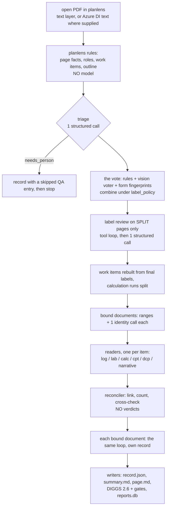

# Report-ingest pipeline: theory of operation

The report-ingest pipeline turns ONE geotechnical report PDF into ONE
structured, cited record — explorations with samples, blows, layers and water;
laboratory tests; calculations; soundings; the owner's two standing query
schemas answered from the narrative — and writes four exports from it (the
record JSON, a summary page, a library page with a SQLite index, and a DIGGS
2.6 XML file). Unlike the two agents, **it is a program that calls models,
not a model that calls programs**: Python fixes the order of work and the
number of calls; each model call fills one bounded slot.

Evidence: brief 2 on Foundry with 5.31.0, GPT-5.4 for triage, the review and
the readers, GPT-4.1-mini for the vision voter (`b2all/`): stage b (the whole
pipeline on 13 reports, 3,418 pages; R21 failed), stage c (calculation and
sounding readers on hand-truthed items), stage d (log, lab and narrative
readers), stage e (vision labels in document mode over 38 reports). Each
stage folder holds `RESULTS.md`, `results.json`, per-item run files and build
logs. Code is cited at `1085ddb`; where the run's 5.31.0 code differs it is
cited as `v5.31.0:` and the difference is stated.

> Scope note. Written from the code, the run files and the RESULTS tables,
> sampled as stated in §8.1. It covers the pipeline's spine and every model
> call in it; each reader's prompt is summarised, not quoted, and mechanisms
> the run files could not settle are marked open.

---

## 1. Boundaries and entry points

| Entry point | What it is | Where |
|---|---|---|
| `graph.ingest_report(source, engine, ...)` | the pipeline: one PDF (path, bytes or an open planlens document) → `ReportRecord` + exports in `out_dir` | `report_ingest/graph.py:305-443` |
| `run_folder` | the same over a folder of PDFs | `report_ingest/run_folder.py` |
| `cluster_scoring.score_on_cluster(stages=...)` | the owner's notebook cell: runs stages against hand truth and writes `RESULTS.md` | `report_ingest/cluster_scoring.py:383` |
| `subagent.build_report_ingest_subagent` | the pipeline as a deepagents `CompiledSubAgent` for the geotech agent: a one-node graph with **no model of its own**, returning counts, paths and the summary's first lines (never the record) | `report_ingest/subagent.py:1-33`; attached by `funhouse_agent/deep/agent.py:1073-1090`, off by default |
| `library.Library` + `library_agent` | a SEPARATE small harness: a model with query tools that answers across reports already ingested, with checked citations | `report_ingest/library.py`, `report_ingest/library_agent.py`; off by default; not exercised in the recorded runs |

The stages of `score_on_cluster` are `labels`, `logs`, `lab`, `calc`,
`soundings`, `narrative`, `vision_labels`, `vote`, `ingest`
(`cluster_scoring.py:140-142`). All but `ingest` and `vote` exercise ONE pass
on hand-truthed items; `vote` calls no model; `ingest` runs the whole graph per
report and scores the record against whatever truth exists.

---

## 2. Control flow

### 2.1 The fixed sequence

`ingest_report` opens the document and calls `_run` (`graph.py:446-584`),
which always does the same things in the same order:



Nothing in it is decided by a model at run time except (a) the workflow
triage returns, which switches whole branches (`graph.py:1-31`:
`needs_person` stops after triage, `appendix_only` skips the narrative
reader, `scanned` skips a text-only narrative with no DI text), and (b) the
label changes the review proposes, which Python validates and applies. How
many calls each pass may spend is fixed by `Budgets` (`graph.py:145-186`):
narrative 8, log 3 (the log reader's own ceiling is 6), lab 4, calc 2,
sounding 2; label review `max(20, 0.5 × split pages)` tool calls over the
split pages (`max(60, 0.25 × pages)` over all pages) and 60 model calls.

### 2.2 State and resumption

All state that matters is on disk under `out_dir`: `triage.json`,
`labels.json`, `vision.json`, `review.json`, one `items/item_N.json` per work
item as it finishes, then `qa.json`, `run.json` and the exports
(`graph.py:254-268`; `b2all/stage_b_ingest/ingest/R09/`). A second run with
`resume=True` reads those instead of paying again. The scoring cell also
mirrors every run file to SharePoint or a durable folder and restores a wiped
`out_dir` at the start (`report_ingest/mirror.py`). In memory a run carries
only the open document, the growing `ReportRecord`, the QA list and a cost
meter.

### 2.3 Concurrency, rate limits, timeouts

The graph is serial: one report, one pass, one call at a time. The engine
waits on rate limits on a fixed ladder (15, 30, 60, 120, 120, 120 s, or the
provider's retry-after; `v5.31.0:report_ingest/engine.py:789-830`). On
Foundry the operator's adapter added a 45 request/minute bucket and retries
on infrastructure errors (`b2all/README.txt`); R21 also ran into rate-limit
give-ups before reaching its real failure
(`stage_b_ingest/foundry_logs/*_stdout.txt`, the R21 lines).

### 2.4 How a run ends, and how it fails

Normally `write_outputs` writes each bound child, then the parent
(`graph.py:404-443`). A pass that raises ends the report: the scoring stage
records `error` in that report's `run.json` and retries it on the next run.
At 5.31.0 the label review raised when its final structured answer did not
parse, so one over-long answer cost the whole report (§8.2, P1). Since
`1ef959b` the review asks again with more room and then in batches, and on
final failure the vote's labels stand and the report goes on
(`report_ingest/label_review.py`, `ReviewIncomplete`).

---

## 3. The model calls: what each is shown

All calls go through one engine method,
`complete(messages, system=, tools=, images=, output_format=)`
(`report_ingest/engine.py:1-40`). Messages are provider-neutral blocks;
structured output is a pydantic model sent as a strict JSON schema, with the
keywords strict mode refuses stripped and folded into descriptions
(`engine.strict_schema`). The default output ceiling is 16,000 tokens
(`v5.31.0:report_ingest/engine.py:123`); on a reasoning model that ceiling
also has to hold the reasoning. Every call is metered (calls, tokens,
seconds); dollar pricing is switched off on Foundry (`engine.py:105-118`).

| Pass | Calls | Shown | Returns | Code |
|---|---|---|---|---|
| **Triage** | 1 | the per-page ledger (kind, rule label, confidence, rule, heading, running header, printed number, segment, text reliability, DI), the printed outline, front-matter text up to 12,000 chars, the first contact sheet (48 thumbnails) as a picture, and counted FACTS (scan fraction, unreliable-text fraction, numbering restarts) | `TriageFindings`: document type, workflow, bound-together parts, anomalies | `report_ingest/triage.py:1-27, 73-80, 411-470` |
| **Vision voter** (cheap tier) | about one per six pages in `sheet` mode (the ingest default) | contact sheets drawn by the module, 6 pages each, 400 px thumbnails, captioned only "p. N" (planlens' own captions name a page kind and biased the vote — the 5.21.1 note in CLAUDE.md); JPEG quality 80 | a label and a confidence per page | `report_ingest/vision_labels.py:142-194, 505-572, 956-1024` |
| **Label review** | a tool loop of up to 60 model calls and `max(20, 0.5 × split)` tool calls, then ONE structured call | a brief: ledger rows for the split pages ± 2, weak spots, outline, triage profile, the budget; tools `read_page` (text and tables, ≤ 14,000 chars), `render_page` (image), `contact_sheet`, `outline` | `ReviewFindings`: label CHANGES only, applied by Python after checks (page exists, label in vocabulary, one change per page) | `v5.31.0:report_ingest/label_review.py:569-700`; tools `label_review.py:150-215` |
| **Bound-document identity** | 1 per bound document | the child's own first pages | title, firm, date | `graph.py:908-950` |
| **Log reader** | 1, plus 1 per continuation sheet, plus 1 follow-up on its own unsettled list (≤ 6) | the FLOOR record built from planlens' `log_grid` (text placed by column and by the fitted depth ruler) as "the starting record", the rows, and the page image at 110 dpi; the follow-up gets magnified bands at 220 dpi | an `Investigation` (samples, SPT, layers, water, header), merged onto the floor | `report_ingest/log_reader.py:1-110` |
| **Lab reader** | ≤ 4 | detected tables (≤ 9,000 chars) and lines, the floor of typed tests from the tables, page images at 110 dpi, zooms at 300 dpi | typed `LabTest` records; the test KIND and the LINK (which boring, which depth) come from the model | `report_ingest/lab_reader.py:86-110, 1429-1500` |
| **Calc reader** | ≤ 2 | the run's pages (≤ 12) as lines and tables, plus a floor of (label, value, unit) pairs found by pattern (≤ 140) | one `Calculation`: kind from 13, program as printed, method, inputs, results, 60-word summary | `report_ingest/calc_reader.py:105-131` |
| **Sounding reader** (CPT, DCP) | ≤ 2 | a tabulated sheet: the table IS the record and the call reads the header; a plotted sheet: traces digitised against the axis ranges read off the plot's own text | a series against depth, and the header | `report_ingest/sounding_reader.py:96-139` |
| **Narrative reader** | ≤ 8, chunks ≤ 90,000 chars, input budget 150,000 tokens | the union of front-matter pages and the first 50 pages with the narrative-labelled pages, passages retrieved per question with their page numbers, up to 8 near-textless pages as pictures at 130 dpi, the conventions glossary (draft rulings) | the two schemas' fields, each cited; an answer whose quote is not found on its cited page drops to confidence 0.3 | `report_ingest/narrative_reader.py:72-123`; `report_ingest/narrative_glossary.py` |
| **Reconciler comment** (optional) | 1 | the conflicts | a sentence per conflict; values untouched | `report_ingest/reconciler.py:39-43` |

The models never choose which pages to read: Python hands each reader its
item's pages. A reader's value at a depth outside its page's fitted ruler is
REFUSED by Python and moved to `unresolved` (`log_reader.py:17-24`); a unit
with no conversion is kept as printed and listed (`model.py:336-372`; QA
kind `unconverted`).

---

## 4. Deterministic versus model

| Decided in code | Left to a model |
|---|---|
| Page facts and rule labels (planlens `roles.assign`) | Document type and workflow (triage) |
| Which voter wins a page under `label_policy` (`label_vote.combine`; default `structural`: the vision label except for the classes the rules own, e.g. `appended_report`, `other`, `calculation`; `label_vote.py:1-90`) | The vision voter's label for each page |
| Which pages go to the review (the split pages ± 2) and whether its changes are valid | Which label changes to propose |
| Work items: which pages form one log, one lab sheet, one calculation run | — |
| The FLOOR: what the log grid, the lab tables, the calc patterns, a tabulated sounding found | What the floor cannot know: the meaning of cells, refusal notation, sample symbols, the lab test kind, the link to a boring, calc kind/method/subject, every narrative answer |
| The MERGE: floor and model objects paired by depth (0.15 m; layers 0.30 m); both kept on disagreement; additions accepted; a correction accepted only with evidence (a box and a note) (`report_ingest/floor.py:1-120`; `report_ingest/log_floor.py:1083-1110, 1199-1440`) | — |
| Refusals: a depth off the ruler; a calc result printed on no page (confidence 0.3); a narrative quote not on its page (confidence 0.3) | — |
| Units: every number kept with the unit printed; SI computed on demand (`model.py:336-372`) | — |
| Reconciliation: links, counts, summary-table cross-check; disagreements recorded, never resolved (`reconciler.py:1-43`) | — |
| DIGGS mapping and its two gates: schema validation (when `pydiggs` is installed) and a read-back through the app's own DIGGS parser | — |

---

## 5. Data path

```
PDF ──planlens──▶ pages: text lines with boxes, tables, page kinds
                  (Azure DI text for scanned pages when a DI result is given)
    ──rules─────▶ page roles + work items
    ──vote──────▶ final page labels (each with confidence, voters, agreed flag)
    ──readers───▶ Investigation / LabTest / Calculation / sounding series / narrative answers
                  every value: Quantity(value as printed, unit as printed,
                  Provenance(page 0-based, bbox in PDF points top-left, method,
                  confidence, alternatives))
    ──reconciler▶ links + QAEntry list
    ──writers───▶ report.record.json · report.summary.md · report.page.md
                  · report.diggs.xml · a row in reports.db
```

Depth, pressure, unit weight and blow rate are `Quantity` objects in the unit
the page printed (ft, m, in, psf, tsf, kPa, pcf, kN/m³, blows/ft …); counts,
ratios and percentages are plain numbers (`model.py:336-372`). The floor and
the scorers compare depths in metres. Pages are 0-based in the record
(`Provenance.page`, `model.py:298-334`).

---

## 6. The scoring harness

`score_on_cluster` reads the corpus under its own file names, resolves IDs
through a manifest, uses Azure DI results where present, and scores each stage
against hand truth kept in a private folder (`truth_dir` with `logs/`, `lab/`,
`calc/`, `soundings/`, `narrative/`; an `OPEN.txt` names the reports whose
pages were looked at while tuning — everything else is scored as "blind").
`RESULTS.md` carries IDs, labels, counts and rates only.

Each reader item is scored three ways from the same run (keys `before`,
`after`, `model_alone` in `stage_d_logs_lab_narrative/logs/*.json`):

* **before** — the floor alone (no model);
* **model_alone** — the model's own answer, as if there were no floor;
* **after** — the merged record, which is what the product keeps;

with the merge's own counts: `kept` (floor values the model omitted and the
merge kept), `added`, `reconciled` (both agreed), `disagreements`.
Tolerances: depths 0.15 m, layer tops 0.30 m, N exact, lab index 0.01,
grading 1 %, sounding depth 0.05 m and value 5 % or one axis tick (stage
RESULTS headers).

For page labels, the rules, the vision voter, rules + review and each vote
policy are scored against the same hand labels with the same scorer; the
"gate" for key labels is 0.98 precision and recall.

---

## 7. What the recorded runs show (numbers)

**Stage b, whole pipeline** (`stage_b_ingest/RESULTS.md`; per report
`ingest/R??/run.json`): 13 reports, 3,418 pages, 3,737 model calls, 39.4 M
input and 5.6 M output tokens, 13.4 hours of serial wall clock; per report
60–897 calls and 507–11,482 s. Policy `structural`, review on split pages:
906 pages split (26.5 %), 379 reviewed, 527 left as `label_disagreement`.
QA entries: 14,064 over 13 reports — `partial` 5,357, `out_of_range` 4,098,
`disagreement` 3,371, `note` 646, `label_disagreement` 527, `conflict` 143,
`unconverted` 65, `count_mismatch` 39, `skipped` 14, `unreadable` 4
(`ingest/R??/qa.json`). DIGGS: written for 12 of 13; schema "not checked here"
(`pydiggs` absent on Foundry); read-back equal on 3 (R12, R18, R20), DIFFERS on
9; R11 not written.

**Stage c** (`stage_c_calc_soundings/RESULTS.md`): calculation reader on 10
hand-truthed runs (43 pages) — overall 62 % → 72 %; inputs 73 % → 76 %,
results 48 % → 59 %. Soundings and pits on 13 sheets — 73 % → 95 %;
tabulated 96 % → 99 %, plotted 32 % → 89 %. **Both sets are entirely open**;
there is no blind number.

**Stage d** (`stage_d_logs_lab_narrative/RESULTS.md`): logs, 15 — open
91 % → 98 %, blind 73 % → 73 % (blind recovery 100 % → 53 %, index 44 % → 0 %,
N 96 % → 84 %); lab, 31 sheets — open 83 % → 46 %, blind 55 % → 82 %;
narrative, 8 reports — recall 75 % overall (blind 74 %), precision 76 % blind.

**Stage e** (`stage_e_vision_document/RESULTS.md`): vision labels in
`document` mode (36-page windows plus a whole-report thumbnail strip, ≤ 50
images a call) on GPT-4.1-mini, strict accuracy rules vs vision: in sample
0.908 vs 0.706; open out-of-sample 0.760 vs 0.660; blind 0.786 vs 0.786; the
12 never-opened reports 0.767 vs 0.833.

---

## 8. Failure modes, with mechanisms

### 8.1 How the sample was chosen

I read the four RESULTS files in full (dollar columns ignored); every stage-b
`run.json`; every stage-b `qa.json` by counts; all 15 stage-d log run files by
their scores, and R30_p65's in detail; the R21 lines of the stage-b build
logs; the owner's measurement ledger entry of 2026-10-04 as a claim to check;
and the code named below. I did not read stage-b item files beyond their
keys, and opened no `raw/` folder.

### 8.2 The failures

**P1. One over-long structured answer failed a whole report (R21).** The
label review's last step asks for ALL its findings in one structured answer
(`v5.31.0:report_ingest/label_review.py:667-677`). On R21 that answer hit its
output ceiling — `stop_reason 'length'`, with a 16,000-token default that on a
reasoning model must also hold the reasoning — so nothing parsed and the code
raised; nothing in `ingest_report` caught it, so the report produced nothing,
on every retry (`stage_b_ingest/foundry_logs/*_stdout.txt`: "R21: FAILED --
RuntimeError ... stop_reason 'length'" in two builds). Fixed after the run
(`1ef959b`): ask again at 32,000 tokens, then 40 pages at a time, and if that
fails too, keep the vote's labels and go on.

**P2. The vote lowered label accuracy on the reports it was run on.** Under
`structural` the vision label wins every page except the rule-owned classes
(`label_vote.py:66-90`). The policy rests on vision beating the rules on pages
nobody had tuned against (0.833 vs 0.767 on 60 never-opened pages, stage e);
on these 13 IN-SAMPLE reports the rules are the stronger voter, and the final
labels scored below the rules on R12 (0.899 → 0.811), R18, R20
(0.968 → 0.768), R23, R29 and R30 (`stage_b_ingest/RESULTS.md`, labels
table). The owner's re-scoring of the same records without model calls gives
rules 0.896, structural 0.878, structural + review 0.863: the review on split
pages LOST 1.5 points (`module_work/field_feedback/2026-09-16_report-ingest/MEASUREMENTS.md`,
"Stage b and the label policy", commit `6143a9d`). On every set the pages the
voters AGREE on already carry more error than the 0.98 gate allows, so no
review of the disagreements alone can reach it (same source).

**P3. "after < before" on logs and lab: partly the scorer, partly real.**
Logs, blind: the merged record scored below the floor on recovery, index and
N. Two of these were scorer faults found after the run: the log scorer read
only `recovery_percent`, so a recovery the floor read off a LENGTH column —
and the merge KEPT — could never score; and index values printed in other
units were compared only as printed (`46be026`; `log_scoring.py`,
`_recovery_numbers`, `_as_numbers`). In R30_p65 recovery fell 4/4 → 0/4 with 0
disagreements and 4 `kept` values, consistent with that fault. N falling
4/4 → 1/4 on the same log has a different cause, visible in the stage-b item
for the same two pages (`stage_b_ingest/ingest/R30/items/item_8.json`, which
keeps the floor, the model's and the merged records; the floor is
deterministic, so it is the same floor stage d had): the FLOOR record held 10
driven records with **no N value on any of them**, and 6 of its 10 sample ids
held soil-description text — the grid's columns were mis-assigned on this
form. The stage-d `before` column scores the grid's CELLS, not the floor
record, so it credited N values the floor never carried. The model returned 21
driven records, 10 with an N; the merged record is the model's 21, and the
misplaced sample ids were KEPT because the model returned none ("kept from the
floor; the reader did not return it"). So "never drop" also preserves the
floor's own mistakes. Lab, open set: `after` equals `model_alone` on every sheet, so
the merge did not cause the collapse; the model's LINK (which boring a test
belongs to) did, together with a scorer that compared boring IDs as exact
strings (`5e70823`; `MEASUREMENTS.md`). In both readers `after` equals
`model_alone` on most items (`stage_d_logs_lab_narrative/logs/*.json`): the
merged score is mostly the model's score.

**P4. DIGGS read-back differs on most reports, and one bad log could block
the file.** Read-back through the app's own parser DIFFERS from the record on
9 of 12 written files; R11 wrote no file (`ingest/R??/run.json`, `diggs`).
The fix after the run (`f61505d`, "one bad log no longer blocks the file;
read-back matches what was written") locates both in the writer. The schema
gate never ran on Foundry because `pydiggs` was not installed.

**P5. QA volume.** 14,064 QA entries for 13 reports, about 1,080 a report,
4,098 of them `out_of_range` refusals and 3,371 `disagreement`s
(`ingest/R??/qa.json`). Each follows the design's own rule — record, never
resolve — but nothing ranks them.

**P6. Calls and tokens scale with bound documents.** The four
`multi_document` reports (R13, R16, R20, R23) took 206–897 calls and 2.7–8.4 M
input tokens each (`run.json`, `cost`), because each bound document goes round
the whole loop again (§2.1, step J); R16's bound volume is 420 of its 426
pages.

**P7. Sets with no blind half.** The calculation and sounding readers were
scored only on reports whose pages were looked at while tuning (stage c
headers); their 72 % and 95 % are in-sample numbers.

**P8. Request size, not context, bounds the vision voter.** In document mode a
window of pages can be refused as "request entity too large" before the
provider's 50-image cap is reached on scanned pages; the pass halves the window
and re-cuts the queue (`vision_labels.py:158-194, 611-630`; the `split`
column in stage e). Pictures travel as JPEG quality 80 to keep request bodies
small without changing the token count (`vision_labels.py:189, 385-430`).

---

## 9. Invariants and whether they held

| Invariant | Held? |
|---|---|
| Python, not a model, decides the sequence and the call ceilings | Held by construction (`graph.py:1-31, 145-186`). |
| The floor is never silently dropped | By the merge rules yes (`kept` is non-zero where the model omitted values); the scores could not show it because of the scorer faults in P3. It also keeps the floor's errors (R30's misplaced sample ids). |
| The floor is at least what the deterministic reading found | Not always: R30's floor record had no N values where the grid's cells did (P3). |
| A disagreement is recorded, never resolved | Held: 3,371 `disagreement` and 143 `conflict` entries, with values kept as `alternatives`. |
| Depths off the page's ruler are refused | Held: 4,098 `out_of_range` entries. |
| Pages are 0-based in the record | Held by schema (`Provenance.page`); how the summary prints them was not checked here. |
| A failure stays inside its report | Held across reports (R21 failed alone); not within a report before `1ef959b`. |
| What a bound document holds is not counted on its parent | Held by design; RESULTS prints child counts on separate lines. |
| `before` and `after` are measured the same way | Not fully: they go through different scoring paths (grid cells vs the record), which is how P3's scorer faults hid. |

---

## 10. Open questions

1. **How often does the floor record hold less than the grid's cells?** In
   R30 (P3) the floor carried no N values while the cells did. A rerun of
   stage d at `1085ddb`, whose run files keep the floor, model and merged
   records, would count it on every log.
2. **Is `structural` the right default?** The only evidence for it is 60
   never-opened pages; the in-sample reports say the opposite (P2). More
   hand-labelled blind pages would settle it.
3. **What does the review do on split pages that loses accuracy?** Each
   report's `review.json` grades changes `fixed / broke / still_wrong`; a
   count across the 13 reports would say.
4. **Is the narrative's 75 % limited by reading or by conventions?** The
   per-question "why" column (`convention` versus reading) in the narrative
   run files would split it.
5. **Does the 16,000-token default bite elsewhere?** Readers on long items use
   the same default; a search of the item files for `stop_reason` would say.

---

## Observations (opinion)

* The spine — code decides the plan, models fill slots, a floor under every
  reader, disagreements recorded — is the right shape for output that must be
  audited. Its weakest point in these runs is measurement: two of the largest
  apparent losses were the scorer.
* `after == model_alone` on most items means the floor mostly fills in where
  the model is silent; whether "correct only with evidence" changes any value
  is not visible in these files.
* About 1,000 QA entries a report is a record nobody will read. Ranking them
  by consequence (a split on an N value or a layer top before a `partial`
  note) would make "record, never resolve" usable.
