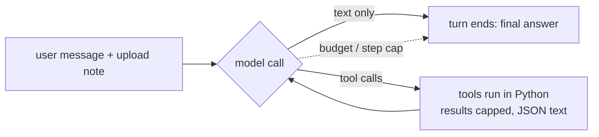

# Shared machinery: the agent loop, the model, the eyes, the limits

This document describes the parts that the **GeotechStaffEngineer agent** and
the **Document Review agent** have in common. Read it first: both of those
documents assume it. The report-ingest pipeline does NOT use this loop; it has
its own engine layer, described in `report_ingest.md`.

Code citations are `path:line` in the GeotechStaffEngineer repo at commit
`1085ddb` (branch `release/5.32.0`, the 5.32.0 release; the files cited here
are unchanged since `23d7e33`). Where the recorded runs used older code
(5.31.0, 5.32.0rc2/rc3) and it matters, that is said.

---

## 1. One sentence

Every agent in the app is a **LangChain/LangGraph tool-calling loop**: the code
sends the model a system prompt, the conversation so far and a list of tool
schemas; the model replies either with text (the turn ends) or with one or more
tool calls; the code runs those tools, appends their results (as text) to the
conversation, and calls the model again. **The model decides what to do next;
the code decides what the model can see, what it can call, how big each result
may be, and when it must stop.**

---

## 2. Who builds the agent

There is ONE builder, `build_deep_agent` (`funhouse_agent/deep/agent.py:692`),
and it produces three different things:

| Caller | What it builds | Where |
|---|---|---|
| Geotech page of the web app | deepagents agent, primary scoped to the analysis modules, `references` + `reviewer` + `calc` + `general-purpose` sub-agents | `webapp/core.py:493` → `deep/agent.py:956-1203` |
| Document Review page, no switch (the "legacy" / `baseline` arm) | the SAME deepagents builder with the modules subtracted and the prompt replaced | `webapp/profiles.py:195-224` → `deep/agent.py:956-1203` |
| Document Review page, `GEOTECH_REVIEW_AGENT=lean` | a separately chosen agent (`create_agent`, not deepagents) | `deep/agent.py:944-954` → `deep/review_agent.py:293` |
| Document Review page, `GEOTECH_REVIEW_AGENT=minimal` | a looking-only measuring stick | `deep/agent.py:936-943` → `deep/minimal_agent.py:232` |
| Geotech evaluation (`eval_harness.run_suite`) | `build_deep_agent(model=model)` with library defaults — **no** calc sub-agent, no host tools | `funhouse_agent/deep/eval_harness.py:1181` |

The switch that picks lean/minimal is read from the environment at build time
(`funhouse_agent/review_flags.py:112-121`), so the evaluation suite can change
it between runs without reinstalling.

### 2.1 What deepagents adds on its own (legacy builds)

`create_deep_agent` wraps the caller's tools and prompt in its own middleware
stack (`.venv/Lib/site-packages/deepagents/graph.py:745-800` for the version
installed locally):

1. **TodoList** — a `write_todos` tool and a prompt section about planning.
2. **Filesystem** — six scratch tools (`ls`, `read_file`, `write_file`,
   `edit_file`, `glob`, `grep`) over an in-memory store that is NOT the disk,
   plus **large-result eviction**: a tool result longer than
   `tool_token_limit_before_evict` × 4 characters (20,000 tokens × 4 = 80,000
   characters in the local version, `deepagents/middleware/filesystem.py:704,1814`)
   is written to `/large_tool_results/<id>` and replaced by a preview.
3. **SubAgent** — the `task` tool, which hands a self-contained job to a named
   sub-agent (or to deepagents' own `general-purpose` helper).
4. **Summarization** — compacts the conversation when it nears the model's
   context window (deepagents' defaults; the app can add a second one,
   `deep/agent.py:145-240`, only when `enable_summarization=True`).
5. **PatchToolCalls** — repairs a history with a tool call that has no result.
6. **AnthropicPromptCaching** — a no-op for OpenAI models.

On top, `build_deep_agent` appends `ScratchFilesystemGuard` to the primary and
to every sub-agent (`deep/agent.py:1127-1133, 1157`). It intercepts the scratch
tools when they are pointed at a REAL path and answers with the tool that reads
real files instead (`funhouse_agent/deep/scratch_guard.py:1-26`). Because some
deepagents versions stopped auto-attaching TodoList while the domain prompt
still tells the model to plan with `write_todos`, the builder checks the
compiled graph and rebuilds once with the todo middleware when the tool is
missing (`deep/agent.py:1179-1194`).

deepagents also contributes a large slab of **generic coding-agent prompt**.
Rendering the prompts with a recording fake model (no network) on the local
install gives:

| Agent as built | System prompt | Tools | Tool-schema text |
|---|---|---|---|
| Geotech, eval defaults | 28,849 chars | 32 | 38,074 chars |
| Geotech, app defaults (calc on) | 30,801 chars | 32 | 38,618 chars |
| Document Review, legacy (`baseline`) | 15,304 chars | 28 | 35,456 chars |
| Document Review, lean + switches (`sweep` arm) | 8,164 chars | 20 | 18,703 chars |
| Document Review, `minimal` | 1,637 chars | 7 | 3,990 chars |

The legacy prompts end with deepagents' sections "Core Behavior",
"Professional Objectivity", "Doing Tasks" ("read relevant files, check existing
patterns"), "Following Conventions" ("Mimic existing style"), "Filesystem
Tools", "Large Tool Results" and "`task` (subagent spawner)". The last one says
*"Whenever possible, parallelize the work that you do ... make tool_calls ...
in parallel"*. That sentence is the most likely reason the recorded
Document Review runs issue 10–12 page looks in a single model step (see
`document_review.md` §6). Exact numbers vary with the deepagents version: the
Foundry runs used deepagents 0.7.13 / langchain 1.3.18, the local render 0.6.8 /
1.3.4.

### 2.2 The lean and minimal builds

`build_review_agent` (`deep/review_agent.py:293-417`) and
`build_minimal_agent` (`deep/minimal_agent.py:232-285`) call LangChain's
`create_agent` directly and choose their middleware:

* PatchToolCalls; a TodoList with a short prompt (lean only,
  `review_agent.py:181-191`); a Summarization middleware keeping the last 12
  messages (`review_agent.py:223-235`); the inline-image middleware when
  looking inline (§5.3); and a **model-call budget** (§4.2).
* No scratch filesystem, no deepagents base prompt, no `general-purpose`
  helper. The `task` tool is a hand-built one that runs a `page_reader`
  (lean, `review_agent.py:248-290`) or `page_looker` (minimal,
  `minimal_agent.py:191-229`) helper with its own prompt and its own budget.

---

## 3. What the model is shown at each call

### 3.1 The first call of a turn

1. **System prompt** — the domain or review prompt (see each harness
   document), plus host extras (SharePoint tools, `record_feedback`, the
   analysis-depth preset) appended by `webapp/core.py:509-546`, plus the
   middleware sections in §2.1.
2. **Tool schemas** — name, description and JSON-schema of every tool (sizes
   in the table above). The model sees descriptions, never the Python.
3. **Conversation history** — see §3.3.
4. **The user message.** On the first turn after an upload it is prefixed
   with a "[System note] The user attached files..." block naming each
   attachment key and its path on disk (`webapp/core.py:158-193`). The legacy
   wording names `open_document`, `analyze_image`, `analyze_pdf_page`,
   `read_pdf_text`, `pdf_import`, `dxf_import`, `drawing_ir`; the lean wording
   names only the review tools. The `minimal` agent receives the LEGACY
   wording (`lean_agent()` is false for `minimal`), which names tools it does
   not have.

### 3.2 Every later call in the same turn

The same system prompt and tools, plus every earlier model reply (text and tool
calls) and every **tool result** of the turn, in order. Tool results are TEXT
(JSON strings). Whatever a tool returned, after capping (§4.1), is what the
model knows of it.

### 3.3 Across turns

The web app keeps the conversation by **replaying text only**: after a turn it
appends `{"role": "assistant", "content": final_answer}` to the saved history
(`webapp/turn_jobs.py:235, 243`; the suite does the same,
`funhouse_agent/review_eval/runner.py:205`). Tool calls and tool results of
earlier turns are NOT replayed; no LangGraph checkpointer is used by default
(`webapp/core.py:493-506`). So the second question about a document starts
from the first answer's prose, not from what the tools returned. Handles to
open documents survive (one process-wide planlens toolkit,
`funhouse_agent/document_tools.py:13-15`), so a handle quoted in the earlier
answer can be reused.

The geotech evaluation goes further: each question is its own fresh
`agent.invoke` with no history at all (`eval_harness.py:963-1015`). Questions
that are written as follow-ups ("Repeat the lateral analysis of the 0.5 m
pile…", LP-2) therefore arrive with nothing to follow up on (see
`geotech_agent.md` §7).

### 3.4 What is NOT recorded

The always-on activity log (`webapp/activity_log.py`) records turn start/end,
every model call's usage and number of requested tool calls, and every tool's
arguments and result (results cut at 32,000 characters,
`activity_log.py:43, 70`). It does **not** record the prompts or the messages
sent (`activity_log.py:44-46`). So the traces show what each tool returned to
the model — which is most of what the model "saw" — but not the system prompt
version or the rendered images. Vision side calls (§5) appear in the log as
model calls with `n_messages = 1`.

---

## 4. Limits: what bounds a turn

### 4.1 Result size caps (what gets cut)

All tool results pass through `_truncate` (`funhouse_agent/deep/tools.py:126-155`):
a result over its cap is cut to the cap and followed by
`...[truncated N chars]. Do NOT re-request this same item ... Run a NARROWER
follow-up search instead` (`tools.py:85-90`). Caps are chosen per tool:

| Result | Cap | Where |
|---|---|---|
| Catalog tools (`list_agents`, `list_methods`, `describe_method`) and most file/vision tools | 8,000 chars | `tools.py:66` |
| `call_agent` on a **calculation** module | **uncapped** | `tools.py:198-216` |
| `call_agent` on a reference module, `read_reference_figure`, `read_pdf_text`, `read_text_file`, `list_files` | 16,000 | `tools.py:73, 703-711` |
| planlens document tools | planlens budgets itself to cap − 1,500 and pages through `next` cursors, so the string cut never fires | `tools.py:691-701`; `document_tools.py:96-120` |
| `analyze_pdf_page` (with tiles), `find_like` | 32,000 (each tool shrinks its own JSON to stay under 30,000) | `tools.py:81, 703-705`; `vision_tools.py:1007, 1146-1155` |
| `render_region` | kept under 7,800 by halving `located` lists, then trimming the analysis by 20 % steps | `vision_tools.py:872-903` |
| `sweep_pages` | 32,000, answers shortened evenly | `deep/sweep.py:183-199` |

Two consequences matter. First, a **calc result is never cut by the app** —
only deepagents' 80,000-character eviction (§2.1) can move it out of the
model's view, replacing it with a preview and a file path. Second, the
truncation marker tells the model to search narrower; it does not tell it what
was lost.

### 4.2 Model-call budgets (graceful)

`ModelCallBudgetMiddleware` (`funhouse_agent/deep/limits.py:64-149`) counts
model calls in one run. On the **last** budgeted call it strips the tools and
appends a "[Round budget reached] ... answer now from what you have" message
(`limits.py:105-126`); if the model still asks for a tool, the hard backstop
ends the run with a fixed message instead of an error (`limits.py:136-149`).
Budgets in force:

| Agent | Budget | Where |
|---|---|---|
| `references` sub-agent | 8 calls per consult | `limits.py:40`; `deep/agent.py:338-341` |
| `calc` sub-agent | 16 | `deep/agent.py:359, 544-545` |
| lean / minimal review agent | 40 per request (`GEOTECH_REVIEW_MAX_MODEL_CALLS`) | `review_agent.py:159, 205-211` |
| `page_reader` / `page_looker` helper | 14 per job | `review_agent.py:162` |
| Geotech primary, legacy review primary, `reviewer`, `general-purpose` | **none** | — |

### 4.3 Step caps (ungraceful)

LangGraph counts graph steps, not model calls; each model call is several
steps. The app passes `recursion_limit = 50` per turn by default
(`webapp/core.py:1245-1251`, applied in `stream_turn`, `core.py:744-750`).
When it is hit the turn raises `GraphRecursionError`, which the app turns into
advice to raise the cap (`core.py:1308-1323`); the review suite scores it as an
empty answer (`review_eval/runner.py:199-213, 266-268`). The lean and minimal
agents raise the cap to `8 × budget + 30` = 350 so that the model-call budget,
not the step cap, ends a long request (`review_agent.py:406-412`;
`core.py:744-748`). **The geotech evaluation passes no `recursion_limit`**
(`eval_harness.py:1006-1009`), so deepagents' own default of 9,999 applies
(`deepagents/graph.py:855`): the evaluation measured an agent with no
effective step cap on the primary, unlike the app.

### 4.4 Auto-continue

If a reply ends on a stated but unperformed step ("Let me get that Ka…") after
tools were used, `stream_turn` re-invokes the agent with "Continue — complete
the action you just stated.", at most twice (`webapp/core.py:608-650,
770-790`). This is a regex on the last sentence; it applies in the app and in
the review suite (which streams through `core.stream_turn`), not in the
geotech evaluation. The continuation pass is invoked with the turn's original
messages plus the first pass's PROSE and the nudge (`core.py:779-782`); with no
checkpointer the first pass's tool calls and results are not in it, so the
continuation starts without the evidence the first pass gathered.

---

## 5. The eyes: how a page reaches a model

### 5.1 Vision by side call (the default everywhere)

`analyze_pdf_page`, `render_region`, `analyze_image`,
`read_reference_figure` and `view_worked_example_source` do NOT show the image
to the reasoning model. They render the page (or a region) with planlens,
make a **separate, one-shot model call** with one user message (image + prompt,
no system prompt, no conversation), and return that call's TEXT to the agent
(`funhouse_agent/vision_tools.py:1010-1080` for a page,
`746-825` for a region; the call itself is
`funhouse_agent/deep/vision_engine.py:132-192`). By default the side call goes
to the SAME chat model object as the agent (`deep/agent.py:964-969`).

The prompt the side call receives is assembled by `_vision_prompt`
(`vision_tools.py:837-849`):

1. (only with `GEOTECH_VISION_TEXT_CONTEXT=1`) the page's text-layer lines
   inside the view, up to 3,500 chars (`vision_view.py:345, 388-427`);
2. the agent's own `prompt` argument, verbatim;
3. the **grid instruction**: give locations as `[x0, y0, x1, y1]` on a 0–999
   grid over the image; read codes character by character and bracket
   confusable characters (`G/Q/O/C/D, E/F, B/8, S/5, I/1/L, Z/2`)
   (`vision_view.py:93-100`);
4. (only with `GEOTECH_VISION_STRUCTURED=1`) an instruction to end with a
   `LOCATED:` JSON line, which the tool parses into page-point boxes
   (`vision_view.py:429-488`; `vision_tools.py:852-869`).

The result returned to the agent is JSON: `page`, `pdf_page` (= page + 1),
`analysis` (the side call's prose), and the **view payload**
(`vision_view.py:241-281`): `view` (the page rectangle the image showed, in PDF
points), `view_px`, a `zoom_hint`, the probed `vision_model`, `budget`,
`detail`, and — when the page's lettering is small in this image — a
`legibility` warning naming a zoom window size. So **the reasoning model
reasons from another model's description**; it learns WHERE things are only
through 0–999 boxes that the side call writes into its prose and that the
agent must copy back into `render_region(view=…, image_box=…)`.

### 5.2 Image size and detail

`vision_view.render_view` renders to the largest image the model actually
reads ("budget"), re-drawing a zoomed region from the vector PDF rather than
cropping pixels (`vision_view.py:1-45, 202-238`). Which budget applies:

1. an environment override (`GEOTECH_VISION_BUDGET`, `GEOTECH_CHART_BUDGET`);
2. otherwise what the **probe** measured: on first use, four small calls ask
   the model who it is and send blank squares at different sizes and detail
   levels, and the image-token ratios reveal how large an image it really
   reads and whether `detail="original"` is honoured
   (`funhouse_agent/vision_probe.py:1-28`); under the default `robust`
   policy every image goes at the larger, "detailed" budget
   (`vision_view.py:61-67, 144-163`);
3. otherwise `openai-high` for pages, `openai-original` for chart read-offs
   (`vision_view.py:72, 78`).

The probe is visible in every recorded Document Review trace as four model
calls with `n_messages = 1` and input tokens of about 10, 702, 702 and 4,926
inside the first vision tool call (e.g.
`brief3/out_sol_532/runs/baseline/set-long-rare-tag/activity.jsonl`, t = 12–18
s). Each suite task ran in its own process on Foundry, so the probe ran once
per task.

On Foundry with GPT-5.6 Sol (brief 3) the probe chose `openai-original`
and the operator's adapter sent `original` as `AUTO` (full size): a letter
page arrived as a 2,794 × 3,616 px image and each whole-page side call cost
about **12,100–12,200 input tokens** (the 90th percentile of side calls in the
`baseline` arm, the median in the `sweep` arm where the four small probe calls
are a smaller share; `brief3/out_sol_532/runs/*/*/activity.jsonl`). With
`GEOTECH_VISION_BUDGET=openai-high` (`baseline_high` arm) the same call cost
about **1,270 input tokens**, and `analyze_pdf_page` auto-tiled far more
often (465 side calls over 17 runs against 335 over 37 for `baseline`).

`analyze_pdf_page(tiles="auto")` ALSO reads the page in 2×2 to 4×4 overlapping
tiles, in parallel (4 workers), when the page's small lettering would arrive
below 12 px in the whole-page image and the policy is `robust`
(`vision_tools.py:1003-1145`; `vision_view.py:86, 284-325`). Each tile is
another side call; the agent receives the overview AND every tile's text.

### 5.3 Vision inline (lean and minimal agents only)

With `GEOTECH_VISION_INLINE=1` (lean) or always (minimal), the page and region
tools make no side call. They store the image in a process-wide store
(96 images, oldest dropped; `funhouse_agent/inline_store.py:24, 46-53`) and
return an `image_id` plus a note. `InlineImageMiddleware`
(`funhouse_agent/deep/inline_images.py:95-115`) then adds ONE extra user
message to the **next request only** (never to the saved state) carrying the
**newest `keep` images** named by tool results since the last user message —
`keep` defaults to **2** (`inline_store.py:31`;
`inline_images.py:45-62`). Images older than the newest two are never shown
again unless the model asks for the view again. When the model issues ten
page looks in one step, eight of those pages are never seen (§6 of
`document_review.md` shows this happening).

### 5.4 Concurrency

Since rc3 every side call holds one of 8 process-wide slots
(`GEOTECH_VISION_MAX_INFLIGHT`, `deep/vision_engine.py:31-71`). The cap was
added after unbounded fan-out (parallel tool calls × tiles × markup checks)
overflowed a 10-connection pool on Foundry and aborted the process
(`vision_engine.py:31-37`; commit `be742b0`). The brief-3 originals ran on rc2
with the same cap applied by the operator's adapter instead (`brief3/README.txt`).

---

## 6. The model behind it all

The agent takes any LangChain chat model. In the recorded runs it was the
Foundry operator's own adapters, not product code:

* **brief 2 (5.31.0, geotech eval):** GPT-5.4 through Foundry's Responses
  request type; image `detail="original"` fell back to `HIGH`
  (`b2all/glue/foundry_responses_model.py:1-60`); a 45 request/minute token
  bucket and infrastructure retries (`b2all/README.txt`). 470 retries were
  logged over 1,396 SDK calls in the geotech run
  (`b2all/geotech_eval/foundry_logs/20261002T022428Z_build.json`), so latency
  figures in that run include retry waits.
* **brief 3 (5.32.0rc2/rc3, Document Review):** GPT-5.6 Sol through the
  Responses route with `original` sent as `AUTO`, at most 8 calls in flight
  (`brief3/README.txt`, `brief3/glue/runner532.py:19-31`).

The product's own engines (`webapp/palantir_sdk_engine.py`,
`webapp/tinyapps_engine.py`, `funhouse_agent/deep/databricks_bridge.py`
`PrompterChatModel`) were **not** what ran on Foundry; the Responses-route
lessons from the operator's adapter were folded back into the product
afterwards (commit `3ef5e98`).

`PrompterChatModel` sends `temperature=0.0` by default, omits it when set to
`None`, and renames `max_tokens` to `max_completion_tokens` on a model that
rejects it (`databricks_bridge.py:257-336, 640-660`).

---

## 7. Invariants this machinery relies on

| Invariant | Holds in the traces? |
|---|---|
| Pages are 0-based in every tool; every page/vision result also carries `pdf_page` = page + 1 for citing (`vision_tools.py:295-302`) | Yes in results. Answers in brief 3 cite viewer numbers; the suite's "no page 0" check passed on all 37 baseline runs (`brief3/out_sol_532/RESULTS_main.md`). |
| One coordinate frame for boxes: PDF points, top-left origin, y down (`document_tools.py`, `vision_tools.py:762-780`) | Yes for tool-to-tool boxes. The 0–999 boxes copied from side-call prose are where precision is lost (`document_review.md` §6.2). |
| A tool error comes back as a JSON `error` the model can read, never an exception that ends the turn (`dispatch.py:765-806`, `vision_tools.py` passim) | Yes: 0 model errors and 0 tool errors in 37×3 brief-3 arms; the geotech eval recorded 70 errored tool results and 0 exceptions (`geo_eval_merged.json` metrics). |
| A result over its cap is cut with a marker, never silently | Yes by construction; the eviction path of deepagents is the exception (it replaces content with a preview and a path). |
| The side call answers only the agent's prompt about one image | Yes by construction — and it is why the agent's prompt wording decides what is read (`document_review.md` §6). |

---

## Observations (opinion, kept apart from the description)

* The biggest lever on what the reasoning model "knows" is not in any prompt:
  it is the side-call boundary (§5.1). Everything the reasoning model learns
  from a page has passed through another model's prose and back through
  0–999 boxes it must copy by hand.
* The `keep = 2` inline window and deepagents' "parallelize whenever
  possible" instruction work against each other: the prompt encourages ten
  looks in one step, the window shows two of them.
* The evaluation harnesses do not run the agent the way the app does
  (step cap, calc sub-agent, history replay). Their numbers describe the
  library default, not the page a user sees.
